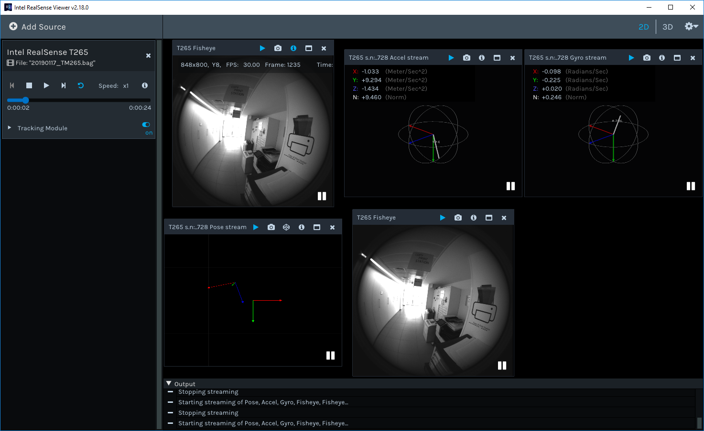
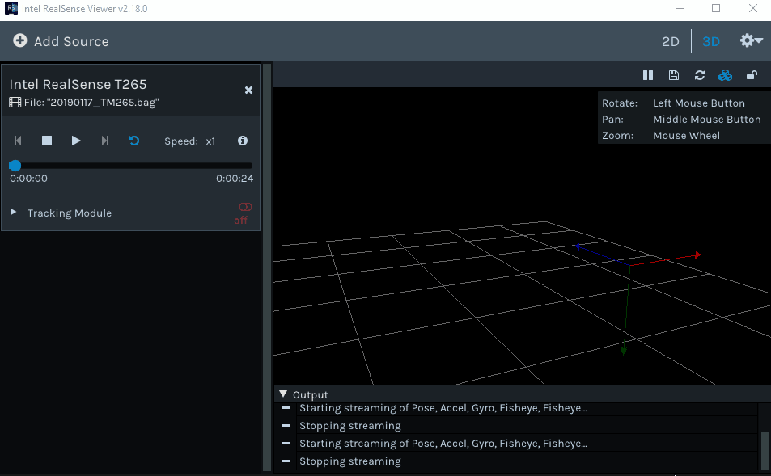
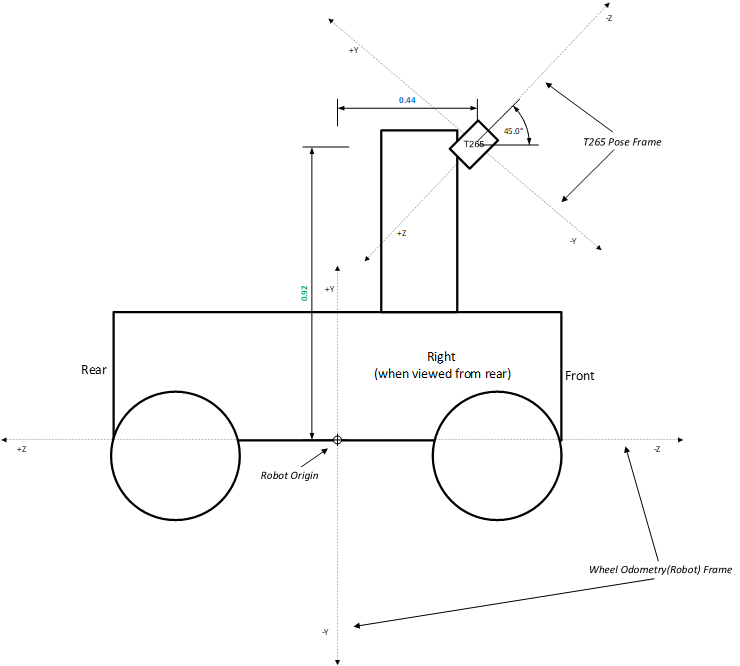

# T265 Tracking Camera


https://github.com/mvp/uhubctl/issues/258


I've tested this on the jetson nano development board (B01 version).

My results:

bus 2-1 is the usb3.0 bus corresponding to the 4 ports on the dev kit.
...
bus 2-1 port 1 can disable the VBUS of all the 2-1 ports.
bus 2-1 ports 2-4 do not disable the VBUS.
When plugging in another (unsupported) hub (anker https://www.amazon.com/gp/product/B07L32B9C2) to any port on bus 2-1, VBUS can no longer be disabled on bus 2-1.

--

It did not work for me. I had to do this instead
echo '2-1' |sudo tee /sys/bus/usb/drivers/usb/unbind"

Edited:
Actually, now uhubctl -l 2-1 -p 1 -a 0 is working on my jetson nano. I did not get what I changed.

What I am looking for is single port power switching that apparently Nano does not allow that due to the fact that all USB ports are ganged with each other as in raspberry pis. Any solution for that is appreciated.


_________


Давай еще раз вернемся к найденому мной в интертете решению проблемыв:

Disable/enable USB ports on ORIN NX programmatically: SOLVED
Is there a way to cut off power to Orin NX USB port then reenable it with some command like below:

sudo sh -c "echo 141a0000.pcie > /sys/bus/platform/drivers/tegra194-pcie/unbind"
sudo sh -c "echo 141a0000.pcie > /sys/bus/platform/drivers/tegra194-pcie/bind"

Find the PCIe card to which the USB is connected. In my case `141a0000.pcie`. The above command will turn the power supply to the PCIe card off and then on thereby making my T265 tracker camera detectable.

Как найти PCI слот к котрому подключена T265 камера?

Как найти "PCIe card to which the USB is connected"?
141a0000.pcie - к которому подключена камера?


### First start problem:


### First run, clean system:

lsusb
...
Bus 001 Device 004: ID 03e7:2150 Intel Myriad VPU [Movidius Neural Compute Stick]
...

lsusb -t
/:  Bus 02.Port 1: Dev 1, Class=root_hub, Driver=tegra-xusb/4p, 10000M
    |__ Port 1: Dev 2, If 0, Class=Hub, Driver=hub/4p, 10000M
/:  Bus 01.Port 1: Dev 1, Class=root_hub, Driver=tegra-xusb/4p, 480M
    |__ Port 2: Dev 2, If 0, Class=Hub, Driver=hub/4p, 480M
        |__ Port 2: Dev 4, If 0, Class=Vendor Specific Class, Driver=, 480M
    |__ Port 3: Dev 3, If 0, Class=Wireless, Driver=btusb, 12M
    |__ Port 3: Dev 3, If 1, Class=Wireless, Driver=btusb, 12M

### After detach / attach:

lsusb 
Bus 002 Device 002: ID 2109:0822 VIA Labs, Inc. USB3.1 Hub             
Bus 002 Device 001: ID 1d6b:0003 Linux Foundation 3.0 root hub
Bus 001 Device 003: ID 0bda:c822 Realtek Semiconductor Corp. Bluetooth Radio 
Bus 001 Device 008: ID 03e7:2150 Intel Myriad VPU [Movidius Neural Compute Stick] <<<<<--------
Bus 001 Device 002: ID 2109:2822 VIA Labs, Inc. USB2.0 Hub             
Bus 001 Device 001: ID 1d6b:0002 Linux Foundation 2.0 root hub

rs-fw-update -l

Connected devices:
1) Name: Intel RealSense T265, serial number: 905312111138, update serial number: unknown, firmware version: 0.2.0.951, USB type: 3.1

lsusb 
Bus 002 Device 003: ID 8087:0b37 Intel Corp. Intel(R) RealSense(TM) Tracking Camera T265 <<<<<--------
Bus 002 Device 002: ID 2109:0822 VIA Labs, Inc. USB3.1 Hub             
Bus 002 Device 001: ID 1d6b:0003 Linux Foundation 3.0 root hub
Bus 001 Device 003: ID 0bda:c822 Realtek Semiconductor Corp. Bluetooth Radio 
Bus 001 Device 002: ID 2109:2822 VIA Labs, Inc. USB2.0 Hub             
Bus 001 Device 001: ID 1d6b:0002 Linux Foundation 2.0 root hub

silenzio@jetsonnx:~/ros2_ws$ lsusb -t
/:  Bus 02.Port 1: Dev 1, Class=root_hub, Driver=tegra-xusb/4p, 10000M
    |__ Port 1: Dev 2, If 0, Class=Hub, Driver=hub/4p, 10000M
        |__ Port 2: Dev 3, If 0, Class=Vendor Specific Class, Driver=, 5000M
/:  Bus 01.Port 1: Dev 1, Class=root_hub, Driver=tegra-xusb/4p, 480M
    |__ Port 2: Dev 2, If 0, Class=Hub, Driver=hub/4p, 480M
    |__ Port 3: Dev 3, If 0, Class=Wireless, Driver=btusb, 12M
    |__ Port 3: Dev 3, If 1, Class=Wireless, Driver=btusb, 12M


Find USB-device:
Put in T265 and run:
```
lsusb
```

```
Bus 002 Device 003: ID 8087:0b37 Intel Corp. Intel(R) RealSense(TM) Tracking Camera T265
```

```
readlink -f /sys/bus/usb/devices/2-3
```

```
/sys/bus/usb/devices/2-3
```

```
echo 0 | sudo tee /sys/bus/usb/devices/2-3/authorized
sleep 1
echo 1 | sudo tee /sys/bus/usb/devices/2-3/authorized
```

/:  Bus 02.Port 1: Dev 1, Class=root_hub, Driver=tegra-xusb/4p, 10000M
    |__ Port 1: Dev 2, If 0, Class=Hub, Driver=hub/4p, 10000M
        |__ Port 2: Dev 3, If 0, Class=Vendor Specific Class, Driver=, 5000M
/:  Bus 01.Port 1: Dev 1, Class=root_hub, Driver=tegra-xusb/4p, 480M
    |__ Port 2: Dev 2, If 0, Class=Hub, Driver=hub/4p, 480M
        |__ Port 4: Dev 4, If 0, Class=Vendor Specific Class, Driver=usb_ch341, 12M
        |__ Port 3: Dev 5, If 0, Class=Vendor Specific Class, Driver=ftdi_sio, 12M
    |__ Port 3: Dev 3, If 0, Class=Wireless, Driver=btusb, 12M
    |__ Port 3: Dev 3, If 1, Class=Wireless, Driver=btusb, 12M

```
|__ Port 2: Dev 3, If 0, Class=Vendor Specific Class, Driver=, 5000M
```


— это, почти наверняка, и есть твоя Realsense T265, потому что:

Driver пустой (подтверждает, что устройство не до конца загрузилось),

Class=Vendor Specific Class (T265 — нестандартное устройство),

5000M — это USB 3.0 (T265 поддерживает USB 3.0),

висит на Bus 02, Port 1.2.

🔍 Что делать дальше?
Ты ищешь путь в /sys/bus/usb/devices/, соответствующий вот этой схеме:

2-1.2

Где:

2 — номер USB-шины (Bus 02),

1.2 — порт 1 хаба + порт 2 внутри него.

✅ Проверь существование узла:

```
ls /sys/bus/usb/devices/2-1.2
```
```
2-1.2:1.0            bDeviceClass     bMaxPower           descriptors  driver       manufacturer  quirks     speed      version
authorized           bDeviceProtocol  bNumConfigurations  dev          ep_00        maxchild      removable  subsystem
avoid_reset_quirk    bDeviceSubClass  bNumInterfaces      devnum       idProduct    port          remove     tx_lanes
bcdDevice            bmAttributes     busnum              devpath      idVendor     power         rx_lanes   uevent
bConfigurationValue  bMaxPacketSize0  configuration       devspec      ltm_capable  product       serial     urbnum
```
```
cat /sys/bus/usb/devices/2-1.2/idVendor
```
```
8087
```
```
silenzio@jetsonnx:~/ros2_ws$ cat /sys/bus/usb/devices/2-1.2/idProduct
```
```
0b37
```

Должно быть:

idVendor = 8087
idProduct = 0b37

Теперь сброс устройства:
```
echo 1 | sudo tee /sys/bus/usb/devices/2-1.2/remove
sleep 1
echo '2-1.2' | sudo tee /sys/bus/usb/drivers/usb/bind
```

Если всё отработает без ошибок — ты восстановишь T265, и она будет работать без перетыкания!

sudo apt install tree

tree -d -L 2 /sys/bus/usb/devices/ | grep 2-1.2
выдала:
2-1:1.0 -> ../../../devices/platform/bus@0/3610000.usb/usb2/2-1/2-1:1.0
__________

lsusb
```
Bus 002 Device 002: ID 2109:0822 VIA Labs, Inc. USB3.1 Hub             
Bus 002 Device 001: ID 1d6b:0003 Linux Foundation 3.0 root hub
Bus 001 Device 003: ID 0bda:c822 Realtek Semiconductor Corp. Bluetooth Radio 
Bus 001 Device 006: ID 1a86:7523 QinHeng Electronics CH340 serial converter
Bus 001 Device 005: ID 0403:6001 Future Technology Devices International, Ltd FT232 Serial (UART) IC
Bus 001 Device 004: ID 03e7:2150 Intel Myriad VPU [Movidius Neural Compute Stick]
Bus 001 Device 002: ID 2109:2822 VIA Labs, Inc. USB2.0 Hub             
Bus 001 Device 001: ID 1d6b:0002 Linux Foundation 2.0 root hub
```

```
./t265find.sh
/sys/bus/usb/devices/1-2.2
```

```
echo 1 | sudo tee /sys/bus/usb/devices/1-2.2/remove
sleep 1
echo '1-2.2' | sudo tee /sys/bus/usb/drivers/usb/bind
```
_________


Все оказалось сложнее:
При перезагрузке Т265 видно как:
lsusb
...
Bus 001 Device 004: ID 03e7:2150 Intel Myriad VPU [Movidius Neural Compute Stick]
...

Его удалось отключить командой:

echo 1 | sudo tee /sys/bus/usb/devices/1-2.2/remove

echo '1-2.2' | sudo tee /sys/bus/usb/devices/1-2.2/remove

echo '1-2.2' | sudo tee /sys/bus/usb/drivers/usb/unbind
1
Но теперь его не видно:
lsusb
Bus 002 Device 002: ID 2109:0822 VIA Labs, Inc. USB3.1 Hub             
Bus 002 Device 001: ID 1d6b:0003 Linux Foundation 3.0 root hub
Bus 001 Device 003: ID 0bda:c822 Realtek Semiconductor Corp. Bluetooth Radio 
Bus 001 Device 006: ID 1a86:7523 QinHeng Electronics CH340 serial converter
Bus 001 Device 005: ID 0403:6001 Future Technology Devices International, Ltd FT232 Serial (UART) IC
Bus 001 Device 002: ID 2109:2822 VIA Labs, Inc. USB2.0 Hub             
Bus 001 Device 001: ID 1d6b:0002 Linux Foundation 2.0 root hub

Как его включить?

echo '1-2.2' | sudo tee /sys/bus/usb/drivers/usb/bind
1-2.2
Пишет:
tee: /sys/bus/usb/drivers/usb/bind: No such device


lsusb -t
/:  Bus 02.Port 1: Dev 1, Class=root_hub, Driver=tegra-xusb/4p, 10000M
    |__ Port 1: Dev 2, If 0, Class=Hub, Driver=hub/4p, 10000M
/:  Bus 01.Port 1: Dev 1, Class=root_hub, Driver=tegra-xusb/4p, 480M
    |__ Port 2: Dev 2, If 0, Class=Hub, Driver=hub/4p, 480M
        |__ Port 4: Dev 5, If 0, Class=Vendor Specific Class, Driver=usb_ch341, 12M
    |__ Port 3: Dev 3, If 0, Class=Wireless, Driver=btusb, 12M
    |__ Port 3: Dev 3, If 1, Class=Wireless, Driver=btusb, 12M


Port 2: 0503 power highspeed enable connect [03e7:2150 Movidius Ltd. Movidius MA2X5X 03e72150]


Запустил:
sudo uhubctl -l 1-2 -p 2 -a off
Current status for hub 2-1 [2109:0822 VIA Labs, Inc. USB3.1 Hub, USB 3.20, 4 ports, ppps]
  Port 2: 02a0 power 5gbps Rx.Detect
Sent power off request
New status for hub 2-1 [2109:0822 VIA Labs, Inc. USB3.1 Hub, USB 3.20, 4 ports, ppps]
  Port 2: 00a0 off
Current status for hub 1-2 [2109:2822 VIA Labs, Inc. USB2.0 Hub, USB 2.10, 4 ports, ppps]
  Port 2: 0503 power highspeed enable connect [03e7:2150 Movidius Ltd. Movidius MA2X5X 03e72150]
Sent power off request
New status for hub 1-2 [2109:2822 VIA Labs, Inc. USB2.0 Hub, USB 2.10, 4 ports, ppps]
  Port 2: 0000 off
  
silenzio@jetsonnx:~/lib/uhubctl$ sudo uhubctl -l 1-2 -p 2 -a on
Current status for hub 2-1 [2109:0822 VIA Labs, Inc. USB3.1 Hub, USB 3.20, 4 ports, ppps]
  Port 2: 00a0 off
Sent power on request
New status for hub 2-1 [2109:0822 VIA Labs, Inc. USB3.1 Hub, USB 3.20, 4 ports, ppps]
  Port 2: 02a0 power 5gbps Rx.Detect
Current status for hub 1-2 [2109:2822 VIA Labs, Inc. USB2.0 Hub, USB 2.10, 4 ports, ppps]
  Port 2: 0000 off
Sent power on request
New status for hub 1-2 [2109:2822 VIA Labs, Inc. USB2.0 Hub, USB 2.10, 4 ports, ppps]
  Port 2: 0101 power connect [03e7:2150]


lsusb -v -d 8087:0b37

Bus 002 Device 003: ID 8087:0b37 Intel Corp. Intel(R) RealSense(TM) Tracking Camera T265
Device Descriptor:
  bLength                18
  bDescriptorType         1
  bcdUSB               3.10
  bDeviceClass            0 
  bDeviceSubClass         0 
  bDeviceProtocol         0 
  bMaxPacketSize0         9
  idVendor           0x8087 Intel Corp.
  idProduct          0x0b37 
  bcdDevice           ff.ff
  iManufacturer           1 Intel(R) Corporation
  iProduct                2 Intel(R) RealSense(TM) Tracking Camera T265
  iSerial                 3 905312111138
  bNumConfigurations      1
  Configuration Descriptor:
    bLength                 9
    bDescriptorType         2
    wTotalLength       0x0060
    bNumInterfaces          1
    bConfigurationValue     1
    iConfiguration          0 
    bmAttributes         0x80
      (Bus Powered)
    MaxPower              504mA
    Interface Descriptor:
      bLength                 9
      bDescriptorType         4
      bInterfaceNumber        0
      bAlternateSetting       0
      bNumEndpoints           6
      bInterfaceClass       255 Vendor Specific Class
      bInterfaceSubClass      0 
      bInterfaceProtocol      0 
      iInterface              4 Bulk Data
      Endpoint Descriptor:
        bLength                 7
        bDescriptorType         5
        bEndpointAddress     0x01  EP 1 OUT
        bmAttributes            2
          Transfer Type            Bulk
          Synch Type               None
          Usage Type               Data
        wMaxPacketSize     0x0400  1x 1024 bytes
        bInterval               0
        bMaxBurst              15
      Endpoint Descriptor:
        bLength                 7
        bDescriptorType         5
        bEndpointAddress     0x81  EP 1 IN
        bmAttributes            2
          Transfer Type            Bulk
          Synch Type               None
          Usage Type               Data
        wMaxPacketSize     0x0400  1x 1024 bytes
        bInterval               0
        bMaxBurst              15
      Endpoint Descriptor:
        bLength                 7
        bDescriptorType         5
        bEndpointAddress     0x02  EP 2 OUT
        bmAttributes            2
          Transfer Type            Bulk
          Synch Type               None
          Usage Type               Data
        wMaxPacketSize     0x0400  1x 1024 bytes
        bInterval               0
        bMaxBurst              15
      Endpoint Descriptor:
        bLength                 7
        bDescriptorType         5
        bEndpointAddress     0x82  EP 2 IN
        bmAttributes            2
          Transfer Type            Bulk
          Synch Type               None
          Usage Type               Data
        wMaxPacketSize     0x0400  1x 1024 bytes
        bInterval               0
        bMaxBurst              15
      Endpoint Descriptor:
        bLength                 7
        bDescriptorType         5
        bEndpointAddress     0x03  EP 3 OUT
        bmAttributes            3
          Transfer Type            Interrupt
          Synch Type               None
          Usage Type               Data
        wMaxPacketSize     0x0400  1x 1024 bytes
        bInterval               1
        bMaxBurst               0
      Endpoint Descriptor:
        bLength                 7
        bDescriptorType         5
        bEndpointAddress     0x83  EP 3 IN
        bmAttributes            3
          Transfer Type            Interrupt
          Synch Type               None
          Usage Type               Data
        wMaxPacketSize     0x0400  1x 1024 bytes
        bInterval               1
        bMaxBurst               0
Binary Object Store Descriptor:
  bLength                 5
  bDescriptorType        15
  wTotalLength       0x0016
  bNumDeviceCaps          2
  USB 2.0 Extension Device Capability:
    bLength                 7
    bDescriptorType        16
    bDevCapabilityType      2
    bmAttributes   0x00000006
      BESL Link Power Management (LPM) Supported
  SuperSpeed USB Device Capability:
    bLength                10
    bDescriptorType        16
    bDevCapabilityType      3
    bmAttributes         0x00
    wSpeedsSupported   0x000e
      Device can operate at Full Speed (12Mbps)
      Device can operate at High Speed (480Mbps)
      Device can operate at SuperSpeed (5Gbps)
    bFunctionalitySupport   1
      Lowest fully-functional device speed is Full Speed (12Mbps)
    bU1DevExitLat          10 micro seconds
    bU2DevExitLat          32 micro seconds
Device Status:     0x0000
  (Bus Powered)


+++++++++++


Финальные команды
Если ты нашёл, что путь камеры идёт через /sys/devices/platform/141a0000.pcie, то:


echo 141a0000.pcie | sudo tee /sys/bus/platform/drivers/tegra194-pcie/unbind
sleep 2
echo 141a0000.pcie | sudo tee /sys/bus/platform/drivers/tegra194-pcie/bind


sudo dmesg

536.314350] usb 1-2.2: new high-speed USB device number 4 using tegra-xusb
[  543.087144] usb 1-2.2: USB disconnect, device number 4


========================
## fresh start:

udo ls /sys/bus/usb/drivers/usb* -ll
[sudo] password for silenzio: 
/sys/bus/usb/drivers/usb:
total 0
lrwxrwxrwx 1 root root    0 Apr 24 00:01 1-2 -> ../../../../devices/platform/bus@0/3610000.usb/usb1/1-2
lrwxrwxrwx 1 root root    0 Apr 24 00:01 1-2.2 -> ../../../../devices/platform/bus@0/3610000.usb/usb1/1-2/1-2.2
lrwxrwxrwx 1 root root    0 Apr 24 00:01 1-3 -> ../../../../devices/platform/bus@0/3610000.usb/usb1/1-3
lrwxrwxrwx 1 root root    0 Apr 24 00:01 2-1 -> ../../../../devices/platform/bus@0/3610000.usb/usb2/2-1
--w------- 1 root root 4096 Apr 24 00:01 bind
--w------- 1 root root 4096 Feb 20 16:24 uevent
--w------- 1 root root 4096 Apr 24 00:01 unbind
lrwxrwxrwx 1 root root    0 Apr 24 00:01 usb1 -> ../../../../devices/platform/bus@0/3610000.usb/usb1
lrwxrwxrwx 1 root root    0 Apr 24 00:01 usb2 -> ../../../../devices/platform/bus@0/3610000.usb/usb2


## after this:

echo 1 | sudo tee /sys/bus/usb/devices/1-2.2/remove


sudo ls /sys/bus/usb/drivers/usb* -ll
/sys/bus/usb/drivers/usb:
total 0
lrwxrwxrwx 1 root root    0 Apr 23 23:56 1-2 -> ../../../../devices/platform/bus@0/3610000.usb/usb1/1-2
lrwxrwxrwx 1 root root    0 Apr 23 23:56 1-3 -> ../../../../devices/platform/bus@0/3610000.usb/usb1/1-3
lrwxrwxrwx 1 root root    0 Apr 23 23:56 2-1 -> ../../../../devices/platform/bus@0/3610000.usb/usb2/2-1
--w------- 1 root root 4096 Apr 23 23:56 bind
--w------- 1 root root 4096 Feb 20 16:24 uevent
--w------- 1 root root 4096 Apr 23 23:56 unbind
lrwxrwxrwx 1 root root    0 Apr 23 23:56 usb1 -> ../../../../devices/platform/bus@0/3610000.usb/usb1
lrwxrwxrwx 1 root root    0 Apr 23 23:56 usb2 -> ../../../../devices/platform/bus@0/3610000.usb/usb2

/sys/bus/usb/drivers/usbfs:
total 0
--w------- 1 root root 4096 Apr 23 23:56 bind
lrwxrwxrwx 1 root root    0 Apr 23 23:56 module -> ../../../../module/usbcore
-rw-r--r-- 1 root root 4096 Apr 23 23:56 new_id
-rw-r--r-- 1 root root 4096 Apr 23 23:56 remove_id
--w------- 1 root root 4096 Feb 20 16:24 uevent
--w------- 1 root root 4096 Apr 23 23:56 unbind

/sys/bus/usb/drivers/usbhid:
total 0
--w------- 1 root root 4096 Apr 23 23:56 bind
lrwxrwxrwx 1 root root    0 Apr 23 23:56 module -> ../../../../module/usbhid
-rw-r--r-- 1 root root 4096 Apr 23 23:56 new_id
-rw-r--r-- 1 root root 4096 Apr 23 23:56 remove_id
--w------- 1 root root 4096 Feb 20 16:24 uevent
--w------- 1 root root 4096 Apr 23 23:56 unbind

/sys/bus/usb/drivers/usb-storage:
total 0
--w------- 1 root root 4096 Apr 23 23:56 bind
lrwxrwxrwx 1 root root    0 Apr 23 23:56 module -> ../../../../module/usb_storage
-rw-r--r-- 1 root root 4096 Apr 23 23:56 new_id
-rw-r--r-- 1 root root 4096 Apr 23 23:56 remove_id
--w------- 1 root root 4096 Feb 20 16:24 uevent
--w------- 1 root root 4096 Apr 23 23:56 unbind


____________

The **Intel® RealSense™ Tracking Camera T265** includes two greyscale cameras with fisheye lens, an IMU, and an Intel® Movidius™ Myriad™ 2 VPU. All of the V‑SLAM algorithms run directly on the VPU, allowing for very low latency and extremely efficient power consumption (1.5W).

RealSense SDK currently supports T265 on Windows and Linux as well as via our ROS wrapper.

## Notes / known issues

- For wheeled robots, odometer input is a requirement for robust and accurate tracking. The relevant APIs will be added to librealsense and ROS/realsense in upcoming releases. Currently, the API is available in the [underlying device driver](https://github.com/IntelRealSense/librealsense/blob/master/third-party/libtm/libtm/include/TrackingDevice.h#L508-L515).
- The relocalization API should be considered unstable, and is planned to be updated in a future release
- Android support will come in a future release, as well as OpenVR integration.

## <a name="origin">Sensor origin and coordinate system</a>
To aid AR/VR integration, the T265 tracking device uses the defacto VR framework standard coordinate system instead of the SDK standard:

  
1.	Positive X direction is towards right imager
2.	Positive Y direction is upwards toward the top of the device
3.	Positive Z direction is inwards toward the back of the device

The center of tracking corresponds to the center location between the right and left monochrome imagers on the PCB.

When T265 tracking starts, an origin coordinate system is created and RealSense SDK provides T265 poses relative to it. World's Y axis is always aligned with gravity and points to the sky. World's X and Z axes are not globally set, but determined when tracking starts based on the initial orientation of the T265 device with the initial -Z world axis as the projection of the camera axis to the ground plane.  This does mean that the initial yaw can seem random when the device is started in a downward facing configuration, say on the drone.   All T265 (and librealsense) coordinate systems are right-handed.

## Calibration

The T265's sensors (including the IMU) are calibrated on the production line, so no further calibration process is required (unlike the IMU on the D435i). Refer to the [rs-ar-basic](../examples/ar-basic) example to see how to get and use sensor intrinsics and extrinsics for the cameras and IMU.

For reference, this is the orientation of each sensor:


## Timestamps

The T265 always reports the time for all sensors in `RS2_TIMESTAMP_DOMAIN_GLOBAL_TIME`. This uses a time synchronization mechanism between the host computer and the T265 to provide all sensor data timestamps in millisecond accurate host clock time.

## Examples and tools

The following `librealsense` examples and tools work with T265 (see the full of [C++ examples](../examples/), [Python examples](../wrappers/python/examples/) and [tools](../tools/)):

### C++ Examples
 - [rs-pose](../examples/pose/) - A basic pose retrieval example
 - [rs-pose-predict](../examples/pose-predict) - Demonstrates pose prediction using librealsense global time and the callback API
 - [rs-pose-and-image](../examples/pose-and-image) - Demonstrates how to use tracking camera asynchroniously to obtain 200Hz poses and 30Hz images
 - [rs-pose-apriltag](../examples/pose-apriltag) - Demonstrates how to compute [Apriltag](https://github.com/AprilRobotics/apriltag/tree/3.1.1) pose from T265 fisheye image stream
 - [rs-ar-basic](../examples/ar-basic) - Shows how to use pose and fisheye frames to display a simple virtual object on the fisheye image
 - [rs-tracking-and-depth](../examples/tracking-and-depth) - Shows how to use the tracking camera together with a depth camera to display a 3D pointcloud with respect to a static reference frame
 - [rs-trajectory](../examples/trajectory) - This sample demonstrates how to draw the 3D trajectory of the device's movement based on pose data. 
 - [rs-capture](../examples/capture) - 2D visualization of sensor data.
 - [rs-save-to-disk](../examples/save-to-disk) - Shows how to configure the camera and save PNGs
 - [rs-multicam](../examples/multicam) - Work multiple cameras streams simultaneously, in separate windows
 - [rs-software-device](../examples/software-device) Shows how to create a custom `rs2::device`
 - [rs-sensor-control](../examples/sensor-control) - A tutorial for using the `rs2::sensor` API

### Python examples

 - [T265 Basic](../wrappers/python/examples/t265_example.py) - Demonstrates how to retrieve pose data from a T265
 - [T265 Coordinates](../wrappers/python/examples/t265_rpy.py) - This example shows how to change coordinate systems of a T265 pose
 - [T265 Stereo](../wrappers/python/examples/t265_stereo.py) - This example shows how to use T265 intrinsics and extrinsics in OpenCV to asynchronously compute depth maps from T265 fisheye images on the host.

### Tools

 - [enumerate-devices](../tools/enumerate-devices) - Console application providing information about connected devices
 - [recorder](../tools/recorder) - Simple command line raw data recorder
 - [data-collect](../tools/data-collect) - Collect statistics about various streams.

### Realsense viewer

As with all Realsense cameras, T265 works with [realsense-viewer](../tools/realsense-viewer). It provides visualization of all sensor streams, including a 3D visualization for pose samples:



The IMU and tracking data streams are fully compatible with SDK's embedded recorder utility.



If you want to record raw sensor data including images in ROS `.bag` format, we recommend using [recorder](../tools/recorder)

## API
The pose and IMU data are treated by the SDK like any other supported sensor. Therefore the sensor access and invocation API calls are similar to those of the depth/rgb sensors of D400 and SR300:

```cpp
rs2::pipeline pipe;

rs2::config cfg;
cfg.enable_stream(RS2_STREAM_GYRO);
cfg.enable_stream(RS2_STREAM_ACCEL);
cfg.enable_stream(RS2_STREAM_POSE);

pipe.start(cfg);

while (app) // Application still alive?
{
    rs2::frameset frameset = pipe.wait_for_frames();

    // Find and retrieve IMU and/or tracking data
    if (rs2::motion_frame accel_frame = frameset.first_or_default(RS2_STREAM_ACCEL))
    {
        rs2_vector accel_sample = accel_frame.get_motion_data();
        //std::cout << "Accel:" << accel_sample.x << ", " << accel_sample.y << ", " << accel_sample.z << std::endl;
        //...
    }

    if (rs2::motion_frame gyro_frame = frameset.first_or_default(RS2_STREAM_GYRO))
    {
        rs2_vector gyro_sample = gyro_frame.get_motion_data();
        //std::cout << "Gyro:" << gyro_sample.x << ", " << gyro_sample.y << ", " << gyro_sample.z << std::endl;
        //...
    }

    if (rs2::pose_frame pose_frame = frameset.first_or_default(RS2_STREAM_POSE))
    {
        rs2_pose pose_sample = pose_frame.get_pose_data();
        //std::cout << "Pose:" << pose_sample.translation.x << ", " << pose_sample.translation.y << ", " << pose_sample.translation.z << std::endl;
        //...
    }
}
```

## FAQ

### Is this a depth camera?
No, the T265 does not offer any Depth information. It can provide position and orientation (6-DOF), IMU (accelerometer and gyroscope), and two monochrome fisheye streams.

### Can I use it together with a depth camera?
Yes, this device can be used with RealSense (and most likely any 3rd-party) depth cameras. It is passive and comes with an IR-cut filter.

### How can I use the camera intrinsics and extrinsics?

The T265 uses the [Kanalla-Brandt distortion model](http://www.ee.oulu.fi/research/mvmp/mvg/files/pdf/pdf_697.pdf). This model is supported in OpenCV as part of the fisheye model. There is a python example which uses the camera intrinsics and extrinsics to [compute depth from T265 images on the host using OpenCV](../wrappers/python/examples/t265_stereo.py). There is also a C++ example which uses the camera intrinsics and extrinsics to [display a virtual object](../examples/ar-basic).

### What platforms are supported?
The T265 is supported via librealsense on Windows, Linux, macOS and via ros-realsense. Android support are planned but not scheduled yet, as well as OpenVR integration.

### What are the system requirements?
Any board with USB2 capable of receiving pose data at 200 times a second should be sufficient. The device was validated on Intel NUC platform. To access the fisheye streams, USB3 is required.

### Will the same SLAM be available for the D435i as a software package?
We are still looking into it, please stay tuned.

### What is wheel odometry and how does it help T265 navigate?

Wheel odometry is the use of sensors to measure how much a wheel turns, it can be used to estimate changes in a wheeled robots position. T265 has wheel odometry support built in, allowing it to use the data from these sensors to refine the position data of the robot. Providing robotic wheel odometer or velocimeter data over USB to TM2 and the corresponding calibration data will make the tracking much more robust on wheeled robots, which otherwise can experience many tracking failures. The calibration file format is described in the [section below](#wheel-odometry-calibration-file-format). We consider odometer input to be a requirement for robust tracking on wheeled robots.

### Can T265 work indoors and outdoors?

Yes, T265 can work both indoors and outdoors. Just like a person, it can be blinded by light that shines straight into its eyes, and it can’t see in absolute darkness.

### Do multiple T265 devices interfere with each other?

No, you can use as many T265 devices in a space as you like.

### Are there any T265 specific options?

Yes, there are.

 - `RS2_OPTION_ENABLE_MAPPING`  - The internal map allows the device to recognize places it's been before so that it can give a consistent pose for that location.   The map has a fixed finite size and will keep the most often/recently seen locations.  Without this it will be operating completely open loop (i.e. just doing VIO) and will have more drift.   The device will use the map to close modest loops and recover from small drifts.  Enabling this option will not cause pose jumps without `RS2_OPTION_ENABLE_POSE_JUMPING`.
 - `RS2_OPTION_ENABLE_POSE_JUMPING` - This option allows the device to discontinuously jump its pose whenever it discovers its pose is inconsistent with one it has given before.   For example, after walking in a circle or covering the camera (getting a small drift) and uncovering it.  Currently this will only affect the translation and not the rotation nor any of the velocities or accelerations.
 - `RS2_OPTION_ENABLE_RELOCALIZATION` - This allows the device to solve the Kidnapped Robot Problem, i.e. it will allow connecting the current map to a loaded map or connecting the current map to itself after accumulating a large drift, say after closing a large loop or covering the camera and walking around.  This is independent of jumping the pose.  When fooled this feature can lead to much larger errors than are likely via the basic mapping.
 - `RS2_OPTION_ENABLE_MAP_PRESERVATION` - This option will allow the device to preserve its current map across stop/start calls.  The device will act as if the map was saved after stop and loaded back before the subsequent start.  This was the default in versions <= 2.29.0.

## Appendix

### Wheel odometry calibration file format
Below is a sample calibration file with inline comments (not a valid file format! Remove "//comments" to make valid) that explain each field. Please note that this is an intermediate solution and a more unified interface will be coming.
```
{
    "velocimeters": [ // array of velocity sensors (currently max. 2 supported)
        {
            "scale_and_alignment": [ // 3-by-3 matrix, row-major (multiplies measurement)
                1.0,
                0.0000000000000000,
                0.0000000000000000,
                0.0000000000000000,
                1.0,
                0.0000000000000000,
                0.0000000000000000,
                0.0000000000000000,
                1.0
            ],
            "noise_variance": 0.004445126050420168, // measurement covariance (to be determined/tuned)
            "extrinsics": { // relative transformation of sensor frame w.r.t. T265 body frame
                "T": [ // translation (in meters)
                    -0.5059,
                    -0.6294,
                    -0.6873
                ],
                "T_variance": [ // currently not used, please ignore
                    9.999999974752427e-7, 
                    9.999999974752427e-7, 
                    9.999999974752427e-7
                ],
                "W": [ // orientation in axis-angle representation, axis x angle (in rad)
                    -1.1155,
                    -1.1690,
                    -1.2115
                ],
                "W_variance": [ // currently not used, please ignore
                    9.999999974752427e-5, 
                    9.999999974752427e-5, 
                    9.999999974752427e-5
                ]
            }
        }
    ]
}
```
### Extrinsic Calibration for Wheeled Odometry Examples

 - All calibration metrics are relative to T265 origin frame. I.e.: They are offsets/rotations *from* the T265 origin *to* the robot's origin. Said another way, we transform a point from frame B (Robot Odometry) to frame A (T265 Pose) or A_p = H_AB * B_p, where A_p is the point expressed in frame A, B_p is the point expressed in frame B, and H_AB is the corresponding homogeneous transformation.

 - In order for the T265 to consume and use odometry data correctly it must know where the robot's origin is relative to itself. This is accomplished by feeding a calibration (json) file into the librealsense API with this initial data.


 In this basic sample robot setup, for simplicity, we assume the X-axis of the camera and robot's coordinate system are aligned (+X coming out of the screen) and only concern ourselves with the Y and Z axis. 


 Corresponsing JSON:
 ```
 {
    "velocimeters": [
        {
            "scale_and_alignment": [
                1.0,
                0.0,
                0.0,
                0.0,
                1.0,
                0.0,
                0.0,
                0.0,
                1.0
            ],
            "noise_variance": 0.00004445126050420168,
            "extrinsics": {
                "T": [
                    0.0,      // No Translation.
                    -0.92,   // 0.92m below (-Y) the camera.
                    0.44    // 0.44m behind (+Z) the camera.
                ],
                "T_variance": [
                    9.999999974752427e-7,
                    9.999999974752427e-7,
                    9.999999974752427e-7
                ],
                "W": [
                    0.0,
                    0.0,
                    0.0
                ],
                "W_variance": [
                    9.999999974752427e-5,
                    9.999999974752427e-5,
                    9.999999974752427e-5
                ]
            }
        }
    ]
}
```

 In this example, we take the above setup and add a rotation around the camera's X-axis.
 


 Corresponding JSON:
 
 ```
 {
    "velocimeters": [
        {
            "scale_and_alignment": [
                1.0,
                0.0,
                0.0,
                0.0,
                1.0,
                0.0,
                0.0,
                0.0,
                1.0
            ],
            "noise_variance": 0.00004445126050420168,
            "extrinsics": {
                "T": [
                    0.0,      // No Translation.
                    -0.3394,  // 0.3394m below (-Y) the camera.
                    0.9617    // 0.9617m behind (+Z) the camera.
                ],
                "T_variance": [
                    9.999999974752427e-7,
                    9.999999974752427e-7,
                    9.999999974752427e-7
                ],
                "W": [
                    -0.7853982,  // -0.78rad (-pi/4) around the camera x-axis.
                    0.0,
                    0.0
                ],
                "W_variance": [
                    9.999999974752427e-5,
                    9.999999974752427e-5,
                    9.999999974752427e-5
                ]
            }
        }
    ]
}
 ```
