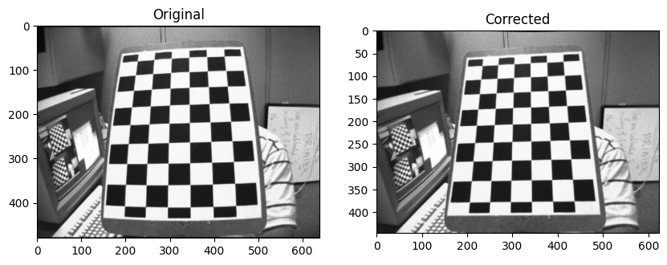
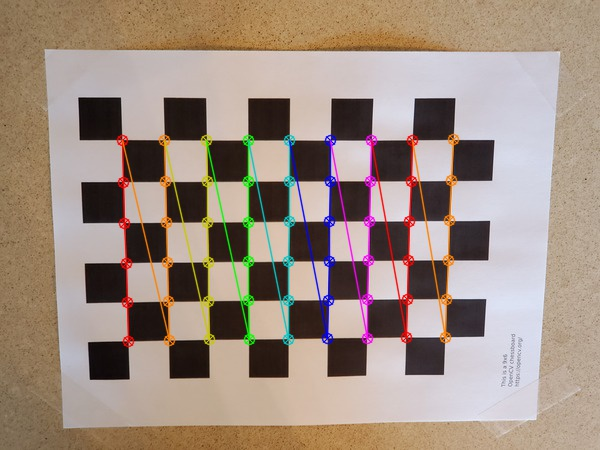

### CV2 Camera Calibration


Calibration resaults:

### SIC RP2 CAM calibration:

```
ros2 run camera_calibration cameracalibrator   --size=9x6   --square=0.063   --approximate=0.3   --no-service-check   --ros-args --remap /image:=/jetson_front_csi_camera/color/image_raw
```

```
# mono pinhole calibration...

D = [0.1578327214445654, -0.31228448969274547, -0.004277685212480875, -0.0038573507607313805, 0.0]
K = [681.2772836567025, 0.0, 308.08227260269973, 0.0, 678.7950823271467, 176.7595391584504, 0.0, 0.0, 1.0]
R = [1.0, 0.0, 0.0, 0.0, 1.0, 0.0, 0.0, 0.0, 1.0]
P = [695.9062991168455, 0.0, 306.2003672195955, 0.0, 0.0, 694.515625018195, 175.61119399379365, 0.0, 0.0, 0.0, 1.0, 0.0]

# oST version 5.0 parameters
[image]
width
640
height
360
[narrow_stereo]

camera matrix
681.277284 0.000000 308.082273
0.000000 678.795082 176.759539
0.000000 0.000000 1.000000

distortion
0.157833 -0.312284 -0.004278 -0.003857 0.000000

rectification
1.000000 0.000000 0.000000
0.000000 1.000000 0.000000
0.000000 0.000000 1.000000

projection
695.906299 0.000000 306.200367 0.000000
0.000000 694.515625 175.611194 0.000000
0.000000 0.000000 1.000000 0.000000
```
____

### T265 fisheye calibration:

```
ros2 run camera_calibration cameracalibrator --size=9x6 --square=0.063 --approximate=0.3 --no-service-check --ros-args --remap /image:=/T265/fisheye1/image_raw
```

```
# mono fisheye calibration...
D = [-1.279184603802619, 7.004177587070426, 0.06870312612960383, -9.177440127251367]
K = [372.56384901671333, -3.544969729686833, 422.8248561176381, 0.0, 374.9738009281779, 399.3048769653474, 0.0, 0.0, 1.0]
R = [1.0, 0.0, 0.0, 0.0, 1.0, 0.0, 0.0, 0.0, 1.0]
P = [372.56384901671333, -3.544969729686833, 422.8248561176381, 0.0, 0.0, 374.9738009281779, 399.3048769653474, 0.0, 0.0, 0.0, 1.0, 0.0]
# None
# oST version 5.0 parameters

[image]
width
848

height
800

[narrow_stereo]
camera matrix
372.563849 -3.544970 422.824856
0.000000 374.973801 399.304877
0.000000 0.000000 1.000000

distortion
-1.279185 7.004178 0.068703 -9.177440

rectification
1.000000 0.000000 0.000000
0.000000 1.000000 0.000000
0.000000 0.000000 1.000000

projection
372.563849 -3.544970 422.824856 0.000000
0.000000 374.973801 399.304877 0.000000
0.000000 0.000000 1.000000 0.000000
```

_____


### Options:

Start the camera calibration node:

```
ros2 run camera_calibration cameracalibrator --size 7x9 --square 0.02 --ros-args -r image:=/my_camera/image_raw -p camera:=/my_camera
```

```
Camera Name:

-c, --camera_name
        name of the camera to appear in the calibration file

Chessboard Options:

You must specify one or more chessboards as pairs of --size and--square options.

  -p PATTERN, --pattern=PATTERN
                    calibration pattern to detect - 'chessboard','circles', 'acircles','charuco'
  -s SIZE, --size=SIZE
                    chessboard size as NxM, counting interior corners (e.g. a standard chessboard is 7x7)
  -q SQUARE, --square=SQUARE
                    chessboard square size in meters

ROS Communication Options:

 --approximate=APPROXIMATE
                    allow specified slop (in seconds) when pairing images from unsynchronized stereo cameras
 --no-service-check
                    disable check for set_camera_info services at startup

Calibration Optimizer Options:

 --fix-principal-point
                    fix the principal point at the image center
 --fix-aspect-ratio
                    enforce focal lengths (fx, fy) are equal
 --zero-tangent-dist
                    set tangential distortion coefficients (p1, p2) to
                    zero
 -k NUM_COEFFS, --k-coefficients=NUM_COEFFS
                    number of radial distortion coefficients to use (up to
                    6, default 2)
 --disable_calib_cb_fast_check
                    uses the CALIB_CB_FAST_CHECK flag for findChessboardCorners

     This will open a calibration window which highlight the checkerboard.
```    

______


[### https://docs.opencv.org/4.x/da/d0d/tutorial_camera_calibration_pattern.html](https://docs.opencv.org/4.x/dc/dbb/tutorial_py_calibration.html)

https://csundergrad.science.uoit.ca/courses/cv-notes/notebooks/02-camera-calibration.html



https://automaticaddison.com/how-to-perform-camera-calibration-using-opencv/

draw_corners.py
```
import cv2 # Import the OpenCV library to enable computer vision
import numpy as np # Import the NumPy scientific computing library
 
# Author: Addison Sears-Collins
# https://automaticaddison.com
# Description: Detect corners on a chessboard
 
filename = 'chessboard_input1.jpg'
 
# Chessboard dimensions
number_of_squares_X = 10 # Number of chessboard squares along the x-axis
number_of_squares_Y = 7  # Number of chessboard squares along the y-axis
nX = number_of_squares_X - 1 # Number of interior corners along x-axis
nY = number_of_squares_Y - 1 # Number of interior corners along y-axis
 
def main():
     
  # Load an image
  image = cv2.imread(filename)
 
  # Convert the image to grayscale
  gray = cv2.cvtColor(image, cv2.COLOR_BGR2GRAY)  
 
  # Find the corners on the chessboard
  success, corners = cv2.findChessboardCorners(gray, (nY, nX), None)
     
  # If the corners are found by the algorithm, draw them
  if success == True:
 
    # Draw the corners
    cv2.drawChessboardCorners(image, (nY, nX), corners, success)
 
    # Create the output file name by removing the '.jpg' part
    size = len(filename)
    new_filename = filename[:size - 4]
    new_filename = new_filename + '_drawn_corners.jpg'     
     
    # Save the new image in the working directory
    cv2.imwrite(new_filename, image)
 
    # Display the image 
    cv2.imshow("Image", image) 
     
    # Display the window until any key is pressed
    cv2.waitKey(0) 
     
    # Close all windows
    cv2.destroyAllWindows() 
     
main()
```

Run the code.

Here is the output:




camera_calibration.py
```
# Author: Addison Sears-Collins
# https://automaticaddison.com
# Description: Perform camera calibration using a chessboard.
 
import cv2 # Import the OpenCV library to enable computer vision
import numpy as np # Import the NumPy scientific computing library
import glob # Used to get retrieve files that have a specified pattern
 
# Path to the image that you want to undistort
distorted_img_filename = 'distorted/chessboard_input12.jpg'
 
# Chessboard dimensions
number_of_squares_X = 10 # Number of chessboard squares along the x-axis
number_of_squares_Y = 7  # Number of chessboard squares along the y-axis
nX = number_of_squares_X - 1 # Number of interior corners along x-axis
nY = number_of_squares_Y - 1 # Number of interior corners along y-axis
square_size = 0.023 # Length of the side of a square in meters
 
# Store vectors of 3D points for all chessboard images (world coordinate frame)
object_points = []
 
# Store vectors of 2D points for all chessboard images (camera coordinate frame)
image_points = []
 
# Set termination criteria. We stop either when an accuracy is reached or when
# we have finished a certain number of iterations.
criteria = (cv2.TERM_CRITERIA_EPS + cv2.TERM_CRITERIA_MAX_ITER, 30, 0.001)
 
# Define real world coordinates for points in the 3D coordinate frame
# Object points are (0,0,0), (1,0,0), (2,0,0) ...., (5,8,0)
object_points_3D = np.zeros((nX * nY, 3), np.float32)       
 
# These are the x and y coordinates                                              
object_points_3D[:,:2] = np.mgrid[0:nY, 0:nX].T.reshape(-1, 2) 
 
object_points_3D = object_points_3D * square_size
 
def main():
     
  # Get the file path for images in the current directory
  images = glob.glob('*.jpg')
     
  # Go through each chessboard image, one by one
  for image_file in images:
  
    # Load the image
    image = cv2.imread(image_file)  
 
    # Convert the image to grayscale
    gray = cv2.cvtColor(image, cv2.COLOR_BGR2GRAY)  
 
    # Find the corners on the chessboard
    success, corners = cv2.findChessboardCorners(gray, (nY, nX), None)
     
    # If the corners are found by the algorithm, draw them
    if success == True:
 
      # Append object points
      object_points.append(object_points_3D)
 
      # Find more exact corner pixels       
      corners_2 = cv2.cornerSubPix(gray, corners, (11,11), (-1,-1), criteria)       
       
      # Append image points
      image_points.append(corners_2)
 
      # Draw the corners
      cv2.drawChessboardCorners(image, (nY, nX), corners_2, success)
 
      # Display the image. Used for testing.
      #cv2.imshow("Image", image) 
     
      # Display the window for a short period. Used for testing.
      #cv2.waitKey(200) 
                                                                                                                     
  # Now take a distorted image and undistort it 
  distorted_image = cv2.imread(distorted_img_filename)
 
  # Perform camera calibration to return the camera matrix, distortion coefficients, rotation and translation vectors etc 
  ret, mtx, dist, rvecs, tvecs = cv2.calibrateCamera(object_points, 
                                                    image_points, 
                                                    gray.shape[::-1], 
                                                    None, 
                                                    None)
 
  # Get the dimensions of the image 
  height, width = distorted_image.shape[:2]
     
  # Refine camera matrix
  # Returns optimal camera matrix and a rectangular region of interest
  optimal_camera_matrix, roi = cv2.getOptimalNewCameraMatrix(mtx, dist, 
                                                            (width,height), 
                                                            1, 
                                                            (width,height))
 
  # Undistort the image
  undistorted_image = cv2.undistort(distorted_image, mtx, dist, None, 
                                    optimal_camera_matrix)
   
  # Crop the image. Uncomment these two lines to remove black lines
  # on the edge of the undistorted image.
  #x, y, w, h = roi
  #undistorted_image = undistorted_image[y:y+h, x:x+w]
     
  # Display key parameter outputs of the camera calibration process
  print("Optimal Camera matrix:") 
  print(optimal_camera_matrix) 
 
  print("\n Distortion coefficient:") 
  print(dist) 
   
  print("\n Rotation Vectors:") 
  print(rvecs) 
   
  print("\n Translation Vectors:") 
  print(tvecs) 
 
  # Create the output file name by removing the '.jpg' part
  size = len(distorted_img_filename)
  new_filename = distorted_img_filename[:size - 4]
  new_filename = new_filename + '_undistorted.jpg'
     
  # Save the undistorted image
  cv2.imwrite(new_filename, undistorted_image)
 
  # Close all windows
  cv2.destroyAllWindows() 
     
main()
```

Output:


### Saving Parameters Using Pickle

If you want to save the camera calibration parameters to a file, you can use a package like Pickle to do it. It will encode these parameters into a text file that you can later upload into a program.

The three key parameters you want to make sure to save are mtx, dist, and optimal_camera_matrix.

Assuming you have import pickle at the top of your program, the Python code for saving the parameters to a pickle file would be as follows:

### Save the camera calibration results.
```
calib_result_pickle = {}
calib_result_pickle["mtx"] = mtx
calib_result_pickle["optimal_camera_matrix"] = optimal_camera_matrix
calib_result_pickle["dist"] = dist
calib_result_pickle["rvecs"] = rvecs
calib_result_pickle["tvecs"] = tvecs
pickle.dump(calib_result_pickle, open("camera_calib_pickle.p", "wb" ))
```

Then if at a later time, you wanted to load the parameters into a new program, you would use this code:

```
calib_result_pickle = pickle.load(open("camera_calib_pickle.p", "rb" ))
mtx = calib_result_pickle["mtx"]
optimal_camera_matrix = calib_result_pickle["optimal_camera_matrix"]
dist = calib_result_pickle["dist"]
Then, given an input image or video frame (i.e. distorted_image), we can undistort it using the following lines of code:
```
```
undistorted_image = cv2.undistort(distorted_image, mtx, dist, None, 
                                    optimal_camera_matrix)
```

That’s it for this tutorial. Hope you enjoyed it. Now you know how to calibrate a camera using OpenCV. 

