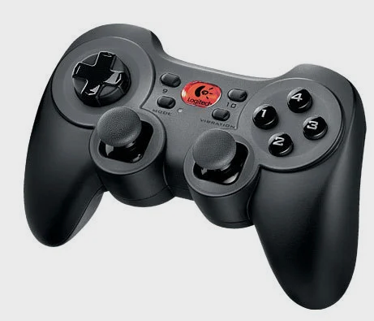
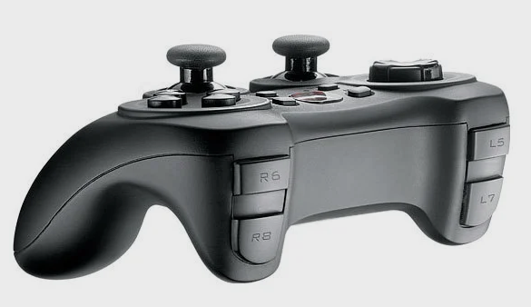
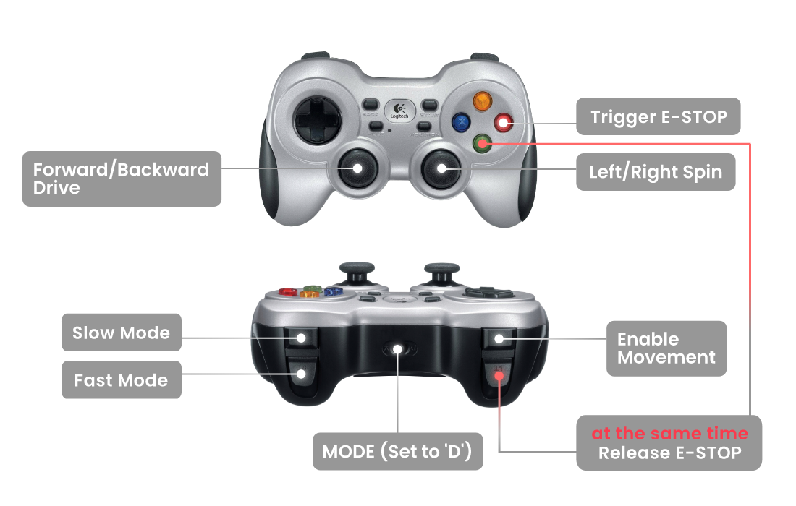

### Logitech Cordless RumblePad 2 driver for ROS2 humble





## Ubuntu PC
```
ls /dev/input/js0
```
```
/dev/input/js0
```

```
sudo dmesg
```
```
...
 2348.847108] usb 1-8: new low-speed USB device number 4 using xhci_hcd
[ 2349.036631] usb 1-8: New USB device found, idVendor=046d, idProduct=c219, bcdDevice= 2.00
[ 2349.036635] usb 1-8: New USB device strings: Mfr=3, Product=1, SerialNumber=0
[ 2349.036637] usb 1-8: Product: Logitech Cordless RumblePad 2
[ 2349.036638] usb 1-8: Manufacturer: Logitech
[ 2349.090665] input: Logitech Logitech Cordless RumblePad 2 as /devices/pci0000:00/0000:00:14.0/usb1/1-8/1-8:1.0/0003:046D:C219.0005/input/input23
[ 2349.090800] logitech 0003:046D:C219.0005: input,hidraw4: USB HID v1.10 Gamepad [Logitech Logitech Cordless RumblePad 2] on usb-0000:00:14.0-8/input0
[ 2349.090805] hid_logitech: Force feedback for Logitech force feedback devices by Johann Deneux <johann.deneux@it.uu.se>
```

```
ros2 run joy joy_enumerate_devices
```
```
ID : GUID                             : GamePad : Mapped : Joystick Device Name
-------------------------------------------------------------------------------
 0 : 030000006d04000019c2000010010000 :    true :   true : Logitech Cordless RumblePad 2
```

RUN:

```
ros2 run joy joy_node
```
```
[INFO] [1743585994.034319024] [joy_node]: Opened joystick: Logitech Cordless RumblePad 2.  deadzone: 0.050000
```
```
ros2 topic echo joy
```
```
header:
  stamp:
    sec: 1743586634
    nanosec: 892524077
  frame_id: joy
axes:
- -0.0257849283516407
- -0.0
- -0.0
- -0.0
- 0.0
- 0.0
buttons:
- 0
- 0
- 0
- 0
- 0
- 0
- 0
- 0
- 0
- 0
- 0
- 0
---
```
_____

### Joy2Twist

Dockerized ROS node allowing control of ROS-powered mobile robots with Logitech F710 gamepad. Joy2Twist node is converting sensor_msgs/Joy message to geometry_msgs/Twist or geometry_msgs/TwistStamped in order to provide velocity commands for the mobile robot. Therefore this package is compliant (but not supported by Husarion) with any other gamepad controller which is able to publish the sensor_msgs/Joy message.

https://github.com/husarion/joy2twist




_________

### Jetson NX
```
sudo dmesg
```
```
...
[ 1480.554675] usb 1-2.3: new low-speed USB device number 6 using tegra-xusb
[ 1480.759887] input: Logitech Logitech Cordless RumblePad 2 as /devices/platform/bus@0/3610000.usb/usb1/1-2/1-2.3/1-2.3:1.0/0003:046D:C219.0002/input/input6
[ 1480.760456] logitech 0003:046D:C219.0002: input,hidraw0: USB HID v1.10 Gamepad [Logitech Logitech Cordless RumblePad 2] on usb-3610000.usb-2.3/input0
[ 1480.795047] logitech: probe of 0003:046D:C219.0002 failed with error -1
```

```
sudo ls -la /dev/input/by-path/
```
```
total 0
drwxr-xr-x 2 root root  80 Jan  1  1970 .
drwxr-xr-x 3 root root 160 Nov 21  2023 ..
lrwxrwxrwx 1 root root   9 Jan  1  1970 platform-3510000.hda-event -> ../event4
lrwxrwxrwx 1 root root   9 Nov 21  2023 platform-gpio-keys-event -> ../event0
```

```
ros2 run joy joy_enumerate_devices
```
```
ID : GUID                             : GamePad : Mapped : Joystick Device Name
-------------------------------------------------------------------------------
```
### FIX:

https://forums.developer.nvidia.com/t/logitech-f710-does-not-show-up-in-dev-input/292637/4

