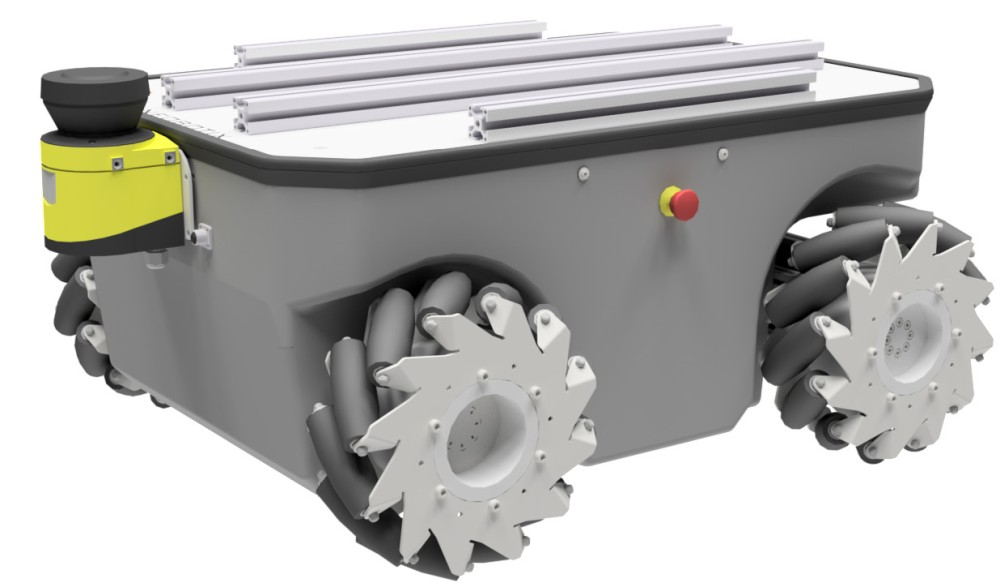
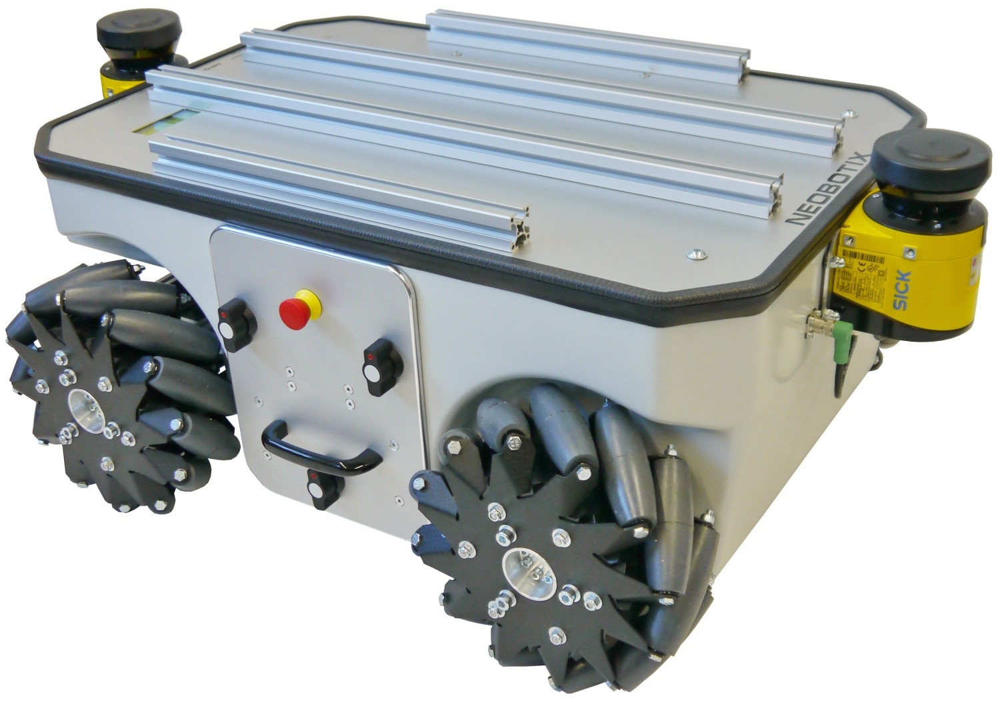
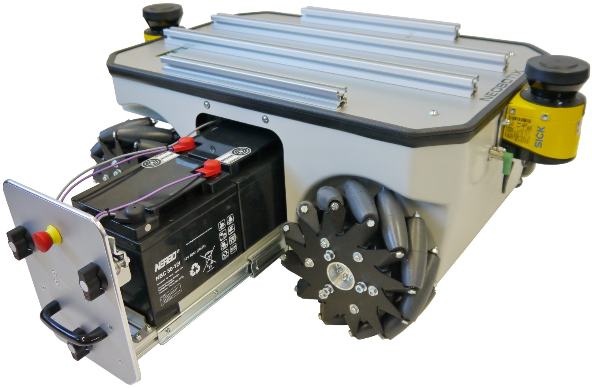
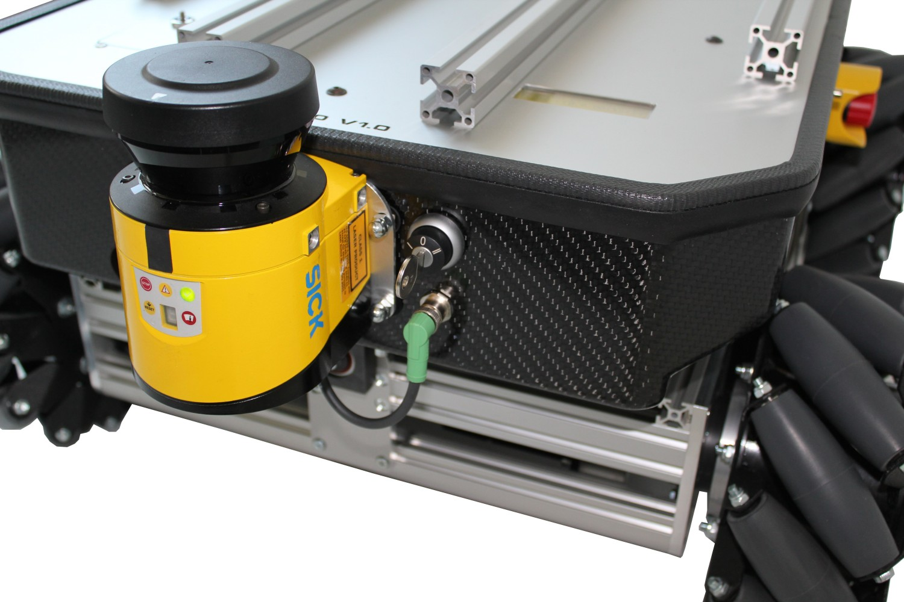
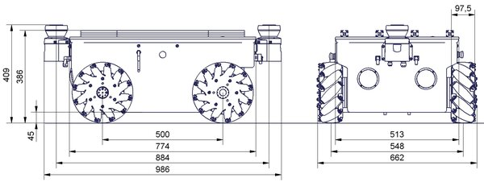

### Neobotix neo_mpo_500-2




### neo_kinematics_mecanum2

https://neobotix-docs.de/ros/packages/neo_kinematics_mecanum2.html#neo-kinematics-mecanum

### Install:

```
git clone -b humble https://github.com/neobotix/neo_mpo_500-2
```

```
git clone -b humble https://github.com/neobotix/neo_kinematics_mecanum2

neo_sick_s300-2
neo_teleop2
neo_kinematics_mecanum2
neo_relayboard_v2-2
neo_srvs2
neo_msgs2
```

### Launch:
```
ros2 launch neo_mpo_500-2 rviz.launch.py

ros2 launch neo_mpo_500-2 bringup.launch.py

ros2 launch neo_mpo_500-2 mapping.launch.py

ros2 launch neo_mpo_500-2 navigation.launch.py

.... "package 'neo_nav2_bringup' not found,
```
______________
### neo_kinematics_mecanum2
```
ros2 launch neo_kinematics_mecanum2 test_setup.launch.py
ros2 topic list
/cmd_vel
/drives/joint_states
/drives/joint_trajectory
/odom
/parameter_events
/rosout
/tf

ros2 topic list -t
/cmd_vel             [geometry_msgs/msg/Twist]
/drives/joint_states [sensor_msgs/msg/JointState]
/drives/joint_trajectory [trajectory_msgs/msg/JointTrajectory]
/odom                 [nav_msgs/msg/Odometry]

```

### T1:
```
## ros2 run turtlebot3_teleop teleop_keyboard --ros-args -r /cmd_vel:=/cmd_vel
ros2 run omni key_teleop
```

### T2:
```
rqt
```

### T3:
```
ros2 launch neo_mpo_500-2 rviz.launch.py
```

### T4:
```
ros2 launch neo_mpo_500-2 bringup.launch.py
```


### T1:
```
ros2 run omni key_teleop
```

### T2:
```
ros2 launch neo_kinematics_mecanum2 test_setup.launch.py
```

### T3:
```
ros2 launch neo_mpo_500-2 demo.launch.py
```

### T3:
```
ros2 launch neo_mpo_500-2 demo.launch.py
```


### neo_mecanum_node

Publishes:

- **/tf (tf2_msgs/msg/TFMessage)**
  - Populates the topic with the transformation of base frame with respect to odom

- **/odom (nav_msgs/msg/odometery)**
  - The odometry topic that publishes the robot’s state information, including position, orientation, and velocity. This topic is typically used for localization and navigation purposes, allowing other nodes to understand the robot’s movement within its environment.

- **/drives/joint_trajectory (trajectory_msg/msg/joint_trajectory)**
  - The joint trajectory topic that publishes commands for the robot’s joints to follow a specified trajectory. This topic is used to control the movements of the robot’s joints by providing a series of waypoints that define the desired positions, velocities over time.
  - Estimated based on the cartesian velocity commands

Subscribes:

- **/cmd_vel (geometry_msgs/msg/TwistStamped)**
  - The velocity command topic that subscribes velocity commands for the robot from the neo_teleop2 node.
  - This topic includes linear and angular velocities that control the robot’s movement in the x, y directions and as well as the rotation.

- **/drives/joint_states (sensor_msgs/msg/JointState)**
  - The joint states topic that subscribes the state information of the robot’s joints from the neo_relayboard_node.
  - This topic contains data such as the position, velocity, and effort of each joint.


_______




