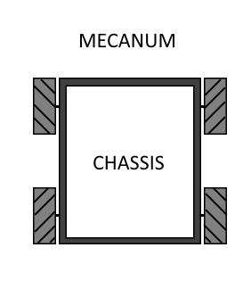
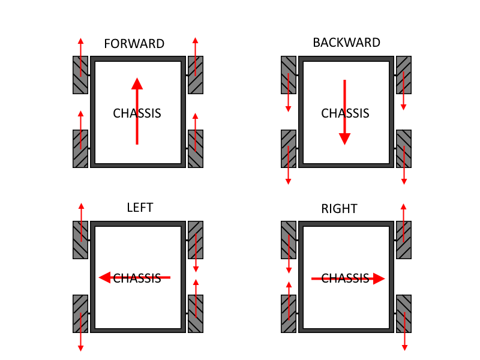
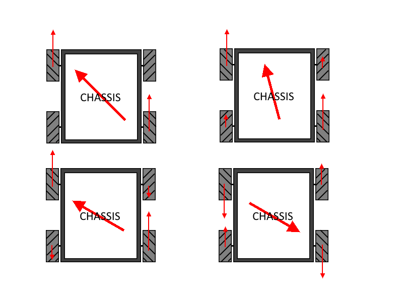
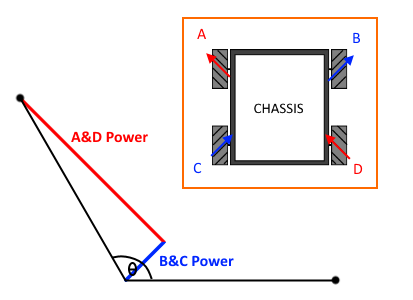
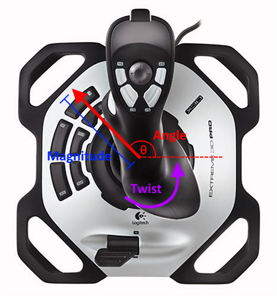
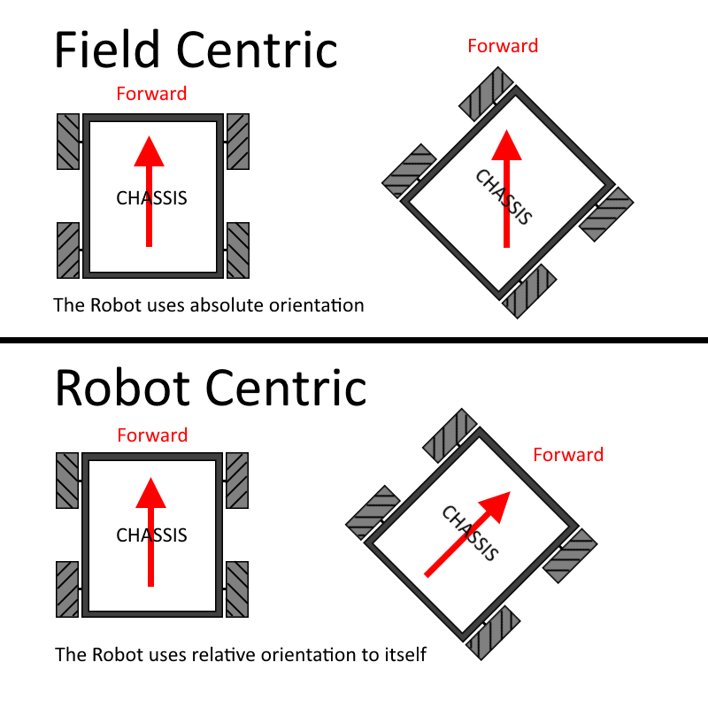

### Mecanum Drive
https://compendium.readthedocs.io/en/latest/tasks/drivetrains/mecanum.html

Mecanum Drive is a type of drive train which uses special wheels called Mecanum wheels, and in which each of the robot’s 4 wheels can rotate independently. The cool thing about Mecanum drive is that, since the wheels are straight but have slanted rollers, the robot can move in any direction.



Since the wheels have slanted rollers, by turning the wheels against each other, the robot can move in any direction. Unlike tank drive, which can only move forwards, move backwards, and turn, a mecanum drive can not only move forward, backward, and turn, but it can also move left, right, or in any angle by modifying the motor power.



This extra ability to strafe gives a robot some more mobility. However, since there are still rollers on every wheel, mecanum drive robots are usually more easily pushed around by other robots, and thus will not excel at defense. Mecanum drive robots also have less pushing power, since the wheels are designed to slip to allow strafing movement.

This type of drive train would be used in a robot where mobility is valued over speed and pushing power.

### Mecanum Drive subsystem

First, create a subsystem class named Drive, as with all drivetrains. In this example, since it’s Mecanum drive, we have 4 motors that turn independently. We also have 4 encoders, one for each wheel (although you only really need one encoder, it may be nice to have more, since mecanum wheels are known to slip easily).

Create the 4 motors and the 4 encoders by declaring them in the class and initializing them in the constructor. Don’t forget to add the Drive subsystem to Robot, as usual.
```
/**
 * Mecanum Drive subsystem
 */
public class Drive extends Subsystem
{
    // Motors
    private static CANTalon LEFT_FRONT_DRIVE_MOTOR;
    private static CANTalon LEFT_BACK_DRIVE_MOTOR;
    private static CANTalon RIGHT_FRONT_DRIVE_MOTOR;
    private static CANTalon RIGHT_BACK_DRIVE_MOTOR;

    // Encoders
    public static Encoder LEFT_FRONT_DRIVE_ENCODER;
    public static Encoder LEFT_BACK_DRIVE_ENCODER;
    public static Encoder RIGHT_FRONT_DRIVE_ENCODER;
    public static Encoder RIGHT_BACK_DRIVE_ENCODER;
    public static MedianPIDSource DRIVE_ENCODERS;

    // Gyro
    public static AHRS DRIVE_GYRO;

    public Drive()
    {
        // Motors
        LEFT_FRONT_DRIVE_MOTOR = new CANTalon(RobotMap.LEFT_FRONT_DRIVE_MOTOR_PIN);
        LEFT_BACK_DRIVE_MOTOR = new CANTalon(RobotMap.LEFT_BACK_DRIVE_MOTOR_PIN);
        RIGHT_FRONT_DRIVE_MOTOR = new CANTalon(RobotMap.RIGHT_FRONT_DRIVE_MOTOR_PIN);
        RIGHT_BACK_DRIVE_MOTOR = new CANTalon(RobotMap.RIGHT_BACK_DRIVE_MOTOR_PIN);

        // Encoders
        LEFT_FRONT_DRIVE_ENCODER = new Encoder(RobotMap.LEFT_FRONT_DRIVE_ENCODER_PIN_A, RobotMap.LEFT_FRONT_DRIVE_ENCODER_ENCODER_PIN_B);
        LEFT_BACK_DRIVE_ENCODER = new Encoder(RobotMap.LEFT_BACK_DRIVE_ENCODER_PIN_A, RobotMap.LEFT_BACK_DRIVE_ENCODER_PIN_B);
        RIGHT_FRONT_DRIVE_ENCODER = new Encoder(RobotMap.RIGHT_FRONT_DRIVE_ENCODER_PIN_A, RobotMap.RIGHT_FRONT_DRIVE_ENCODER_ENCODER_PIN_B);
        RIGHT_BACK_DRIVE_ENCODER = new Encoder(RobotMap.RIGHT_BACK_DRIVE_ENCODER_PIN_A, RobotMap.RIGHT_BACK_DRIVE_ENCODER_PIN_B);
        DRIVE_ENCODERS = new MedianPIDSource(LEFT_FRONT_DRIVE_ENCODER, LEFT_BACK_DRIVE_ENCODER, RIGHT_FRONT_DRIVE_ENCODER, RIGHT_BACK_DRIVE_ENCODER);

        // Gyro
        DRIVE_GYRO = new AHRS(RobotMap.MXP_PORT);
    }

    public void initDefaultCommand()
    {

    }
}
```

When we move using Mecanum drive, there are 2 different things we can do: We can translate (move without turning), and we can turn. So, we need a method that sets the 4 motors using the direction we want to translate, how fast we want to translate, and how fast want to turn.

To write our Mecanum drive method, let’s start with making the robot translate. First, it’s important to notice that we can not only translate front, back, left, and right, but that we can move in any direction. If we want to move forward and left, for example, notice that the front left and back right wheels are all pointing forward and to the left. Set those wheels to full power, and the others to 0. That will cause the robot to go forward and left. In this way, we can use different combinations of wheel power to make the robot move in any direction.



Notice that, in the above graphic, each diagonal pair of wheels (front left and back right, back left and front right) are always set to the same value. This holds for any direction we want to translate in, since each diagonal pair of wheels is facing the same way (as long as we’re only translating, and not turning yet).

Here, it’s important to note that mecanum wheels are slanted at 45°. This means that, when we supply a direction, we can figure out what sum of the mecanum wheel vectors will give us our desired angle.

This image shows can see that all we need to do is break up any angle’s unit vector into two vectors that add up to it, and if we turn the wheels with the correct ratio in power, the robot should move in that direction.



The way to do this is by transforming the angle’s unit vector to the coordinate system that is rotated at -45°. The formula for doing this, for every angle θ is:

```
A&D power = sin(θ)cos(45°) + cos(θ)sin(45°) = (√2 / 2) * (sin(θ) + cos(θ))
B&C power = sin(θ)sin(45°) - cos(θ)cos(45°) = (√2 / 2) * (sin(θ) - cos(θ))
```
This formula was derived simply from the angle addition formulas. Since we’re converting to a coordinate that’s rotated -45° system, an equivalent operation is instead rotating the point 45° using the angle addition formulas.

Now, we know what power to set the wheels when translating, since the above formula gives us a unit vector, so we can simply multiply by the translation power to get the final motor power to use:
```
public static void setMecanumDrive(double translationAngle, double translationPower, double turnPower)
{
    // calculate motor power
    double ADPower = translationPower * Math.sqrt(2) * 0.5 * (Math.sin(translationAngle) + Math.cos(translationAngle));
    double BCPower = translationPower * Math.sqrt(2) * 0.5 * (Math.sin(translationAngle) - Math.cos(translationAngle));

    // set the motors
    LEFT_FRONT_DRIVE_MOTOR.set(ADPower);
    LEFT_BACK_DRIVE_MOTOR.set(BCPower);
    RIGHT_FRONT_DRIVE_MOTOR.set(BCPower);
    RIGHT_BACK_DRIVE_MOTOR.set(ADPower);
}
```
This works for translation, but we also need to factor in turning power.

We want to make it so that if turning power is small, the normal translation is not affected. However, if turning power is large, the turning will start to take more of an effect, causing the left side wheels and right side wheels to turn at different speeds.

One simple way would be to, for example, simply add turningPower to the right wheels and subtract it from the left wheels. However, this is not optimal, since the maximum motor output is 1.0, and you may set one motor over 1.0 with this way of turning, causing the translation angle to be wrong.

Instead, we will keep track of the motor values, and make sure that, if we are going to set a motor’s power over 1.0 or under -1.0, which would affect the translation angle, then we instead scale the other motors down to make sure that doesn’t happen.
```
public static void setMecanumDrive(double translationAngle, double translationPower, double turnPower)
{
    // calculate motor power
    double ADPower = translationPower * Math.sqrt(2) * 0.5 * (Math.sin(translationAngle) + Math.cos(translationAngle));
    double BCPower = translationPower * Math.sqrt(2) * 0.5 * (Math.sin(translationAngle) - Math.cos(translationAngle));

    // check if turning power will interfere with normal translation
    // check ADPower to see if trying to apply turnPower would put motor power over 1.0 or under -1.0
    double turningScale = Math.max(Math.abs(ADPower + turnPower), Math.abs(ADPower - turnPower));
    // check BCPower to see if trying to apply turnPower would put motor power over 1.0 or under -1.0
    turningScale = Math.max(turningScale, Math.max(Math.abs(BCPower + turnPower), Math.abs(BCPower - turnPower)));

    // adjust turn power scale correctly
    if (Math.abs(turningScale) < 1.0)
    {
        turningScale = 1.0;
    }

    // set the motors, and divide them by turningScale to make sure none of them go over the top, which would alter the translation angle
    LEFT_FRONT_DRIVE_MOTOR.set((ADPower - turningScale) / turningScale);
    LEFT_BACK_DRIVE_MOTOR.set((BCPower - turningScale) / turningScale);
    RIGHT_FRONT_DRIVE_MOTOR.set((BCPower + turningScale) / turningScale);
    RIGHT_BACK_DRIVE_MOTOR.set((ADPower + turningScale) / turningScale);
}
```
Now, using this method, we can create a Mecanum drive command. For mecanum drive, we usually use a joystick rather than a controller. In this example, we’ll use one joystick, with the direction it’s pointed at being the translationAngle and the joystick’s magnitude away from the center being the translationPower. Then, using the twist axis, we can get turnPower.



Also, note that there are two modes for a Mecanum drive: Field centric, and Robot centric.



Field centric mode is control from the perspective of the driver. This means that, no matter where the robot is on the field and how it’s turned, if the driver moves the joystick forward, then the robot will go forward from the driver’s perspective. This type of control requires a gyro (which any mecanum drive robot should have).

In Robot centric mode, however, if the robot were turned to the right, then the robot would go rightwards from the driver’s perspective.

In this example, we add in one line of code to the command that makes it field centric. To make it robot centric, simply remove the line.
```
/**
 * Mecanum drive command
 */
public class DriveContinuous extends Command {

    public DriveContinuous()
    {
        // Use requires() here to declare subsystem dependencies
        requires(Robot.drive);
    }

    // Called just before this Command runs the first time
    protected void initialize()
    {

    }

    // Called repeatedly when this Command is scheduled to run
    protected void execute()
    {
        // get joystick input
        double angle = Math.arctan2(OI.driver.getRawAxis(1), OI.driver.getRawAxis(0));
        double magnitude = Math.hypot(OI.driver.getRawAxis(0), OI.driver.getRawAxis(1));
        double twist = OI.driver.getRawAxis(2);

        // use field centric controls by subtracting off the robot angle
        angle -= Drive.DRIVE_GYRO.get();

        Drive.setMecanumDrive(angle, magnitude, twist);
    }

    // Make this return true when this Command no longer needs to run execute()
    protected boolean isFinished()
    {
        return false;
    }

    // Called once after isFinished returns true
    protected void end()
    {
        // sets all drive wheels to 0.0
        Drive.setMecanumDrive(0.0, 0.0, 0.0);
    }

    // Called when another command which requires one or more of the same
    // subsystems is scheduled to run
    protected void interrupted()
    {
        end();
    }
}
```
Now, just don’t forget to make DriveContinuous the default command:
```
public void initDefaultCommand()
{
    setDefaultCommand(new DriveContinuous());
}
```
And that’s all there is to Mecanum drive! of course, it is possible to add PID controllers to make sure the robot holds its angle and other enhancements, but now that there is a setMecanumDrive method, these improvements should be fairly easy, since you can make custom PID Outputs that call setMecanumDrive.
