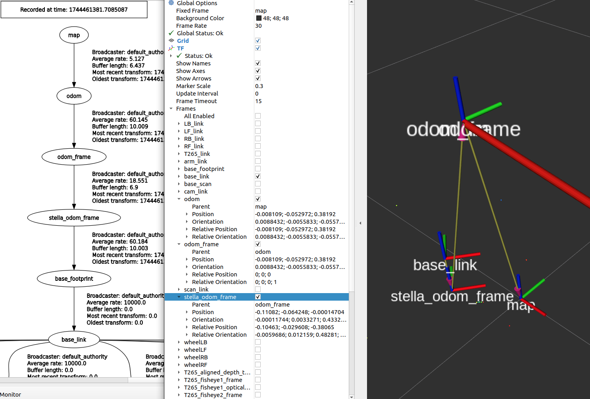
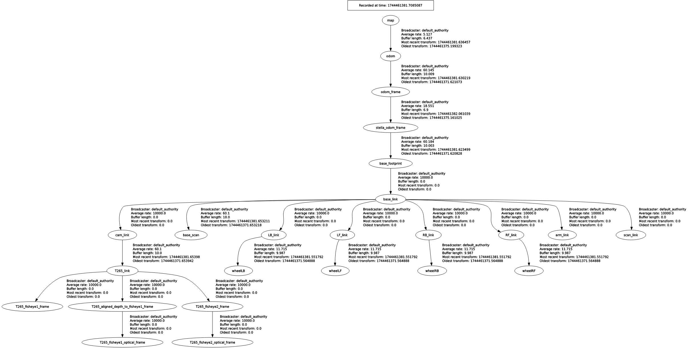
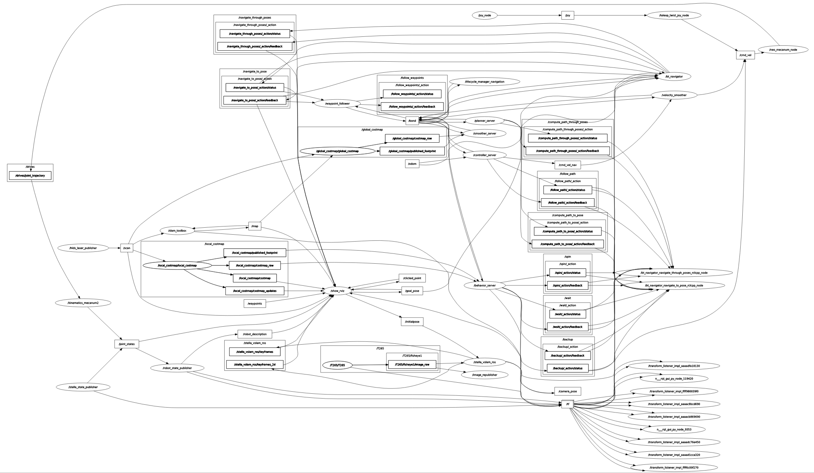

### Setup:

Stella_vslam_ros launch file:

~/ros2_ws/src/stella_vslam_ros/launch/slam.launch
```
<?xml version="1.0"?>
<launch>
    <node name="stella_vslam_ros" pkg="stella_vslam_ros" exec="run_slam" 
        args="--viewer none -v /home/silenzio/lib/stella_vslam/vocab/orb_vocab.fbow \
        -c /home/silenzio/lib/stella_vslam/example/tum_vi/T265_mono.yaml \
        -map-db /home/silenzio/ros2_ws/src/omni/map/stella_vslam/map.msg \
        --ros-args -p use_sim_time:=false \
        --ros-args -p publish_tf:=true \
        --ros-args -p odom_frame:=stella_odom_frame \
        --ros-args -p camera_frame:=stella_camera_frame \
        --ros-args -p map_frame:=odom_frame
        " output="screen">
     <remap from="/camera/image_raw" to="/T265/fisheye1/image_raw"/>
     <remap from="/stella_vslam_ros/camera_pose" to="/camera_pose"/>
    </node>
</launch>
```

### Omni robot launch file:

/home/silenzio/ros2_ws/src/omni/launch/stella_slam.launch.py
```
...
            od3 = TransformStamped()
            od3.header.frame_id = 'odom'
            od3.child_frame_id = 'odom_frame'

            od2 = TransformStamped()
            od2.header.frame_id = 'stella_odom_frame' 
            od2.child_frame_id = 'base_footprint' 

            od1 = TransformStamped()
            od1.header.frame_id = 'cam_link'
            od1.child_frame_id = 'T265_link'
            
            #od4 = TransformStamped()
            #od4.header.frame_id = 'cam_link'
            #od4.child_frame_id = 'L515_link'

            od0 = TransformStamped()
            od0.header.frame_id = 'base_link' #was 'scan_link'
            od0.child_frame_id = 'base_scan' #was 'laser'
...

        try:
            while rclpy.ok():
                rclpy.spin_once(self)                
                now = self.get_clock().now()
                    od0.header.stamp = self.get_clock().now().to_msg()
                    od0.transform.rotation = euler_to_quaternion( 0.0, 0.0, pi/2.0 )  
                    self.broadcaster.sendTransform(od0)

                    od1.header.stamp = self.get_clock().now().to_msg()
                    od1.transform.rotation = euler_to_quaternion( 0.0, 0.0, pi+(pi/2.0) )
                    self.broadcaster.sendTransform(od1)

                    od2.header.stamp = self.get_clock().now().to_msg()
                    self.broadcaster.sendTransform(od2)

                    od3.header.stamp = self.get_clock().now().to_msg()
                    ## od3.transform.rotation = euler_to_quaternion( 0.0, 0.0, pi/2.0 )
                    self.broadcaster.sendTransform(od3)

                    #od4.header.stamp = self.get_clock().now().to_msg()
                    #self.broadcaster.sendTransform(od4)

                # This will adjust as needed per iteration
                loop_rate.sleep()
```

_______
### Run:

UbuntuPC:
T0:
```
ros2 launch teleop_twist_joy teleop-launch.py
```

Jetson NX:
T0:
```
01_ROS2_T256_L515.sh
```

T1:
```
sudo chmod a+rw /dev/ttyUSB0
```
```
ros2 launch hls_lfcd_lds_driver hlds_laser.launch.py
```

```
03_stella_RVIZ_omni.sh
```
```
04_stella_SLAM.sh
```

T4:
```
ros2 launch nav2_bringup navigation_launch.py map:=~/ros2_ws/my_map.yaml
```

T5:
```
ros2 launch slam_toolbox online_async_launch.py
```

_______

### Graphics:

rqt TF Tree and RVIZ2:



rqt TF Tree 


rqt node Graph



