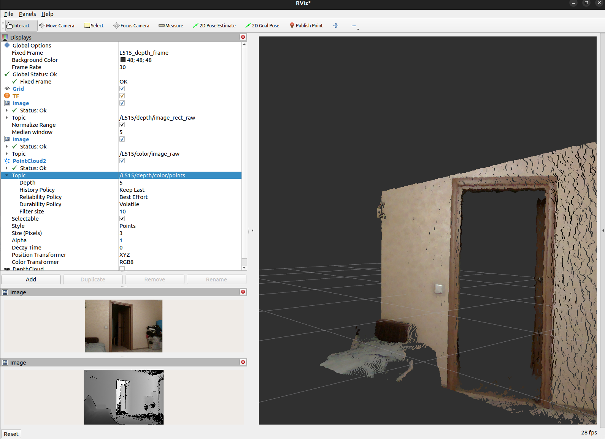
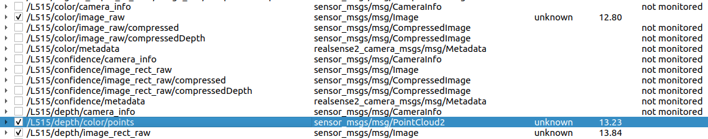

## OctoMap-ROS2

https://github.com/Taeyoung96/OctoMap-ROS2

### Environment setting
- ROS2 humble
- PCL
- Eigen

### Install:

Environment setting
```
sudo apt update

sudo apt install libatlas-base-dev libeigen3-dev libpcl-dev libgoogle-glog-dev libsuitesparse-dev libglew-dev ros-humble-pcl-conversions ros-humble-pcl-ros ros-humble-ament-cmake-auto
```

```
cd ~/ros2_ws/src
git clone https://github.com/Taeyoung96/OctoMap-ROS2.git
```
### Build:


```
colcon build --packages-select octomap_msgs octomap_ros
```
```
source install/setup.bash
```
```
colcon build
```

### Run:
___
```
ros2 launch fast_lio velodyne.launch.py
```
Error:
```
Package 'fast_lio' not found:...
```

```
ros2 launch octomap_server octomap_mapping.launch.xml

[INFO] [launch]: All log files can be found below /home/silenzio/.ros/log/2025-04-13-19-09-58-032111-jetsonnx-87161
[INFO] [launch]: Default logging verbosity is set to INFO
[INFO] [octomap_server_node-1]: process started with pid [87186]
[octomap_server_node-1] [INFO] [1744560598.479580164] [octomap_server]: Publishing latched (single publish will take longer, all topics are prepared)
[octomap_server_node-1] [WARN] [1744560598.495300750] [octomap_server]: Nothing to publish, octree is empty
[octomap_server_node-1] [WARN] [1744560598.495430163] [octomap_server]: Could not open file
```


You need to run the 3D Mapping package (ex. FAST_LIO_ROS2) at the same time.

On the FAST-LIO2 terminal,
```
ros2 launch fast_lio velodyne.launch.py
```
For this docker container,

``` 
ros2 launch octomap_server octomap_mapping.launch.xml
```

Map save
```
ros2 run nav2_map_server map_saver_cli -f ~/ros2_ws/src/ --ros-args --remap map:=/projected_map
```

_____________


### Install image_pipeline:
[https://github.com/ros-perception/image_pipeline/tree/humble](https://github.com/ros-perception/image_pipeline/tree/humble)

To convert L515 RGBD data to PointCloud2

```
cd ~/ros2_ws/src

git clone -b humble https://github.com/ros-perception/image_pipeline
```
```
colcon build --packages-select depth_image_proc
```
```
source install/setup.bash
```

### Run:
point_cloud_xyz_node

T0:
01_ROS2_T256_L515.sh
```
# cd /foxy/t265_l515_v4_0_4_ws
# . install/local_setup.bash
# export CYCLONEDDS_URI=/.ros/cyclonedds_foxy.xml
# ros2 launch realsense2_camera rs_launch.py rgb_camera.profile:=640x480x30
```

T1:
```
ros2 run depth_image_proc point_cloud_xyz_node --ros-args -r /camera_info:=/camera/depth/camera_info
```

T2:
```
ros2 run image_transport republish raw in:=/camera/depth/image_rect_raw raw out:=/image_rect
```

### Work:


### Run:
point_cloud_xyzrgb_node

T0:
01_ROS2_T256_L515.sh
```
# cd /foxy/t265_l515_v4_0_4_ws
# . install/local_setup.bash
# export CYCLONEDDS_URI=/.ros/cyclonedds_foxy.xml
# ros2 launch realsense2_camera rs_launch.py rgb_camera.profile:=640x480x30
```

T1:
```
ros2 run depth_image_proc point_cloud_xyzrgb_node --ros-args -r /camera_info:=/camera/depth/camera_info -r /rgb/camera_info:=/camera/color/camera_info
```

T2:
```
ros2 run image_transport republish raw in:=/camera/depth/image_rect_raw raw out:=/depth_registered/image_rect
```

T2:
```
ros2 run image_transport republish raw in:=/camera/color/image_raw raw out:=/rgb/image_rect_color
```

### Work:


_____________


### Run:
PointCloud2

T0:
01_ROS2_T256_L515.sh
```
# cd /foxy/t265_l515_v4_0_4_ws
# . install/local_setup.bash
# export CYCLONEDDS_URI=/.ros/cyclonedds_foxy.xml
# ros2 launch realsense2_camera rs_launch.py rgb_camera.profile:=640x480x30 camera_name:=L515
```

T1:
```
rviz2
```

### Work:



</br>




rs_launch.py:
```
...
configurable_parameters = [{'name': 'camera_name',                  'default': 'camera', 'description': 'camera unique name'},
                           {'name': 'serial_no',                    'default': "''", 'description': 'choose device by serial number'},
                           {'name': 'usb_port_id',                  'default': "''", 'description': 'choose device by usb port id'},
                           {'name': 'device_type',                  'default': "''", 'description': 'choose device by type'},
                           {'name': 'config_file',                  'default': "''", 'description': 'yaml config file'},
                           {'name': 'unite_imu_method',             'default': "1", 'description': '[0-None, 1-copy, 2-linear_interpolation]'},
                           {'name': 'json_file_path',               'default': "''", 'description': 'allows advanced configuration'},
                           {'name': 'log_level',                    'default': 'info', 'description': 'debug log level [DEBUG|INFO|WARN|ERROR|FATAL]'},
                           {'name': 'output',                       'default': 'screen', 'description': 'pipe node output [screen|log]'},
                           {'name': 'depth_module.profile',         'default': '640x480x30', 'description': 'depth module profile'},                           
                           {'name': 'enable_depth',                 'default': 'true', 'description': 'enable depth stream'},
                           {'name': 'rgb_camera.profile',           'default': '640x480x30', 'description': 'color image width'},
                           {'name': 'enable_color',                 'default': 'true', 'description': 'enable color stream'},
                           {'name': 'enable_infra1',                'default': 'false', 'description': 'enable infra1 stream'},
                           {'name': 'enable_infra2',                'default': 'false', 'description': 'enable infra2 stream'},
                           {'name': 'infra_rgb',                    'default': 'false', 'description': 'enable infra2 stream'},
                           {'name': 'tracking_module.profile',      'default': '0,0,0', 'description': 'fisheye width'},
                           {'name': 'enable_fisheye1',              'default': 'true', 'description': 'enable fisheye1 stream'},
                           {'name': 'enable_fisheye2',              'default': 'true', 'description': 'enable fisheye2 stream'},
                           {'name': 'enable_confidence',            'default': 'true', 'description': 'enable depth stream'},
                           {'name': 'gyro_fps',                     'default': '0', 'description': "''"},                           
                           {'name': 'accel_fps',                    'default': '0', 'description': "''"},                           
                           {'name': 'enable_gyro',                  'default': 'true', 'description': "''"},                           
                           {'name': 'enable_accel',                 'default': 'true', 'description': "''"},                           
                           {'name': 'enable_pose',                  'default': 'false', 'description': "''"},                           
                           {'name': 'pose_fps',                     'default': '200', 'description': "''"},                           
                           {'name': 'pointcloud.enable',            'default': 'true', 'description': ''}, 
                           {'name': 'pointcloud.stream_filter',     'default': '2', 'description': 'texture stream for pointcloud'},
                           {'name': 'pointcloud.stream_index_filter','default': '0', 'description': 'texture stream index for pointcloud'},
                           {'name': 'enable_sync',                  'default': 'true', 'description': "''"},                           
                           {'name': 'align_depth.enable',           'default': 'true', 'description': "''"},                           
                           {'name': 'clip_distance',                'default': '-2.', 'description': "''"},                           
                           {'name': 'linear_accel_cov',             'default': '0.01', 'description': "''"},                           
                           {'name': 'initial_reset',                'default': 'false', 'description': "''"},                           
                           {'name': 'allow_no_texture_points',      'default': 'false', 'description': "''"},                           
                           {'name': 'ordered_pc',                   'default': 'false', 'description': ''},
                           {'name': 'calib_odom_file',              'default': "''", 'description': "''"},
                           {'name': 'topic_odom_in',                'default': "'odom'", 'description': 'topic for T265 wheel odometry'},
                           {'name': 'tf_publish_rate',              'default': '0.0', 'description': 'Rate of publishing static_tf'},
                           {'name': 'diagnostics_period',           'default': '0.0', 'description': 'Rate of publishing diagnostics. 0=Disabled'},
                           {'name': 'decimation_filter.enable',     'default': 'false', 'description': 'Rate of publishing static_tf'},
                           {'name': 'rosbag_filename',              'default': "''", 'description': 'A realsense bagfile to run from as a device'},
                           {'name': 'depth_module.exposure.1',     'default': '7500', 'description': 'Initial value for hdr_merge filter'},
                           {'name': 'depth_module.gain.1',         'default': '16', 'description': 'Initial value for hdr_merge filter'},
                           {'name': 'depth_module.exposure.2',     'default': '1', 'description': 'Initial value for hdr_merge filter'},
                           {'name': 'depth_module.gain.2',         'default': '16', 'description': 'Initial value for hdr_merge filter'},
                           {'name': 'wait_for_device_timeout',      'default': '-1.', 'description': 'Timeout for waiting for device to connect (Seconds)'},
                           {'name': 'reconnect_timeout',            'default': '6.', 'description': 'Timeout(seconds) between consequtive reconnection attempts'},
                          ]
...
```
