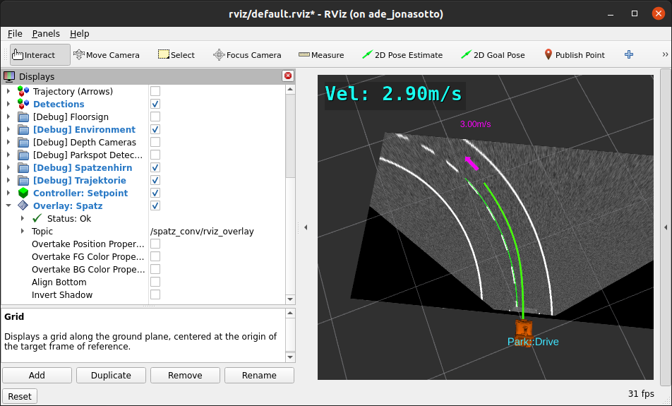
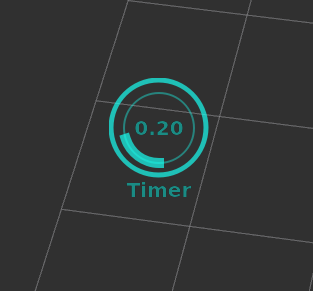

- [JetsonOrin NX](JetsonOrinNX16Gb/README.md)<br/>
- [UbuntuPC](UbuntuPC)<br/>
- [DDSConfig](#ddsconfig)<br/>
- [teleop_keyboard](#turtlebot3-turtlebot3-teleop-teleop-keyboard)<br/>
- [rviz_2d_overlay_plugins](#rviz-2d-overlay-plugins)<br/>

## ROS2 command:
```
nano ~/.bashrc
source ~/.bashrc

echo $ROS_DISTRO
echo $ROS_DOMAIN_ID

source /opt/ros/$ROS_DISTRO/setup.bash
source /opt/ros/humble/setup.bash
cd ~/ros2_ws && source install/setup.bash

colcon_cd

colcon build

colcon build --packages-select omni

ros2 run ... ...

ros2 launch ... ...

rqt_graph

ros2 topic list
ros2 topic list -t

ros2 topic info /cmd_vel -v

ros2 topic echo odom --no-arr

ros2 topic echo /L515/depth/color/points --flow-style

ros2 topic echo /L515/depth/color/points --field header.stamp.sec

ros2 run tf2_tools view_frames

ros2 topic hz /camera/color/image_raw

ros2 topic pub /say_text std_msgs/String "{data: 'Hello world'}"

just once:
ros2 topic pub /say_text std_msgs/String "{data: 'Hello world'}" -1

ros2 doctor --report | grep middleware

ros2 pkg executables pcl_ros
pcl_ros filter_crop_box_node
pcl_ros filter_extract_indices_node
pcl_ros filter_passthrough_node
pcl_ros filter_project_inliers_node
...


## PACKAGES:

## Lidar lfcd_lds:
sudo chmod a+rw /dev/ttyUSB0
ros2 launch hls_lfcd_lds_driver hlds_laser.launch.py

## Turtlebot3 teleop:

ros2 run turtlebot3_teleop teleop_keyboard

## REMAP:
##ros2 run demo_nodes_cpp listener --ros-args --remap /chatter:=/alt_chatter

--ros-args --remap /odom:=/T265/pose/sample 

## Publisher:
ros2 run tf2_ros static_transform_publisher 0 0 0 0 0 0 1 base_link camera_link
ros2 run tf2_ros static_transform_publisher 0.1 0 0.2 0 0 0 base_link base_laser


ros2 run tf2_ros tf2_echo base_link base_laser

At time 0.0
- Translation: [0.100, 0.000, 0.200]
- Rotation: in Quaternion [0.000, 0.000, 0.000, 1.000]

ros2 run py_pubsub publisher_member_function
ros2 run py_pubsub subscriber_member_function

ros2 run csi_cam_opencv impub
ros2 run csi_cam_opencv imsubs

sudo apt install ros-${ROS_DISTRO}-rqt*
rqt
ros2 run <plugin_name> <plugin_name>  # i.e. ros2 run rqt_graph rqt_graph
ros2 run rqt_console rqt_console
ros2 run rqt_reconfigure rqt_reconfigure
ros2 run rqt_image_view rqt_image_view
ros2 run rqt_graph rqt_graph
ros2 run rqt_tf_tree rqt_tf_tree
ros2 run rqt_joint_trajectory_controller rqt_joint_trajectory_controller

sudo apt install ros-humble-moveit
sudo apt install ros-$ROS_DISTRO-perception-pcl
sudo apt install ros-humble-pcl-conversions ros-humble-pcl-ros
sudo apt install ros-humble-octomap-rviz-plugins

```


### create:
```
cd ~/ros2_ws/src
ros2 pkg create --build-type ament_python my_package --node-name my_node
```

### build:
```
cd ~/ros2_ws
colcon build --packages-select my_package
source install/setup.bash
```

### run:
```
ros2 run my_package my_node
```

_________________


Install on Ubuntu PC:

```
cd ~/ros2_ws/src
git clone -b ros2 https://github.com/OctoMap/octomap_rviz_plugins
cd ..
colcon build --packages-select octomap_rviz_plugins
```

______

### 1. Building specific packages 📦
Instead of trying to build the non-existent openarm_ros2 meta-package, build each of the actual packages individually:

```
colcon build --packages-select openarm_bringup openarm_bimanual_moveit_config openarm_hardware
```

Or build them together with their dependencies:

```
colcon build --packages-up-to openarm_bringup openarm_bimanual_moveit_config openarm_hardware openarm_mujoco_hardware --symlink-install
```

The --packages-up-to flag will build the specified packages and all their dependencies, but not other packages in the workspace.

### 2. Using overlay

You can create an overlay for an existing workspace:

Create a new workspace for openarm_ros2:

```
mkdir -p ~/openarm_ws/src
cd ~/openarm_ws/src
git clone https://github.com/enactic/openarm_ros2
cd ~/openarm_ws
```

Build the project in the new workspace:
```
colcon build --symlink-install
```

In your main workspace (~/ros2_ws), overlay the built project:
```
cd ~/ros2_ws
source ~/openarm_ws/install/setup.bash
```

Now you can use packages from openarm_ros2 along with your existing packages.


_______
By the way, if you want to see the available arguments you can pass to the launch file from the terminal window, type:
```
ros2 launch -s basic_mobile_robot basic_mobile_bot_v1.launch.py
Arguments (pass arguments as '<name>:=<value>'):
    'model':
        Absolute path to robot urdf file
        (default: '/home/silenzio/ros2_ws/install/basic_mobile_robot/share/basic_mobile_robot/models/basic_mobile_bot_v1.urdf')
    'rviz_config_file':
        Full path to the RVIZ config file to use
        (default: '/home/silenzio/ros2_ws/install/basic_mobile_robot/share/basic_mobile_robot/rviz/urdf_config.rviz')
    'gui':
        Flag to enable joint_state_publisher_gui
        (default: 'True')
    'use_robot_state_pub':
        Whether to start the robot state publisher
        (default: 'True')
    'use_rviz':
        Whether to start RVIZ
        (default: 'True')
    'use_sim_time':
        Use simulation (Gazebo) clock if true
        (default: 'True')
```

If we want to see the coordinate transformation from one link to another, we can type the following command. For example, what is the position and orientation of the front caster wheel relative to the base_link of the robot?

The syntax is:
```
ros2 run tf2_ros tf2_echo <parent frame> <child frame>
```
We open a terminal window, and type:
```
ros2 run tf2_ros tf2_echo base_link front_caster
```
Here is the output. With respect to the base_link reference frame, the front caster wheel is located at (x=0.217 meters, y=0 meters, and z=-0.1 meters).
```
At time 0.0
- Translation: [0.217, 0.000, -0.100]
- Rotation: in Quaternion [0.000, 0.000, 0.000, 1.000]
- Rotation: in RPY (radian) [0.000, -0.000, 0.000]
- Rotation: in RPY (degree) [0.000, -0.000, 0.000]
- Matrix:
  1.000  0.000  0.000  0.217
  0.000  1.000  0.000  0.000
  0.000  0.000  1.000 -0.100
  0.000  0.000  0.000  1.000
```

__________

## Ubuntu PC ROS2 humble info:
```
dpkg -s ros-humble-ros2cli
Package: ros-humble-ros2cli
Status: install ok installed
Priority: optional
Section: misc
Installed-Size: 205
Maintainer: Aditya Pande <aditya.pande@openrobotics.org>
Architecture: amd64
Version: 0.18.11-1jammy.20241128.015950
Depends: python3-argcomplete, python3-importlib-metadata, python3-netifaces, python3-packaging, python3-pkg-resources, ros-humble-rclpy, ros-humble-ros-workspace
Description: Framework for ROS 2 command line tools.
```
```
ros2 --help
usage: ros2 [-h] [--use-python-default-buffering] Call `ros2 <command> -h` for more detailed usage. ...

ros2 is an extensible command-line tool for ROS 2.

options:
  -h, --help            show this help message and exit
  --use-python-default-buffering
                        Do not force line buffering in stdout and instead use the python default buffering, which might be affected by
                        PYTHONUNBUFFERED/-u and depends on whatever stdout is interactive or not
Commands:
  action     Various action related sub-commands
  bag        Various rosbag related sub-commands
  component  Various component related sub-commands
  control    Various control related sub-commands
  daemon     Various daemon related sub-commands
  doctor     Check ROS setup and other potential issues
  interface  Show information about ROS interfaces
  launch     Run a launch file
  lifecycle  Various lifecycle related sub-commands
  llama      
  multicast  Various multicast related sub-commands
  node       Various node related sub-commands
  param      Various param related sub-commands
  pkg        Various package related sub-commands
  run        Run a package specific executable
  security   Various security related sub-commands
  service    Various service related sub-commands
  test       Run a ROS2 launch test
  topic      Various topic related sub-commands
  wtf        Use `wtf` as alias to `doctor`

  Call `ros2 <command> -h` for more detailed usage.
```
```
ros2 status
usage: ros2 [-h] [--use-python-default-buffering] Call `ros2 <command> -h` for more detailed usage. ...
ros2: error: argument Call `ros2 <command> -h` for more detailed usage.: invalid choice: 'status' (choose from 'action', 'bag', 'component', 'control', 'daemon', 'doctor', 'extension_points', 'extensions', 'interface', 'launch', 'lifecycle', 'llama', 'multicast', 'node', 'param', 'pkg', 'run', 'security', 'service', 'test', 'topic', 'wtf')
```

___________

## Jetson NX ROS2 humble:
```
dpkg -s ros-humble-ros2cli
Package: ros-humble-ros2cli
Status: install ok installed
Priority: optional
Section: misc
Installed-Size: 205
Maintainer: Aditya Pande <aditya.pande@openrobotics.org>
Architecture: arm64
Version: 0.18.12-1jammy.20250326.001744
Depends: python3-argcomplete, python3-importlib-metadata, python3-netifaces, python3-packaging, python3-pkg-resources, ros-humble-rclpy, ros-humble-ros-workspace
Description: Framework for ROS 2 command line tools.
```


__________

### DDSConfig:
- [source link](https://gist.github.com/robosam2003/d5fcfaf4bfd55298d86c1460cb7fc60c)<br/>


# Configuring Cyclone DDS for Wifi + Ethernet connection on an Enterprise Network (for ROS2)

For communication between wifi and ethernet devices, the DDS layer in ROS2 relies on the _multicast_ ability of a given network. 

This is often **disabled** on enterprise networks (at university or work etc) for (I think) security reasons .

To get around this, you have to configure CycloneDDS to comunicate in a **unicast**  manner, and you must specify the local IPs
of all the participants you want to communicate.

_I am using CycloneDDS instead of the default (for ROS2 humble at least) FastDDS, because I ran into lots of issues trying to get topic 
discovery to work properly in a unicast manner._

### ROS2 setup with Cyclone DDS
- Install cyclonedds on your respective ros distro (replace `<ros-distro>` with your ros distribution, e.g. `humble`)
```
sudo apt install ros-$ROS_DISTRO-rmw-cyclonedds-cpp
```
- Switch to cyclone as your ros2 rmw (robot middle ware). I recommend placing this command in your .bashrc, so that it's called every 
time you launch your terminal.
```
export RMW_IMPLEMENTATION=rmw_cyclonedds_cpp
```
- Add an environment variable to the cyclone configuration xml file (again, add this to your .bashrc)
```
export CYCLONEDDS_URI=/path/to/the/xml/profile
```
- Create a cyclone dds congiguration file called `cyclonedds.xml`, that disables multicast, and specifies the (static) IPs of the
devices in the network
```xml
<?xml version="1.0" encoding="UTF-8" ?>
<CycloneDDS xmlns="https://cdds.io/config" xmlns:xsi="http://www.w3.org/2001/XMLSchema-instance" xsi:schemaLocation="https://cdds.io/config https://raw.githubusercontent.com/eclipse-cyclonedds/cyclonedds/master/etc/cyclonedds.xsd">
    <Domain Id="any">
        <General>
            <Interfaces>
                <NetworkInterface autodetermine="true" priority="default" />
            </Interfaces>
            <AllowMulticast>false</AllowMulticast>
            <MaxMessageSize>65500B</MaxMessageSize>
        </General>
        <Discovery>
            <EnableTopicDiscoveryEndpoints>true</EnableTopicDiscoveryEndpoints>
        <ParticipantIndex>auto</ParticipantIndex>
        <MaxAutoParticipantIndex>50</MaxAutoParticipantIndex>
            <Peers>
                <Peer Address="192.30.58.232"/>
                <Peer Address="143.167.46.22"/>
                <Peer Address="143.167.47.43"/>
            </Peers>
        </Discovery>
        <Internal>
            <Watermarks>
                <WhcHigh>500kB</WhcHigh>
            </Watermarks>
        </Internal>
    </Domain>
</CycloneDDS>
```

Now, even on an enterprise network, you can communicate with ROS2 between wifi and ethernet based devices. Enjoy /:) 


_____________


## Ubuntu PC ROS2 humble:
```
nano ~/.ros/cyclonedds.xml
export CYCLONEDDS_URI=~/.ros/cyclonedds.xml
```
```
<?xml version="1.0" encoding="UTF-8" ?>
<CycloneDDS xmlns="https://cdds.io/config" xmlns:xsi="http://www.w3.org/2001/XMLSchema-instance" xsi:schemaLocation="https://cdds.io/config https:>
    <Domain Id="any">
        <General>
            <Interfaces>
                <NetworkInterface autodetermine="true" priority="default" />
            </Interfaces>
            <AllowMulticast>false</AllowMulticast>
            <MaxMessageSize>65500B</MaxMessageSize>
        </General>
        <Discovery>
            <EnableTopicDiscoveryEndpoints>true</EnableTopicDiscoveryEndpoints>
        <ParticipantIndex>auto</ParticipantIndex>
        <MaxAutoParticipantIndex>50</MaxAutoParticipantIndex>
            <Peers>
                <Peer Address="192.168.JN.IP"/>
                <Peer Address="192.168.PC.IP"/>
                <!--Peer Address="172.17.0.1"/-->
            </Peers>
        </Discovery>
        <Internal>
            <Watermarks>
                <WhcHigh>500kB</WhcHigh>
            </Watermarks>
        </Internal>
    </Domain>
</CycloneDDS>

```

## Jetson NX ROS2 humble:
```
nano ~/.ros/cyclonedds.xml
export CYCLONEDDS_URI=~/.ros/cyclonedds.xml
```

```
<?xml version="1.0" encoding="UTF-8" ?>
<CycloneDDS xmlns="https://cdds.io/config" xmlns:xsi="http://www.w3.org/2001/XMLSchema-instance" xsi:schemaLocation="h>
    <Domain Id="any">
        <General>
            <Interfaces>
                <NetworkInterface autodetermine="true" priority="default" />
            </Interfaces>
            <!--NetworkInterfaceAddress>lo</NetworkInterfaceAddress-->
            <AllowMulticast>false</AllowMulticast>
            <MaxMessageSize>65500B</MaxMessageSize>
        </General>
        <Discovery>
            <EnableTopicDiscoveryEndpoints>true</EnableTopicDiscoveryEndpoints>
        <ParticipantIndex>auto</ParticipantIndex>
        <MaxAutoParticipantIndex>50</MaxAutoParticipantIndex>
            <Peers>
                <Peer Address="192.168.PC.IP"/>
                <Peer Address="192.168.JN.IP"/>
                <!--Peer Address="172.17.0.1"/-->
            </Peers>
        </Discovery>
        <Internal>
            <Watermarks>
                <WhcHigh>500kB</WhcHigh>
            </Watermarks>
        </Internal>
    </Domain>
</CycloneDDS>
```

## Jetson NX ROS2 foxy docker:
```
nano ~/.ros/cyclonedds_foxy.xml
export CYCLONEDDS_URI=/.ros/cyclonedds_foxy.xml
```

```
<?xml version="1.0" encoding="UTF-8" ?>
<CycloneDDS xmlns="https://cdds.io/config" xmlns:xsi="http://www.w3.org/2001/XMLSchema-instance" xsi:schemaLoca>
    <Domain Id="any">
        <General>
            <!--Interfaces>
                <NetworkInterface autodetermine="true" priority="default" />
            </Interfaces-->
            <!--NetworkInterfaceAddress>lo</NetworkInterfaceAddress-->
            <AllowMulticast>false</AllowMulticast>
            <MaxMessageSize>65500B</MaxMessageSize>
        </General>
        <Discovery>
                <!--EnableTopicDiscoveryEndpoints>true</EnableTopicDiscoveryEndpoints-->
        <ParticipantIndex>auto</ParticipantIndex>
        <MaxAutoParticipantIndex>50</MaxAutoParticipantIndex>
            <Peers>
                <Peer Address="192.168.PC.IP"/>
                <Peer Address="192.168.JN.IP"/>
                <Peer Address="172.17.0.1"/>
            </Peers>
        </Discovery>
        <Internal>
            <Watermarks>
                <WhcHigh>500kB</WhcHigh>
            </Watermarks>
        </Internal>
    </Domain>

```

### turtlebot3 turtlebot3_teleop teleop_keyboard

teleop_keyboard node cannot be launched from a launch file, including .launch.py. If you try doing that, you will get an error (in Linux) termios.error: (25, 'Inappropriate ioctl for device').
```
silenzio@ubuntuPC:~/ros2_ws$ ros2 launch omni key_teleop.launch.py
[INFO] [launch]: All log files can be found below /home/silenzio/.ros/log/2025-03-31-14-38-16-258718-ubuntuPC-5551
[INFO] [launch]: Default logging verbosity is set to INFO
[INFO] [key_teleop-1]: process started with pid [5552]
[key_teleop-1] Traceback (most recent call last):
[key_teleop-1]   File "/home/silenzio/ros2_ws/install/omni/lib/omni/key_teleop", line 33, in <module>
[key_teleop-1]     sys.exit(load_entry_point('omni==0.0.0', 'console_scripts', 'key_teleop')())
[key_teleop-1]   File "/home/silenzio/ros2_ws/install/omni/lib/python3.10/site-packages/omni/key_teleop.py", line 141, in main
[key_teleop-1]     settings = termios.tcgetattr(sys.stdin)
[key_teleop-1] termios.error: (25, 'Inappropriate ioctl for device')
[ERROR] [key_teleop-1]: process has died [pid 5552, exit code 1, cmd '/home/silenzio/ros2_ws/install/omni/lib/omni/key_teleop --ros-args -r __node:=key_teleop'].
```
The error above because teleop_keyboard.py needs direct access to TTY STDIN device in order to capture keyboard strokes.
### Fix:

```
silenzio@ubuntuPC:~/ros2_ws$ ros2 run omni key_teleop

Control Your TurtleBot3!
---------------------------
Moving around:
        w
   a    s    d
        x

w/x : increase/decrease linear velocity (Burger : ~ 0.22, Waffle and Waffle Pi : ~ 0.26)
a/d : increase/decrease angular velocity (Burger : ~ 2.84, Waffle and Waffle Pi : ~ 1.82)

space key, s : force stop

CTRL-C to quit
```


_______
```
apt-cache showpkg ros-humble-ros2cli

Package: ros-humble-ros2cli
Versions: 
0.18.12-1jammy.20250326.001744 (/var/lib/apt/lists/packages.ros.org_ros2_ubuntu_dists_jammy_main_binary-arm64_Packages) (/var/lib/dpkg/status)
 Description Language: 
                 File: /var/lib/apt/lists/packages.ros.org_ros2_ubuntu_dists_jammy_main_binary-arm64_Packages
                  MD5: 0cc181a105f94f9956a32747924d8891
Reverse Depends: 

ros-humble-fogros2,ros-humble-ros2cli
  ros-humble-topic-tools,ros-humble-ros2cli
  ros-humble-system-fingerprint,ros-humble-ros2cli
  ros-humble-swri-cli-tools,ros-humble-ros2cli
  ros-humble-sros2-cmake,ros-humble-ros2cli
  ros-humble-sros2,ros-humble-ros2cli
  ros-humble-ros2trace-analysis,ros-humble-ros2cli
  ros-humble-ros2trace,ros-humble-ros2cli
  ros-humble-ros2topic,ros-humble-ros2cli
  ros-humble-ros2test,ros-humble-ros2cli
  ros-humble-ros2service,ros-humble-ros2cli
  ros-humble-ros2run,ros-humble-ros2cli
  ros-humble-ros2pkg,ros-humble-ros2cli
  ros-humble-ros2param,ros-humble-ros2cli
  ros-humble-ros2nodl,ros-humble-ros2cli
  ros-humble-ros2node,ros-humble-ros2cli
  ros-humble-ros2multicast,ros-humble-ros2cli
  ros-humble-ros2lifecycle,ros-humble-ros2cli
  ros-humble-ros2launch,ros-humble-ros2cli
  ros-humble-ros2interface,ros-humble-ros2cli
  ros-humble-ros2doctor,ros-humble-ros2cli
  ros-humble-ros2controlcli,ros-humble-ros2cli
  ros-humble-ros2component,ros-humble-ros2cli
  ros-humble-ros2cli-common-extensions,ros-humble-ros2cli
  ros-humble-ros2caret,ros-humble-ros2cli
  ros-humble-ros2bag,ros-humble-ros2cli
  ros-humble-ros2action,ros-humble-ros2cli
  ros-humble-ros2acceleration,ros-humble-ros2cli
  ros-humble-nodl-to-policy,ros-humble-ros2cli
  ros-humble-leo-fw,ros-humble-ros2cli
  ros-humble-lanelet2-examples,ros-humble-ros2cli
```

```
sudo apt install ros-$ROS_DISTRO-ros2topic
sudo apt install ros-$ROS_DISTRO-ros2action
sudo apt install ros-$ROS_DISTRO-ros2component
sudo apt install ros-$ROS_DISTRO-ros2doctor
sudo apt install ros-$ROS_DISTRO-ros2interface
sudo apt install ros-$ROS_DISTRO-ros2lifecycle
sudo apt install ros-$ROS_DISTRO-ros2multicast
sudo apt install ros-$ROS_DISTRO-ros2security
sudo apt install ros-$ROS_DISTRO-ros2test
```

### rviz_2d_overlay_plugins:




Install the plugin:
```
sudo apt install ros-humble-rviz-2d-overlay-plugins
```

Then publish a message: 

this for text overlay: 
https://github.com/teamspatzenhirn/rviz_2d_overlay_plugins/blob/main/rviz_2d_overlay_msgs/msg/OverlayText.msg

this for gauge overlay: 

https://github.com/ros2/common_interfaces/blob/rolling/std_msgs/msg/Float32.msg

then select the topics in rviz

## Use: 
https://github.com/teamspatzenhirn/rviz_2d_overlay_plugins/tree/main/rviz_2d_overlay_plugins#using-a-string-topic

### Alignment and Positioning
To allow easy positioning of the overlay along the edges of the rviz window, and to support multiple/dynamic window sizes, the position is given by offsets from the respective border. Depending on whether the horizontal_alignment is LEFT, RIGHT or CENTER, the horizontal_distance field sets the distance to the left or right border, or the offset from center.

For LEFT and RIGHT alignment, a distance of zero means that the text is aligned to the border without any gap, a positive distance moves the overlay towards the center.

For CENTER alignment, a distance of zero means completely centered, positive values move the overlay towards the bottom right of the window.

TOP and BOTTOM for the vertical alignment work just like LEFT and RIGHT in the horizontal case.


### Using a string topic
A simple coverter node (rviz2d_from_string_node) is provided which can covert std_msgs/msg/String to rviz_2d_overlay_msgs/msg/OverlayText. The working principle is simple, it subscribes to a String topic, publishes the content as an OverlayText and the other proeries can be set from ROS parameters or by overtaking it in RViz2.

A launch file which runs this node and sets the parameters may look something like:

``` py 
from launch import LaunchDescription
from launch_ros.actions import Node

def generate_launch_description():
    return LaunchDescription([
        Node(
            package='rviz_2d_overlay_plugins',
            executable='string_to_overlay_text',
            name='string_to_overlay_text_1',
            output='screen',
            parameters=[
                {"string_topic": "chatter"},
                {"fg_color": "b"}, # colors can be: r,g,b,w,k,p,y (red,green,blue,white,black,pink,yellow)
            ],
        ),
    ])
```

In case a /chatter topic is needed this can be published with a single command:

```
ros2 topic pub /chatter std_msgs/String "data: Hello world"
```


### Circular Gauge Overlay
Screenshot showing the PieChartDisplay, a circular gauge




The PieChartDisplay is a rather boring pie chart, as it only displays a single value. PieChartDisplay and "Circular Gauge" are used synonymously in this package. The gauge allows displaying a - [std_msgs/Float32]( https://github.com/ros2/common_interfaces/blob/rolling/std_msgs/msg/Float32.msg)

Formatting and positioning, as well as setting the maximum value is only possible in the display options inside rviz.
______


### 📝 Создание кастомного сообщения в ROS2

Сначала вам нужно создать пакет для ваших пользовательских интерфейсов в вашей рабочей среде ROS2 (workspace). Это стандартная практика, которая помогает избежать путаницы с зависимостями.

Создайте пакет interfaces. Убедитесь, что вы находитесь в папке src вашего workspace (ros2_ws/src), и выполните команду:
```
ros2 pkg create --build-type ament_cmake my_robot_interfaces
```

Создайте структуру папок. Перейдите в созданный пакет и удалите ненужные папки, создав вместо них msg и srv:
```
cd my_robot_interfaces
rm -rf include src
mkdir msg srv
```

Определите ваше сообщение. В папке msg создайте файл с именем HandMessage.msg и опишите в нем структуру данных, точно как вы указали в своем примере:

```
float32[3] wrist_pos
float32[4] wrist_quat
bool[5] button_state
```
Настройте файлы сборки. Отредактируйте CMakeLists.txt и package.xml, чтобы сообщения правильно генерировались.

В CMakeLists.txt найдите и дополните следующие строки:
```
find_package(rosidl_default_generators REQUIRED)
rosidl_generate_interfaces(${PROJECT_NAME}
  "msg/HandMessage.msg"
)
```

В package.xml добавьте:
```
<buildtool_depend>rosidl_default_generators</buildtool_depend>
<exec_depend>rosidl_default_runtime</exec_depend>
<member_of_group>rosidl_interface_packages</member_of_group>
```

Соберите пакет. Вернитесь в корень вашего workspace (ros2_ws) и выполните:
```
colcon build --packages-select my_robot_interfaces
source install/setup.bash
```

После этого ваше сообщение HandMessage станет доступно в системе ROS2. Проверить это можно командой:
```
cd ~/ros2_ws
ros2 interface show my_robot_interfaces/msg/HandMessage
```

### wokrs
```
float32[3] wrist_pos
float32[4] wrist_quat
bool[5] button_state
```
___


### 🔧 Генерация C# кода для Unity

Теперь, когда сообщение создано в ROS2, его нужно "перенести" в Unity, сгенерировав соответствующий C#-класс. Вам не требуется устанавливать ROS2 на свою Windows-машину — нужны только сами файлы .msg.

Скопируйте файлы сообщений. Перенесите весь пакет my_robot_interfaces (или хотя бы папку my_robot_interfaces/msg с файлом HandMessage.msg) на компьютер с Unity.
Откройте генератор сообщений в Unity. 
В меню Unity Editor выберите Robotics -> Generate ROS Messages....
Укажите путь и сгенерируйте:

В открывшемся окне Message Browser в поле `"ROS message path"` укажите путь к папке, внутри которой лежит ваш пакет my_robot_interfaces. Например, если вы положили его в C:\Messages, то укажите этот путь. Утилита найдет все файлы .msg внутри.

В списке сообщений найдите my_robot_interfaces/msg/HandMessage и отметьте его галочкой.

Нажмите `"Build selected messages"`. C# код будет сгенерирован и помещен в папку Assets вашего Unity-проекта.

💻 Использование сообщения в коде C#
После генерации вы можете использовать ваше кастомное сообщение в скриптах Unity так же, как и стандартные.

```csharp
using UnityEngine;
using Unity.Robotics.ROSTCPConnector;
// Используйте сгенерированное пространство имен
using RosMessageTypes.MsgInterfaces;

public class HandMessagePublisher : MonoBehaviour
{
    ROSConnection ros;

    void Start()
    {
        ros = ROSConnection.GetOrCreateInstance();
        // Зарегистрируйте publisher с вашим кастомным типом
        ros.RegisterPublisher<HandMessageMsg>("hand_topic");
    }

    void Update()
    {
        // Создайте и заполните экземпляр сообщения
        HandMessageMsg message = new HandMessageMsg();
        // Доступ к полям осуществляется через экземпляр сообщения
        message.wrist_pos[0] = 1.0f;
        message.button_state[1] = true;
        // Опубликуйте сообщение
        ros.Publish("hand_topic", message);
    }
}
```

💡 Ключевые моменты для запоминания
Пакет интерфейсов должен быть ament_cmake. В ROS2 создавать кастомные сообщения можно только в CMake-пакетах.

Указывайте путь к папке, содержащей пакеты. При генерации в Unity указывается не путь до самого пакета, а до родительской директории.

Следите за зависимостями. Если ваше сообщение использует типы из других пакетов (например, geometry_msgs/Point), их также нужно добавить в CMakeLists.txt и package.xml и, скорее всего, их .msg файлы тоже должны быть доступны для генерации в Unity.


________

Давайте разберемся, откуда `rosdep` берет информацию и как использовать его точечно.

### Откуда `rosdep update` берет информацию?

`rosdep update` скачивает информацию о зависимостях из **центрального индекса `rosdistro`**, который хранится на GitHub . Вот как это устроено:

1.  **Файлы источников (`sources.list.d`)**:
    При выполнении `sudo rosdep init` создается файл `/etc/ros/rosdep/sources.list.d/20-default.list` . В этом файле прописаны URL-адреса, откуда `rosdep` будет скачивать данные. Обычно это ссылки на YAML-файлы в официальном репозитории `ros/rosdistro` на GitHub :
    *   `base.yaml` — содержит правила для системных зависимостей (для apt) .
    *   `python.yaml` — для Python-зависимостей .
    *   `...` и другие файлы для разных платформ.

2.  **Процесс `rosdep update`**:
    Когда вы запускаете `rosdep update`, программа читает эти файлы источников, скачивает по указанным URL свежие YAML-файлы с правилами и создает на их основе локальный кэш (обычно в `~/.ros/rosdep/sources.cache`) . При последующих вызовах `rosdep install` используется именно этот локальный кэш, чтобы не ходить в интернет каждый раз.

3.  **Сопоставление с `package.xml`**:
    Когда вы затем запускаете `rosdep install`, он смотрит на ключи (зависимости), указанные в `package.xml` вашего пакета (например, `<depend>libserial</depend>`). Затем он ищет эти ключи в своем локальном кэше (скачанном через `rosdep update`) и определяет, какой системный пакет (например, `libserial-dev`) нужно установить через `apt` в вашей конкретной ОС (Ubuntu 22.04) .

### Как запустить `rosdep` только для одного пакета?

Чтобы обработать только один пакет `feetech_ros2_driver`, вам не нужно изменять глобальную команду `rosdep update` (она всегда обновляет общий кэш для всей системы). Вместо этого, вы должны изменить команду **`rosdep install`**, указав ей путь **только к вашему пакету**, а не ко всей папке `src`.

Из корня вашего рабочего пространства (`~/ros2_ws`) выполните:

```bash
rosdep install --from-paths src/feetech_ros2_driver --ignore-src -y
```

**Что означают эти ключи:**
*   `--from-paths src/feetech_ros2_driver` — указывает `rosdep` искать файлы `package.xml` **только** в этой конкретной папке вашего пакета, а не во всей `src` .
*   `--ignore-src` — говорит `rosdep` **игнорировать** зависимости, которые уже есть в папке `src` (то есть те пакеты, которые вы сами скачали в рабочее пространство). Нам это и нужно — мы хотим установить только внешнюю зависимость `libserial` .
*   `-y` — автоматически отвечает "Yes" на все запросы пакетного менеджера (`apt`), чтобы установка прошла без вашего вмешательства .

Эта команда проанализирует `package.xml` пакета `feetech_ros2_driver`, увидит там зависимость `libserial`, найдет в своем кэше (обновленном через `rosdep update`), что для Ubuntu это пакет `libserial-dev`, и установит его через `sudo apt install libserial-dev -y`.

После того как эта команда успешно отработает и установит `libserial-dev`, вы сможете повторить сборку вашего пакета:
```bash
colcon build --packages-select feetech_ros2_driver --cmake-args -DCMAKE_TOOLCHAIN_FILE=~/lib/vcpkg/scripts/buildsystems/vcpkg.cmake -Drange-v3_DIR=/home/silenzio/lib/vcpkg/installed/x64-linux/share/range-v3
```
