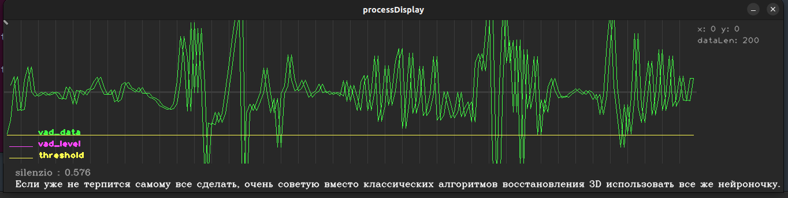
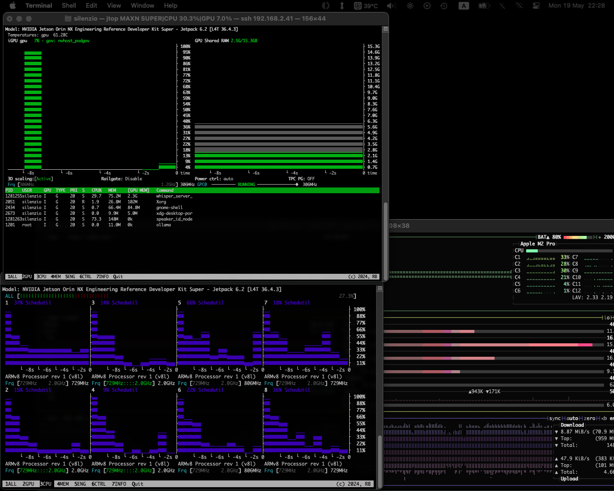
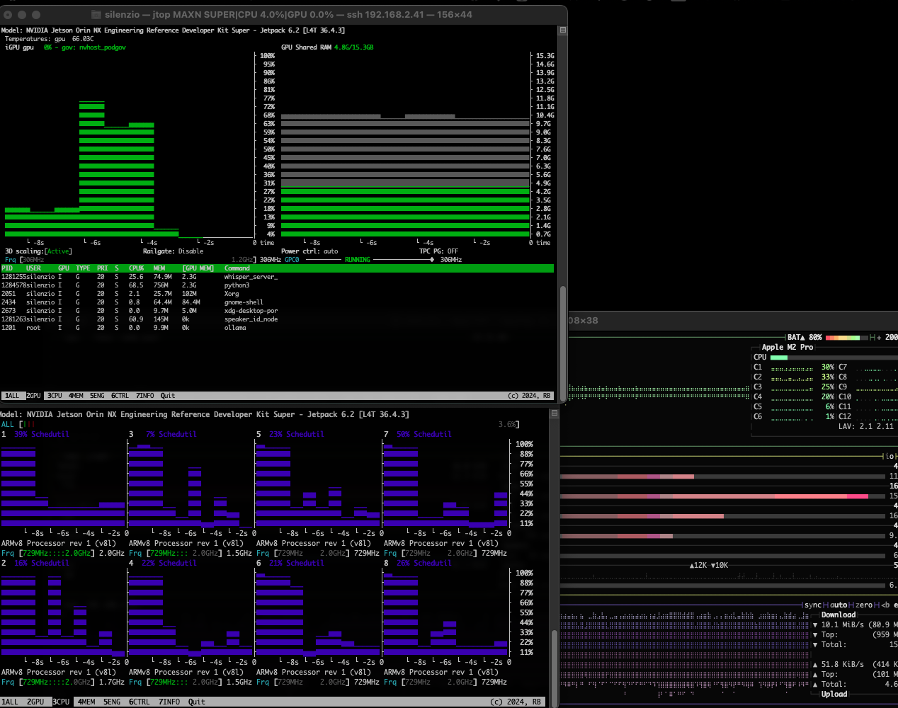
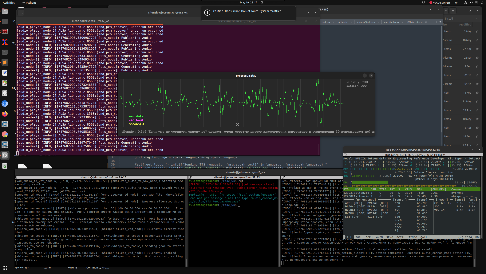

 
## Install ST_LLM_TS

ROS2-nodes audio_capturer → whisper_ros → llama_ros → coqui_tts (in ROS2-node/script) → audio_player_node

### Sound system setup:
```
speaker-test -D sysdefault:CARD=S3 -c 2
```
```
speaker-test 1.2.6

Playback device is sysdefault:CARD=S3

Stream parameters are 48000Hz, S16_LE, 2 channels
Using 16 octaves of pink noise
Rate set to 48000Hz (requested 48000Hz)
Buffer size range from 2048 to 16384
Period size range from 1024 to 1024
Using max buffer size 16384
Periods = 4
was set period_size = 1024
was set buffer_size = 16384
 0 - Front Left
 1 - Front Right
Time per period = 5.640342 
 0 - Front Left
 1 - Front Right
...
Control+C
```

```
sudo apt install pulseaudio pavucontrol
pulseaudio --start
```

```
aplay -L | grep -E "sysdefault|hw|default"
sysdefault
default
hw:CARD=S3,DEV=0
plughw:CARD=S3,DEV=0
sysdefault:CARD=S3
```
```
sudo nano ~/.asoundrc:
```

```
pcm.!default {
    type plug
    slave.pcm "hw:CARD=S3,DEV=0"  # your device from >aplay -L | grep -E "sysdefault|hw|default"<
}
```
_________
### Set USB Sound_Blaster_Play__3 as default Input Device and Output Device:

> Output Device: Speakers - Sound Blaster Play! 3

> Input Device: Microphone - Sound Blaster Play! 3


###  Test pulseaudio service:
```
systemctl --user status pulseaudio
```
###  If not active, restart:
```
systemctl --user restart pulseaudio
```


```
pactl list short sinks
1	alsa_output.platform-sound.analog-stereo	module-alsa-card.c	s16le 2ch 44100Hz	SUSPENDED
2	alsa_output.usb-Creative_Technology_Ltd_Sound_Blaster_Play__3_YDSB1730148001584Q-00.iec958-stereo	module-alsa-card.c	s16le 2ch 44100Hz	SUSPENDED
```
```
pactl list short sources
1	alsa_input.usb-Creative_Technology_Ltd_Sound_Blaster_Play__3_YDSB1730148001584Q-00.analog-stereo	module-alsa-card.c	s16le 2ch 44100Hz	SUSPENDED
2	alsa_output.platform-sound.analog-stereo.monitor	module-alsa-card.c	s16le 2ch 44100Hz	RUNNING
3	alsa_input.platform-sound.analog-stereo	module-alsa-card.c	s16le 2ch 44100Hz	RUNNING
4	alsa_output.usb-Creative_Technology_Ltd_Sound_Blaster_Play__3_YDSB1730148001584Q-00.iec958-stereo.monitor	module-alsa-card.c	s16le 2ch 48000Hz	SUSPENDED
```

```
sudo nano /usr/local/bin/set_default_audio.sh
```

```
#!/bin/bash
sleep 5  # Wait for PulseAudio loading...
pacmd set-default-sink "alsa_output.usb-Creative_Technology_Ltd_Sound_Blaster_Play__3_YDSB1730148001584Q-00.iec958-stereo"
pacmd set-default-source "alsa_input.usb-Creative_Technology_Ltd_Sound_Blaster_Play__3_YDSB1730148001584Q-00.analog-stereo"
```
```
sudo chmod +x /usr/local/bin/set_default_audio.sh
```

```
mkdir -p ~/.config/systemd/user/
nano ~/.config/systemd/user/set_default_audio.service
```
### Create systemd-service:
```
[Unit]
Description=Set Default Audio Devices
After=pulseaudio.service
Requires=pulseaudio.service

[Service]
Type=oneshot
ExecStart=/usr/local/bin/set_default_audio.sh

[Install]
WantedBy=default.target
```
### Run systemd-service:
```
systemctl --user enable set_default_audio.service
systemctl --user start set_default_audio.service
```

###  Check default device:
```
pactl get-default-sink
```

> alsa_output.usb-Creative_Technology_Ltd_Sound_Blaster_Play__3_YDSB1730148001584Q-00.iec958-stereo

```
pactl get-default-source
```

> alsa_input.usb-Creative_Technology_Ltd_Sound_Blaster_Play__3_YDSB1730148001584Q-00.analog-stereo


____________


### Install whisper.cpp lib:

```
cd ~/lib
git clone https://github.com/ggerganov/whisper.cpp
cd whisper.cpp
mkdir build && cd build
cmake .. \
    -DGGML_CUDA=ON \
    -DCMAKE_CUDA_ARCHITECTURES=87 \
    -DCUDA_TOOLKIT_ROOT_DIR=/usr/local/cuda \
    -DCMAKE_CUDA_COMPILER=/usr/local/cuda/bin/nvcc \
    -DWHISPER_CUBLAS=OFF 
make -j$(nproc)
```
```
[100%] Built target whisper-server
```
```
./main --help | grep cuda  # Should be "--cuda"
...empty...
```

```
### python3 -m pip install --upgrade \
    "sounddevice>=0.4.6" \
    "numpy<1.26" \
    "whispercpp==0.0.14" \
    "librosa==0.10.1" \
    "nvidia-cudnn-cu12==9.1.0.70" \
    "nvidia-tensorrt==10.0.1" \
    --extra-index-url https://download.pytorch.org/whl/cu121

pip install whispercpp librosa==0.10.1
```

```
cd ~/lib/whisper.cpp/models
wget https://huggingface.co/ggerganov/whisper.cpp/resolve/main/ggml-medium.bin
```

```
./whisper-cli -m /home/silenzio/lib/whisper.cpp/models/ggml-small-ru-q5_k_m.bin   -f '/home/silenzio/lib/whisper.cpp/samples/jfk.wav'    -l ru    -t 4
./build/bin/whisper-cli -m /home/silenzio/lib/whisper.cpp/models/ggml-medium.bin   -f '/home/silenzio/lib/whisper.cpp/samples/jfk.wav' -t 4
```
### Work:

```
whisper_init_from_file_with_params_no_state: loading model from '/home/silenzio/lib/whisper.cpp/models/ggml-medium.bin'
whisper_init_with_params_no_state: use gpu    = 1
whisper_init_with_params_no_state: flash attn = 0
whisper_init_with_params_no_state: gpu_device = 0
whisper_init_with_params_no_state: dtw        = 0
ggml_cuda_init: GGML_CUDA_FORCE_MMQ:    no
ggml_cuda_init: GGML_CUDA_FORCE_CUBLAS: no
ggml_cuda_init: found 1 CUDA devices:
  Device 0: Orin, compute capability 8.7, VMM: yes
whisper_init_with_params_no_state: devices    = 2
whisper_init_with_params_no_state: backends   = 2
whisper_model_load: loading model
whisper_model_load: n_vocab       = 51865
whisper_model_load: n_audio_ctx   = 1500
whisper_model_load: n_audio_state = 1024
whisper_model_load: n_audio_head  = 16
whisper_model_load: n_audio_layer = 24
whisper_model_load: n_text_ctx    = 448
whisper_model_load: n_text_state  = 1024
whisper_model_load: n_text_head   = 16
whisper_model_load: n_text_layer  = 24
whisper_model_load: n_mels        = 80
whisper_model_load: ftype         = 1
whisper_model_load: qntvr         = 0
whisper_model_load: type          = 4 (medium)
whisper_model_load: adding 1608 extra tokens
whisper_model_load: n_langs       = 99
whisper_default_buffer_type: using device CUDA0 (Orin)
whisper_model_load:    CUDA0 total size =  1533.14 MB
whisper_model_load: model size    = 1533.14 MB
whisper_backend_init_gpu: using CUDA0 backend
whisper_init_state: kv self size  =   50.33 MB
whisper_init_state: kv cross size =  150.99 MB
whisper_init_state: kv pad  size  =    6.29 MB
whisper_init_state: compute buffer (conv)   =   29.51 MB
whisper_init_state: compute buffer (encode) =  170.15 MB
whisper_init_state: compute buffer (cross)  =    7.72 MB
whisper_init_state: compute buffer (decode) =   99.11 MB

system_info: n_threads = 4 / 8 | AVX = 0 | AVX2 = 0 | AVX512 = 0 | FMA = 0 | NEON = 1 | ARM_FMA = 1 | F16C = 0 | FP16_VA = 1 | WASM_SIMD = 0 | SSE3 = 0 | SSSE3 = 0 | VSX = 0 | COREML = 0 | OPENVINO = 0 | 

main: processing '/home/silenzio/lib/whisper.cpp/samples/jfk.wav'
 (176000 samples, 11.0 sec), 4 threads, 1 processors, 5 beams + best of 5, lang = ru, task = transcribe, timestamps = 1 ...

[00:00:00.000 --> 00:00:11.000] И так, мои дорогие американцы, запросите, что ваш страна может сделать для вас, запросите, что вы можете сделать для вашей страны.

whisper_print_timings:     load time =  2303.32 ms
whisper_print_timings:     fallbacks =   0 p /   0 h
whisper_print_timings:      mel time =    13.42 ms
whisper_print_timings:   sample time =   179.33 ms /   199 runs (    0.90 ms per run)
whisper_print_timings:   encode time =  1057.34 ms /     1 runs ( 1057.34 ms per run)
whisper_print_timings:   decode time =     0.00 ms /     1 runs (    0.00 ms per run)
whisper_print_timings:   batchd time =  1287.01 ms /   197 runs (    6.53 ms per run)
whisper_print_timings:   prompt time =     0.00 ms /     1 runs (    0.00 ms per run)
whisper_print_timings:    total time =  5124.30 ms
```


```
lsusb
...
Bus 001 Device 006: ID 041e:324d Creative Technology, Ltd Sound Blaster Play! 3
...
```

```
### sudo apt install ros-humble-audio-common
cd ~/ros2_ws/src
gir clone -t ros2 https://github.com/ros-drivers/audio_common
cd ..
colcon build --packages-select audio_common
```

```
ros2 run audio_common audio_capturer_node

```
### FIX:
https://github.com/ros-drivers/audio_common/issues/227

Make file "audio.repos":
```
repositories:
  audio_common:
    type: git
    url: https://github.com/knorth55/audio_common.git
    version: ros2-idl-bugfix
  rosidl:
    type: git
    url: https://github.com/ros2/rosidl.git
    version: 3.3.1
  rosidl_python:
    type: git
    url: https://github.com/knorth55/rosidl_python.git
    version: fix-141
```

```
cd ~/
mkdir tmp_ws/src -p
cd tmp_ws/src/
ls
vcs import < audio.repos
rosdep install --from-paths . -y -r -i
colcon build
```

## T0:
```
cd ~/tmp_ws/src
ource install/setup.bash
ros2 run sound_play soundplay_node.py
```

## T1:
```
ros2 run sound_play say.py 'Hello my name is Omni'
```
### Work: I can hear the voice in AC
```
\###
ros2 run audio_capture audio_capture
This node publish `audio_common_msgs/msg/AudioDataStamped` to topic `/audio`.
Create file "params.yaml" in "/home/silenzio/ros2_ws/src/whisper_ros/config/params.yaml":
whisper_node:
  ros__parameters:
    model_path: "/absolute/path/to/ggml-medium.bin"
    language: "ru"
    beam_size: 5
    audio_topic: "/audio"
    text_topic: "/speech_text"
    translate: false

### cd ~/ros2_ws && source install/setup.bash
### ros2 run whisper_ros whisper_node --ros-args --params-file /home/silenzio/ros2_ws/src/whisper_ros/config/params.yaml

```

## Step #1: Mic audio → audio_capturer → whisper_ros → ROS2-topic:

### run:

## T0:
```
ros2 launch whisper_bringup whisper.launch.py
```
```
ros2 launch whisper_bringup whisper.launch.py \
  language:=ru \
  model_path:=/home/silenzio/lib/whisper.cpp/models/ggml-small.bin \
  translate:=false
```

>
```
[whisper_server_node-1] 
[whisper_server_node-1] [INFO] [1747326644.938892967] [whisper.whisper_node]: [whisper_node] Activated
[silero_vad_node-2] [INFO] [1747326787.895219120] [whisper.silero_vad_node]: SileroVAD enabled
[silero_vad_node-2] [INFO] [1747326800.241615510] [whisper.silero_vad_node]: Speech starts...
[silero_vad_node-2] [INFO] [1747326801.809064114] [whisper.silero_vad_node]: Speech ends...
[whisper_server_node-1] [INFO] [1747326801.865077706] [whisper.whisper_node]: Transcribing
[silero_vad_node-2] [INFO] [1747326801.865480312] [whisper.silero_vad_node]: SileroVAD disabled
[whisper_server_node-1] [INFO] [whisper.cpp:transcribe:100] [00:00:00.000 --> 00:00:30.000]:  1, 2, 3, 1, 2, 3, 4, 5
[whisper_server_node-1] [INFO] [1747326804.437417008] [whisper.whisper_node]: Text heard: 1, 2, 3, 1, 2, 3, 4, 5
[silero_vad_node-2] [INFO] [1747326804.438242572] [whisper.silero_vad_node]: SileroVAD already disabled
[silero_vad_node-2] [INFO] [1747326818.142648843] [whisper.silero_vad_node]: SileroVAD enabled
[silero_vad_node-2] [INFO] [1747326819.938180824] [whisper.silero_vad_node]: Speech starts...
[silero_vad_node-2] [INFO] [1747326821.994006711] [whisper.silero_vad_node]: Speech ends...
[whisper_server_node-1] [INFO] [1747326822.048060936] [whisper.whisper_node]: Transcribing
[silero_vad_node-2] [INFO] [1747326822.048283952] [whisper.silero_vad_node]: SileroVAD disabled
[whisper_server_node-1] [INFO] [whisper.cpp:transcribe:100] [00:00:00.000 --> 00:00:30.000]:  One, two, three, four, five, out for a walk.
[whisper_server_node-1] [INFO] [1747326824.526614093] [whisper.whisper_node]: Text heard: One, two, three, four, five, out for a walk.
[silero_vad_node-2] [INFO] [1747326824.527316774] [whisper.silero_vad_node]: SileroVAD already disabled
```

## T1:
```
ros2 action send_goal /whisper/listen whisper_msgs/action/STT "{}"
```
>
```
Waiting for an action server to become available...
Sending goal:
     prompt: ''
grammar_config:
  grammar: ''
  start_rule: ''
  grammar_penalty: 100.0
Goal accepted with ID: f78c2693359442879ac78eff4086804c
Result:
    transcription:
  text: One, two, three, four, five, out for a walk.
  audio_time: 2.0
  transcription_time: 2.4785516262054443
Goal finished with status: SUCCEEDED
```

## T2:
```
ros2 run omni whisper_to_topic
```
>
```
[INFO] [1747329821.142150646] [whisper_to_topic]: Waiting for the Whisper action server...
[INFO] [1747329821.143088631] [whisper_to_topic]: Sending goal to start recognition...
[INFO] [1747329821.145836280] [whisper_to_topic]: Goal accepted. Waiting for result...
[INFO] [1747329828.613853047] [whisper_to_topic]: Recognized text: This is a test.
[INFO] [1747329828.614660723] [whisper_to_topic]: Published recognized text to /speech_text
```


### Topics, actions:
```
ros2 interface show whisper_msgs/action/STT
```
>
```
String prompt
GrammarConfig grammar_config
	string grammar              ""
	string start_rule           ""
	float64 grammar_penalty     100.0
---
Transcription transcription
	string text
	float32 audio_time
	float32 transcription_time
---
```
```
ros2 action list
```
>
```
/whisper/listen
silenzio@jetsonnx:~/ros2_ws$ ros2 action info /whisper/listen
Action: /whisper/listen
Action clients: 0
Action servers: 1
    //w/h/i/s/p/e/rwhisper_node
```
____

### run:

## T0:
```
ros2 launch whisper_bringup whisper.launch.py
```
```
ros2 launch whisper_bringup whisper.launch.py \
  language:=ru \
  model_path:=/home/silenzio/lib/whisper.cpp/models/ggml-small.bin \
  translate:=false
```


## T2:
```
ros2 run omni whisper_to_topic
```
>
```
[INFO] [1747329821.142150646] [whisper_to_topic]: Waiting for the Whisper action server...
[INFO] [1747329821.143088631] [whisper_to_topic]: Sending goal to start recognition...
[INFO] [1747329821.145836280] [whisper_to_topic]: Goal accepted. Waiting for result...
[INFO] [1747329828.613853047] [whisper_to_topic]: Recognized text: This is a test.
[INFO] [1747329828.614660723] [whisper_to_topic]: Published recognized text to /speech_text

```
```
ros2 topic echo /speech_text
```
>
```
---
data: This is a test.
```
______

## Step #2: ROS2-topic → (owner/guest):

```
pip install speechbrain
```
## T1:
```
ros2 launch whisper_bringup whisper.launch.py
```

## T2:
```
ros2 run omni whisper_to_topic
```

## T3:
```
ros2 run omni speaker_id_node
```

## T4:
```
ros2 run omni vad_audio_to_wav_node
```
________________

## Step #2: ROS2-topic → LLM  → TTS:

Install Rust on Ubuntu Using APT
```
sudo apt update

sudo apt install rustc

rustc -V
```

Install cargo - Rust compiler
```
curl --proto '=https' --tlsv1.2 -sSf https://sh.rustup.rs | sh
```
> stable-aarch64-unknown-linux-gnu installed - rustc 1.87.0 (17067e9ac 2025-05-09)
> 
> Rust is installed now. Great!

```
source $HOME/.cargo/env
sudo apt install -y cmake protobuf-compiler libclang-dev
```

```
export CARGO_TARGET_AARCH64_UNKNOWN_LINUX_GNU_LINKER=/usr/bin/aarch64-linux-gnu-gcc
pip3 install setuptools_rust
pip install --no-build-isolation sudachipy==0.6.7
```
> Successfully installed sudachipy-0.6.7

Install TTS without Japan voices
```
pip install TTS==0.22.0 \
  --no-deps \
  --global-option="--skip-ja" \
  --extra-index-url https://download.pytorch.org/whl/cu121
```
>  Successfully installed TTS-0.22.0

Jetson Orin optimize:
```
export CARGO_BUILD_JOBS=2
export MAX_JOBS=2
```
```
### pip3 install coqpit anyascii trainer bangla bnnumerizer bnunicodenormalizer  einops encodec g2pkk hangul_romanize inflect jamo jieba nltk num2words pypinyin pysbd umap-learn unidecode gruut spacy cython transformers
### Not work...
```


___
```
pip3 install coqui-tts==0.25.3
```
### work

```
$ tts --list_models
...
Name format: type/language/dataset/model
  1: tts_models/multilingual/multi-dataset/xtts_v2
  2: tts_models/multilingual/multi-dataset/xtts_v1.1
  3: tts_models/multilingual/multi-dataset/your_tts
  4: tts_models/multilingual/multi-dataset/bark
  5: tts_models/bg/cv/vits
  6: tts_models/cs/cv/vits
  7: tts_models/da/cv/vits
  8: tts_models/et/cv/vits
  9: tts_models/ga/cv/vits
 10: tts_models/en/ek1/tacotron2
 11: tts_models/en/ljspeech/tacotron2-DDC
 12: tts_models/en/ljspeech/tacotron2-DDC_ph
 ...
Path to downloaded models: /home/silenzio/.local/share/tts

```

```
tts --list_models
```
### Get models: 

https://huggingface.co/coqui/XTTS-v2/tree/main?clone=true

git clone https://huggingface.co/coqui/XTTS-v2

### Get XTTS-v2 model (2Gb)
```
~/.local/share/tts/tts_models--multilingual--multi-dataset--xtts_v2
git clone https://huggingface.co/coqui/XTTS-v2
cp /XTTS-v2 .
```
```
$tts --model_name "tts_models/multilingual/multi-dataset/xtts_v2"--list_speaker_idxs
```

## works

## Step #2: ROS2-topic → (owner/guest):

### T1:
```
ros2 launch tts_bringup tts.launch.py
```
### T2:
```
ros2 action send_goal /say audio_common_msgs/action/TTS "{'text': 'Alternatively, use esc then tab to move to the next interactive element on the page.', 'language': 'es'}"
```
____________

### ROS2-nodes audio_capturer → whisper_ros → >>> → tts_ros → audio_player_node:

###  T1:
```
ros2 launch whisper_bringup whisper.launch.py
```

### T2:

```
ros2 launch tts_bringup tts.launch.py
```

### T3:

```
ros2 run omni tts_action_client
```

## works!

____________


____________

STT only (whisper_ros + silero-vad) GPU_CPU:



____________

STT+TTS (whisper_ros + silero-vad + tts_ros) GPU_CPU



____________



____________
