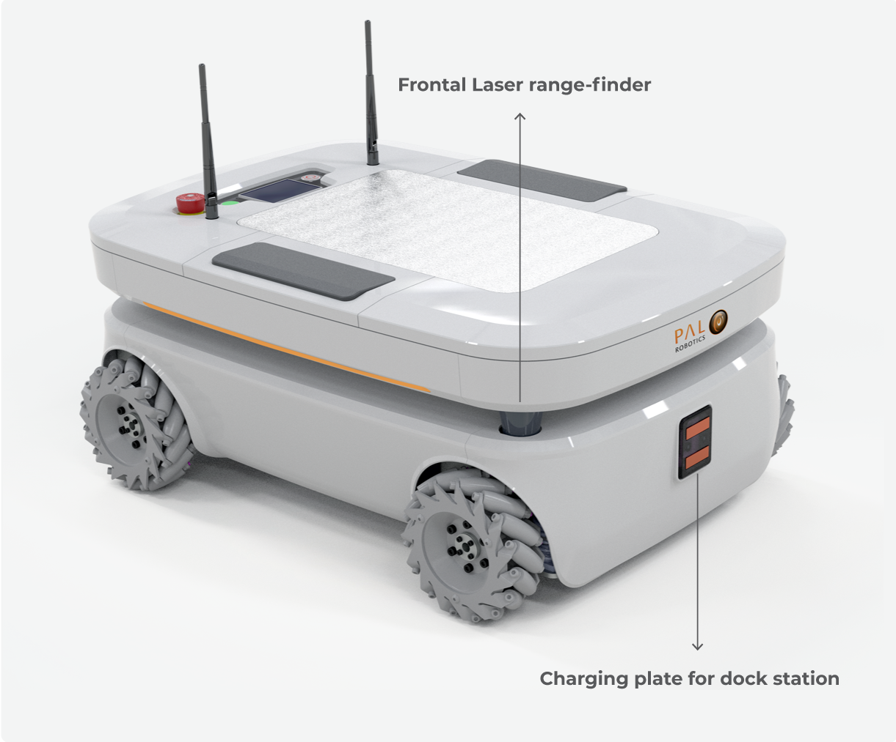
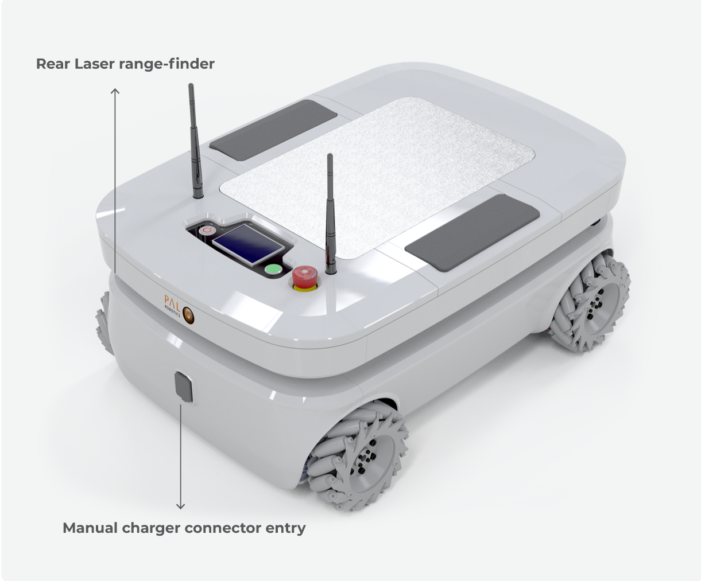
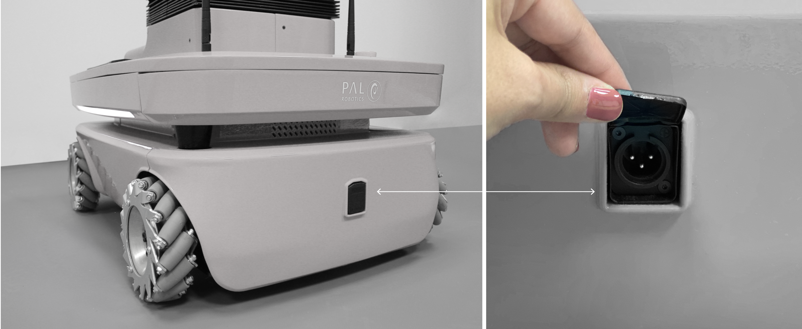
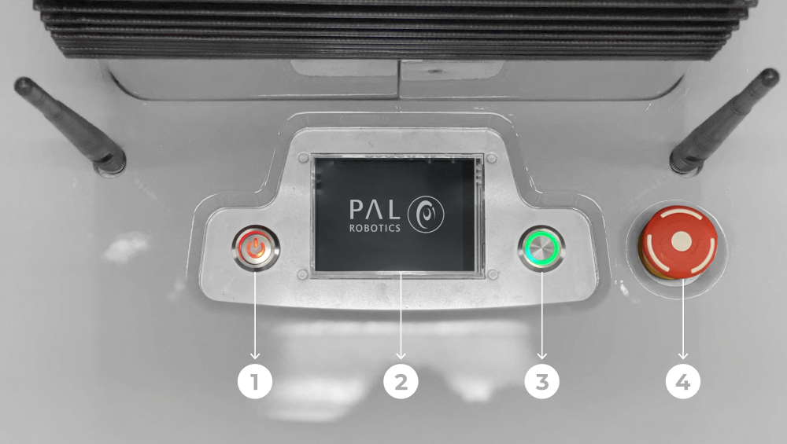
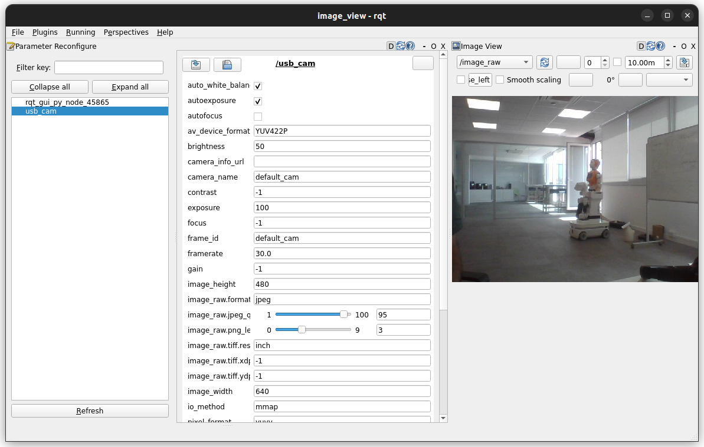
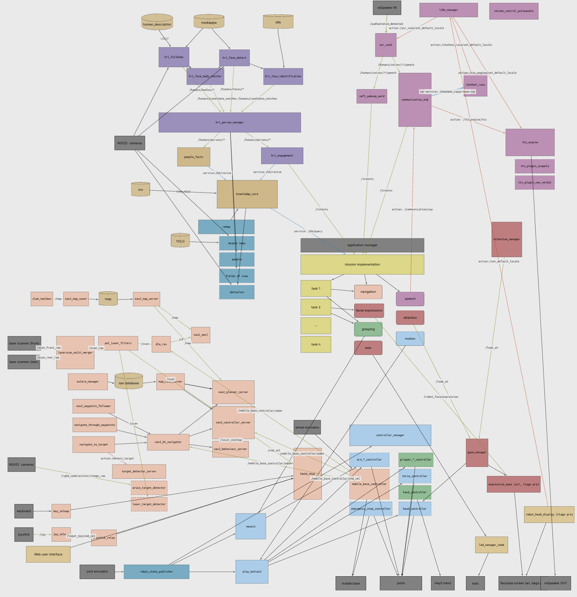

### docs pal-robotics 
https://docs.pal-robotics.com/sdk/24.09/nodes/mobile_base_controller.html
https://docs.pal-robotics.com/edge/hardware/tiago/mobile-base-omni#tiago-mobile-base-omni


https://github.com/pal-robotics/omni_base_simulation/tree/humble-devel

This repository contains the launch files to simulate the TIAGo OMNI Base robot in ROS 2.


[Omnidirectional mobile base - PAL OS 24.9 documentation.pdf](https://github.com/silenzio777/silenzio_robot_library/blob/main/ROS2/TIAGO_OMNI_Base_ROS2_Simulation/Omnidirectional%20mobile%20base%20-%20PAL%20OS%2024.9%20documentation.pdf)</br>

### TIAGo OMNI Base

Setup
Prerequisites
Install ROS 2 Humble by following the installation instructions.

Update the apt package index and install needed packages
```
sudo apt-get update
sudo apt-get install git python3-vcstool python3-rosdep python3-colcon-common-extensions
```

Disclaimer: In our testing environment, we've found out that the simulation is more reliable if we switch to Cyclone DDS. You can do this by installing it with sudo apt install ros-humble-rmw-cyclonedds-cpp and setting the RMW_IMPLEMENTATION environment variable: export RMW_IMPLEMENTATION=rmw_cyclonedds_cpp. More information on working with different DDS implementations here.

We are still looking on the issues when working with Fast RTPS.

Setting up the workspace
Create a workspace and clone all repositories:
```
mkdir -p ~/omni_base_public_ws/src
cd ~/omni_base_public_ws
vcs import --input https://raw.githubusercontent.com/pal-robotics/omni_base_tutorials/humble-devel/omni_base_public.repos src
```

Install dependencies using rosdep
```
sudo rosdep init
rosdep update
rosdep install --from-paths src -y --ignore-src
```

Source the environment and build
```
source /opt/ros/humble/setup.bash
colcon build --symlink-install
```

Finally, before running any application you have to source the workspace
```
source ~/omni_base_public_ws/install/setup.bash
```
Also you can add it to your .bashrc

### Simulation
Standalone
Launch gazebo simulation:
```
ros2 launch omni_base_gazebo omni_base_gazebo.launch.py is_public_sim:=True
```

TIAGo OMNI Base simulation

You can launch gazebo simulation using PAL office gazebo world by executing:

```
ros2 launch omni_base_gazebo omni_base_gazebo.launch.py is_public_sim:=True world_name:=pal_office
```
To move the robot you can use the following command from another terminal:
```
ros2 topic pub /mobile_base_controller/cmd_vel_unstamped geometry_msgs/msg/Twist '{linear: {x: 1}, angular: {z: 0}}' -r10
```

The velocities can be modified by changing the values of x, y and z.

### Navigation 2
You can launch TIAGo OMNI Base navigation by executing:
```
ros2 launch omni_base_2dnav omni_base_nav_bringup.launch.py is_public_sim:=True
```

Then, you can send a goal:

With rviz2
Send goal with rviz2

By using Navigation 2 API. For further information see Navigation 2 Tutorials
Simulation + Navigation 2
You can also start the simulation and navigation together by using:

```
ros2 launch omni_base_gazebo omni_base_gazebo.launch.py is_public_sim:=True navigation:=True
```

Then, goals can be sent in the same way.

Simulation + Navigation 2 + SLAM
You can also start the simulation navigation and slam together by using:

```
ros2 launch omni_base_gazebo omni_base_gazebo.launch.py is_public_sim:=True navigation:=True slam:=True
```


_________













________


### Tiago Simulation

Custom install:

System Specs

- Ubuntu 22.04
- Gazebo Classic 11
- ROS 2 Humble

Cloned tiago_simulation humble branch:
```
source /opt/ros/humble/setup.bash
sudo apt update
sudo apt install ros-humble-tiago-simulation
```

```
git clone https://github.com/ros-controls/ros2_control.git -b humble
git clone https://github.com/ros-controls/gazebo_ros2_control.git -b humble
git clone https://github.com/pal-robotics/pal_hey5.git -b humble-devel
git clone https://github.com/ros-perception/vision_msgs.git -b ros2
git clone https://github.com/pal-robotics/play_motion2.git -b humble-devel
git clone https://github.com/PickNikRobotics/launch_param_builder.git
git clone https://github.com/pal-robotics/pal_urdf_utils.git -b humble-devel
```

Launch Tiago robot simulation in Gazebo Classic:
```
ros2 launch tiago_gazebo tiago_gazebo.launch.py arm:=no-arm
```
```
ros2 run tiago_gazebo tiago_gazebo.launch.py
```
