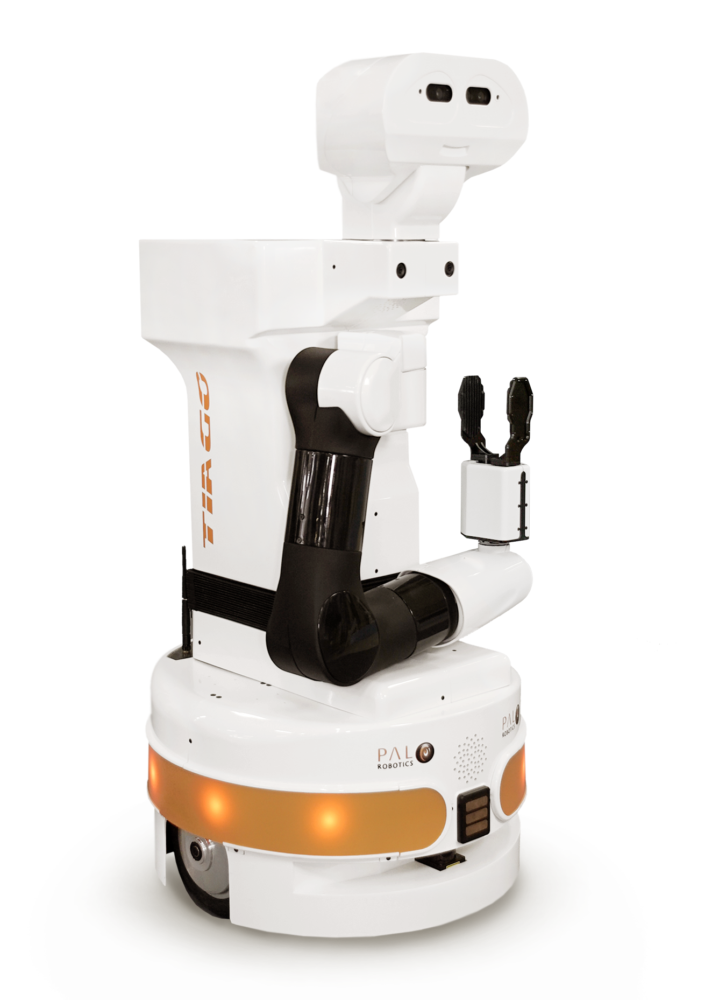

## TIAGo ROS 2 Simulation



## This repository contains the launch files to simulate the TIAGo robot in ROS 2.
https://github.com/pal-robotics/tiago_simulation/tree/humble-devel

### Install:
```
sudo apt install ros-humble-moveit
```

### Prerequisites
```
sudo apt-get update
sudo apt-get install git python3-vcstool python3-rosdep python3-colcon-common-extensions
```

### Create a workspace and clone all repositories:
```
mkdir -p ~/tiago_public_ws/src
cd ~/tiago_public_ws
vcs import --input https://raw.githubusercontent.com/pal-robotics/tiago_tutorials/humble-devel/tiago_public.repos src
```
### Install dependencies using rosdep
```
sudo rosdep init
rosdep update
rosdep install --from-paths src -y --ignore-src
```

### Source the environment and build
```
source /opt/ros/humble/setup.bash
colcon build --symlink-install
```
_Ubuntu PC: build OK_

### Finally, before running any application you have to source the workspace
```
source ~/tiago_public_ws/install/setup.bash
```

### Simulation
Standalone
Launch gazebo simulation:
```
ros2 launch tiago_gazebo tiago_gazebo.launch.py is_public_sim:=True [arm_type:=no-arm]
```
**Ubuntu PC: launch OK**

### You can launch gazebo simulation using PAL office gazebo world by executing:
```
ros2 launch tiago_gazebo tiago_gazebo.launch.py is_public_sim:=True world_name:=pal_office [arm_type:=no-arm]
```

### To move the robot you can use the following command from another terminal:
```
ros2 topic pub /mobile_base_controller/cmd_vel_unstamped geometry_msgs/msg/Twist '{linear: {x: 1}, angular: {z: 0}}' -r10
```

### The velocities can be modified by changing the values of x and z.

Navigation 2
You can launch TIAGo navigation by executing
```
ros2 launch tiago_2dnav tiago_nav_bringup.launch.py is_public_sim:=True
```
### Then, you can send a goal:

With rviz2:

By using Navigation 2 API. For further information see Navigation 2 Tutorials
https://navigation.ros.org/tutorials/index.html

**Ubuntu PC: launch OK**

### Simulation + Navigation 2
You can also start the simulation and navigation together by using
```
ros2 launch tiago_gazebo tiago_gazebo.launch.py navigation:=True is_public_sim:=True [arm_type:=no-arm]
```
Then, goals can be sent in the same way.

### Simulation + Navigation 2 + SLAM
You can start the SLAM and navigation in simulation by using
```
ros2 launch tiago_gazebo tiago_gazebo.launch.py is_public_sim:=True navigation:=True slam:=True
```
**Ubuntu PC: launch OK**

### Simulation + MoveIt 2
To launch TIAGo simulation with MoveIt 2 you can use
```
ros2 launch tiago_gazebo tiago_gazebo.launch.py moveit:=True  is_public_sim:=True
```
You can move the robot by:

Launching rviz2
```
ros2 launch tiago_moveit_config moveit_rviz.launch.py
```
**Ubuntu PC: work with errors...**


Using MoveIt 2 API. For further information see MoveIt 2 Tutorials
https://moveit.picknik.ai/humble/doc/tutorials/tutorials.html

### Simulation + Navigation 2 + MoveIt 2

Finally, to launch all together:
```
ros2 launch tiago_gazebo tiago_gazebo.launch.py navigation:=True moveit:=True is_public_sim:=True
```
To use private simulation you can avoid to set is_public_sim argument.


_______

### Install omni_base_robot
https://github.com/pal-robotics/omni_base_robot/tree/humble-devel

### Install 
```
cd ~/tiago_public_ws/src
git clone https://github.com/pal-robotics/omni_base_robot.git
```
### Build
```
colcon build
```
### Launch
```
source ~/tiago_public_ws/install/setup.bash
ros2 launch omni_base_description show.launch.py
```

**Ubuntu PC: launch OK**
