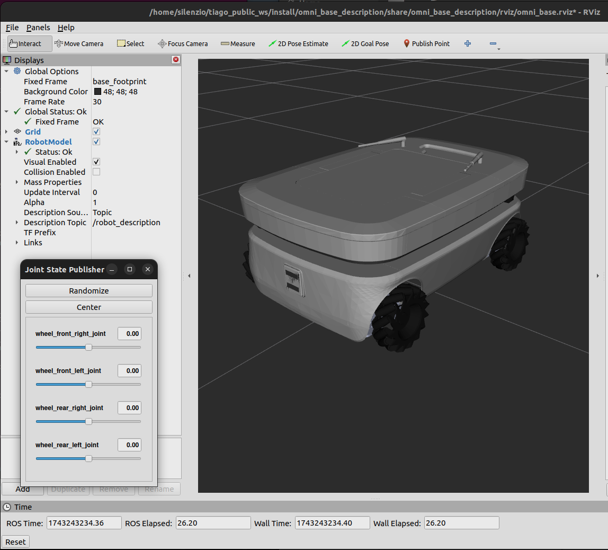

## TIAGo ROS 2 Simulation


## This repository contains the launch files to simulate the TIAGo robot in ROS 2.
https://github.com/pal-robotics/tiago_simulation/tree/humble-devel

### Install:
```
sudo apt install ros-humble-moveit
```

### Prerequisites
```
sudo apt-get update
sudo apt-get install git python3-vcstool python3-rosdep python3-colcon-common-extensions
```

### Create a workspace and clone all repositories:
```
mkdir -p ~/tiago_public_ws/src
cd ~/tiago_public_ws
vcs import --input https://raw.githubusercontent.com/pal-robotics/tiago_tutorials/humble-devel/tiago_public.repos src
```
### Install dependencies using rosdep
```
sudo rosdep init
rosdep update
rosdep install --from-paths src -y --ignore-src
```

### Source the environment and build
```
source /opt/ros/humble/setup.bash
colcon build --symlink-install
```
_Ubuntu PC: build OK_

### Finally, before running any application you have to source the workspace
```
source ~/tiago_public_ws/install/setup.bash
```

### Simulation
Standalone
Launch gazebo simulation:
```
ros2 launch tiago_gazebo tiago_gazebo.launch.py is_public_sim:=True [arm_type:=no-arm]
```
_Ubuntu PC: launch OK_

### You can launch gazebo simulation using PAL office gazebo world by executing:
```
ros2 launch tiago_gazebo tiago_gazebo.launch.py is_public_sim:=True world_name:=pal_office [arm_type:=no-arm]
```

### To move the robot you can use the following command from another terminal:
```
ros2 topic pub /mobile_base_controller/cmd_vel_unstamped geometry_msgs/msg/Twist '{linear: {x: 1}, angular: {z: 0}}' -r10
```

### The velocities can be modified by changing the values of x and z.

Navigation 2
You can launch TIAGo navigation by executing
```
ros2 launch tiago_2dnav tiago_nav_bringup.launch.py is_public_sim:=True
```
### Then, you can send a goal:

With rviz2:

By using Navigation 2 API. For further information see Navigation 2 Tutorials
https://navigation.ros.org/tutorials/index.html

_Ubuntu PC: launch OK_

### Simulation + Navigation 2
You can also start the simulation and navigation together by using
```
ros2 launch tiago_gazebo tiago_gazebo.launch.py navigation:=True is_public_sim:=True [arm_type:=no-arm]
```
Then, goals can be sent in the same way.

### Simulation + Navigation 2 + SLAM
You can start the SLAM and navigation in simulation by using
```
ros2 launch tiago_gazebo tiago_gazebo.launch.py is_public_sim:=True navigation:=True slam:=True
```
_Ubuntu PC: launch OK_

### Simulation + MoveIt 2
To launch TIAGo simulation with MoveIt 2 you can use
```
ros2 launch tiago_gazebo tiago_gazebo.launch.py moveit:=True  is_public_sim:=True
```
You can move the robot by:

Launching rviz2
```
ros2 launch tiago_moveit_config moveit_rviz.launch.py
```
_Ubuntu PC: work with errors..._


Using MoveIt 2 API. For further information see MoveIt 2 Tutorials
https://moveit.picknik.ai/humble/doc/tutorials/tutorials.html

### Simulation + Navigation 2 + MoveIt 2

Finally, to launch all together:
```
ros2 launch tiago_gazebo tiago_gazebo.launch.py navigation:=True moveit:=True is_public_sim:=True
```
To use private simulation you can avoid to set is_public_sim argument.


_______

### Install omni_base_robot
https://github.com/pal-robotics/omni_base_robot/tree/humble-devel

### Install 
```
cd ~/tiago_public_ws/src
git clone https://github.com/pal-robotics/omni_base_robot.git
```

### Build
```
colcon build
```

### Launch
```
source ~/tiago_public_ws/install/setup.bash
ros2 launch omni_base_description show.launch.py
```


_Ubuntu PC: launch OK_


```
source ~/tiago_public_ws/install/setup.bash
ros2 launch omni_base_description robot_state_publisher.launch.py
```

```
source ~/tiago_public_ws/install/setup.bash
ros2 launch omni_base_controller_configuration default_controllers.launch.py
```

```
source ~/tiago_public_ws/install/setup.bash
ros2 launch omni_base_bringup omni_base_bringup.launch.py
```


```
...
[spawner-2] [INFO] [1743243747.291694892] [spawner_joint_state_broadcaster]: waiting for service /controller_manager/list_controllers to become available...
[spawner-1] [INFO] [1743243747.297165716] [spawner_mobile_base_controller]: waiting for service /controller_manager/list_controllers to become available...
[spawner-3] [INFO] [1743243747.345740690] [spawner_imu_sensor_broadcaster]: waiting for service /controller_manager/list_controllers to become available...
```

```
source ~/tiago_public_ws/install/setup.bash
ros2 launch omni_base_bringup twist_mux.launch.py
```
```
INFO] [launch]: All log files can be found below /home/silenzio/.ros/log/2025-03-29-13-24-50-387891-ubuntuPC-20187
[INFO] [launch]: Default logging verbosity is set to INFO
[INFO] [twist_mux-1]: process started with pid [20188]
[INFO] [twist_marker-2]: process started with pid [20190]
[INFO] [joystick_relay.py-3]: process started with pid [20192]
[twist_mux-1] [INFO] [1743243890.517509691] [twist_mux]: Topic handler 'topics.assisted_teleop' subscribed to topic 'assisted_vel': timeout = 0.500000s , priority = 200.
[twist_mux-1] [INFO] [1743243890.518017684] [twist_mux]: Topic handler 'topics.docking' subscribed to topic 'docking_vel': timeout = 0.500000s , priority = 210.
[twist_mux-1] [INFO] [1743243890.518139111] [twist_mux]: Topic handler 'topics.joystick' subscribed to topic 'joy_vel': timeout = 0.500000s , priority = 100.
[twist_mux-1] [INFO] [1743243890.518278258] [twist_mux]: Topic handler 'topics.keyboard' subscribed to topic 'key_vel': timeout = 0.500000s , priority = 90.
[twist_mux-1] [INFO] [1743243890.518413948] [twist_mux]: Topic handler 'topics.navigation' subscribed to topic 'cmd_vel': timeout = 0.500000s , priority = 10.
[twist_mux-1] [INFO] [1743243890.518554289] [twist_mux]: Topic handler 'topics.rviz' subscribed to topic 'rviz_joy_vel': timeout = 0.500000s , priority = 100.
[twist_mux-1] [INFO] [1743243890.518651837] [twist_mux]: Topic handler 'topics.webgui_joystick' subscribed to topic 'tab_vel': timeout = 0.500000s , priority = 100.
[twist_mux-1] [INFO] [1743243890.518781756] [twist_mux]: Topic handler 'locks.assisted_teleop' subscribed to topic 'assisted_teleop_priority': timeout = None , priority = 200.
[twist_mux-1] [INFO] [1743243890.518951526] [twist_mux]: Topic handler 'locks.charging' subscribed to topic 'power/is_charging': timeout = None , priority = 210.
[twist_mux-1] [INFO] [1743243890.519099946] [twist_mux]: Topic handler 'locks.joystick' subscribed to topic 'joy_priority': timeout = None , priority = 100.
```
___
### Install teleop_tools:
https://github.com/ros-teleop/teleop_tools

```
## sudo apt-get install ros-${ROS_DISTRO}-teleop-twist-joy
sudo apt install ros-${ROS_DISTRO}-teleop-tools
```

ros2 run turtlebot3_teleop teleop_keyboard
ros2 run turtlebot3_teleop teleop_keyboard --ros-args -r /cmd_vel:=/input_joy/cmd_vel


___
```
source ~/tiago_public_ws/install/setup.bash
ros2 launch omni_base_bringup joystick_teleop.launch.py
```
```
[INFO] [launch]: All log files can be found below /home/silenzio/.ros/log/2025-03-29-13-31-20-954467-ubuntuPC-21337
[INFO] [launch]: Default logging verbosity is set to INFO
[INFO] [joy_teleop-1]: process started with pid [21338]
[INFO] [joy_linux_node-2]: process started with pid [21340]
[joy_linux_node-2] [ERROR] [1743244281.017400552] [joystick]: Couldn't open joystick /dev/joystick. Will retry every second.
```


________


### T1:
```
ros2 run turtlebot3_teleop teleop_keyboard --ros-args -r /cmd_vel:=/input_joy/cmd_vel
```
```
/input_joy/cmd_vel
```

### T2:
```
ros2 launch omni_base_description robot_state_publisher.launch.py
```
```
/joint_states
/parameter_events
/robot_description
```

### T3:
```
ros2 launch omni_base_bringup omni_base_bringup.launch.py
```
```
/cmd_vel
/input_joy/cmd_vel
/joy_vel
/key_vel
/tab_vel
/assisted_teleop_priority
/assisted_vel

/docking_vel

/joint_states
/joy_priority

/marker
/mobile_base_controller/cmd_vel_unstamped

/power/is_charging
/robot_description
/rviz_joy_vel

/text_marker

/parameter_events
/tf
/tf_static
/rosout
/diagnostics
```

