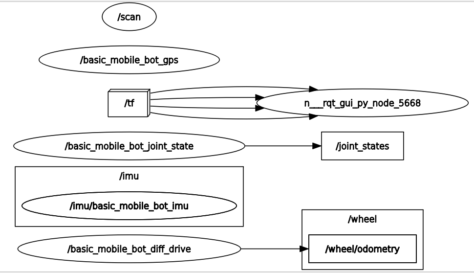
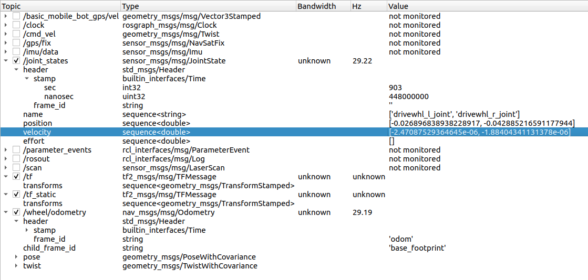
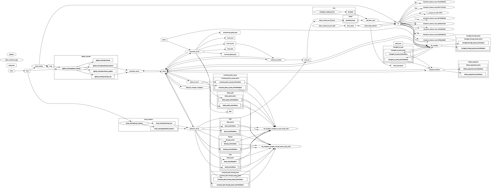
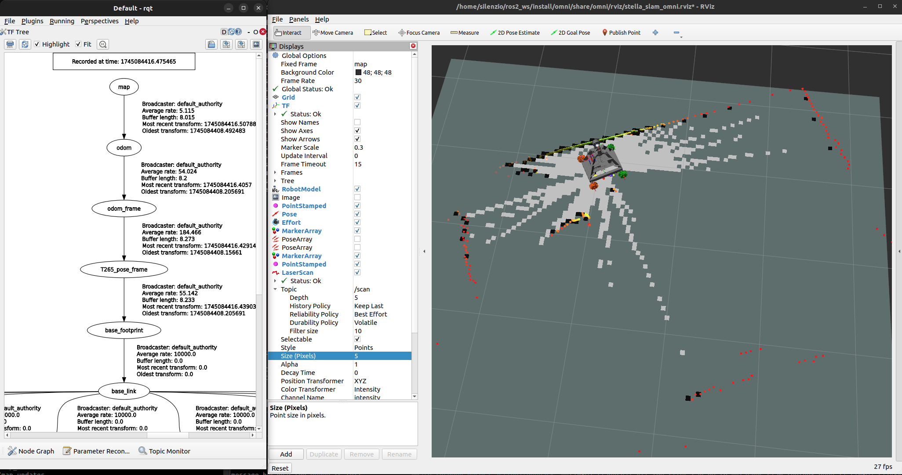
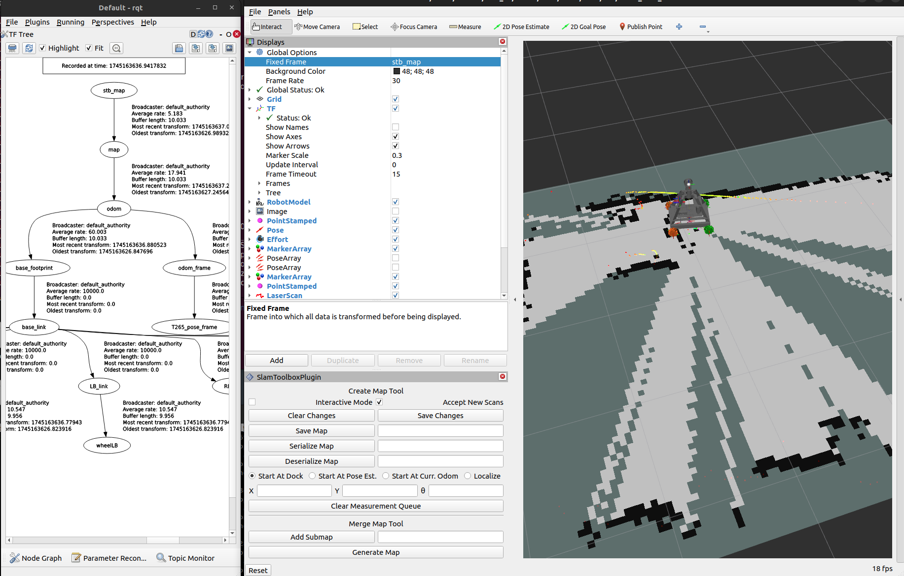

 
### Set Up the Odometry for a Simulated Mobile Robot in ROS 2
 
https://automaticaddison.com/set-up-the-odometry-for-a-simulated-mobile-robot-in-ros-2/

You can get the entire code for this project:</br>

https://drive.google.com/drive/folders/1134y69OYI7JzXF9H2B_IV4VztaCAzzPj?usp=sharing

https://drive.google.com/drive/folders/1VrgqtETVSuheNITop0MXDy4BY3U8IphQ?usp=sharing


```
sudo apt-get install ros-humble-rqt-robot-steering
sudo apt install ros-humble-robot-localization

source /opt/ros/humble/setup.bash
cd ~/ros2_ws && source install/setup.bash

cd ~/ros2_ws/basic_mobile_robot/
mkdir src

cd ~/ros2_ws/two_wheeled_robot/
mkdir src
mkdir two_wheeled_robot
cd ~/ros2_ws/two_wheeled_robot/two_wheeled_robot
touch __init__.py

cd cd ~/ros2_ws
colcon build --packages-select basic_mobile_robot

...
Finished <<< two_wheeled_robot [0.80s]
Finished <<< basic_mobile_robot [1.39s]
```


## Setup gazebo sim worlds:
Add this to ~/.bashrc: 
```
nano ~/.bashrc
```
```
export GAZEBO_MODEL_PATH=$GAZEBO_MODEL_PATH:/home/silenzio/ros2_ws/src/two_wheeled_robot/models
export GAZEBO_MODEL_PATH=$GAZEBO_MODEL_PATH:/home/silenzio/ros2_ws/src/basic_mobile_robot/models
source /usr/share/gazebo/setup.sh
```

```
cd ~/ros2_ws/src/basic_mobile_robot/worlds/basic_mobile_bot_world

gazebo smalltown.world
```

## Work


_________
```
ros2 topic list
```
```
/basic_mobile_bot_gps/vel
/clock
/cmd_vel
/gps/fix
/imu/data
/joint_states
/parameter_events
/rosout
/scan
/tf
/tf_static
/wheel/odometry
```

```
ros2 topic echo /wheel/odometry
```
```
---
header:
  stamp:
    sec: 128
    nanosec: 10000000
  frame_id: odom <<<<<<<<----------
child_frame_id: base_footprint
pose:
  pose:
    position:
      x: 0.02441921691747031
      y: 0.0018134250499734017
      z: 0.23998762789650288
    orientation:
      x: -7.403960886581067e-07
      y: 2.820512818694179e-05
      z: 0.0025158213575046232
      w: 0.9999968349184009
  covariance:
  - 1.0e-05
```


```
ros2 topic echo /imu/data
```
```
---
header:
  stamp:
    sec: 242
    nanosec: 880000000
  frame_id: imu_link <<<<<<<-------
orientation:
  x: -8.010266040970521e-07
  y: 2.818959237384517e-05
  z: 0.0031263367730648916
  w: 0.9999951125996001
orientation_covariance:
- 0.0
```
```
ros2 topic echo /scan
```
```
---
header:
  stamp:
    sec: 737
    nanosec: 800000000
  frame_id: lidar_link <<<<<<<------
angle_min: -3.141590118408203
angle_max: 3.141590118408203
angle_increment: 0.052799832075834274
time_increment: 0.0
scan_time: 0.0
range_min: 0.30000001192092896
range_max: 15.0
ranges:
- .inf
```

```
ros2 node list
```
```
/basic_mobile_bot_diff_drive <<<<<<<------
/basic_mobile_bot_gps
/basic_mobile_bot_joint_state <<<<<<<------
/imu/basic_mobile_bot_imu
/rqt_gui_py_node_5668
/scan
```


### UbuntiPC + gazebo sim:

TOPICS and FRAMES:

```
/wheel/odometry <-- frame_id: odom
                    child_frame_id: base_footprint

/scan  <--  frame_id: lidar_link

/imu/data <-- frame_id: imu_link 
```

NODES:
```
/basic_mobile_bot_joint_state  <<<----- 'drivewhl_l_joint', 'drivewhl_r_joint'

/basic_mobile_bot_diff_drive
```





________


### T0:
```
rqt_robot_steering
```
 
### T1:
```
cd ~/ros2_ws && source install/setup.bash
ros2 launch basic_mobile_robot basic_mobile_bot_v2.launch.py
```
### Error:

```
[gzclient-2] gzclient: /usr/include/boost/smart_ptr/shared_ptr.hpp:728: typename boost::detail::sp_member_access<T>::type boost::shared_ptr<T>::operator->() const [with T = gazebo::rendering::Camera; typename boost::detail::sp_member_access<T>::type = gazebo::rendering::Camera*]: Assertion `px != 0' failed.
[ERROR] [gzclient-2]: process has died [pid 26331, exit code -6, cmd 'gzclient --gui-client-plugin=libgazebo_ros_eol_gui.so'].
```

### Fix:

I had same problem in ros2 Humble.
Sourcing . /usr/share/gazebo/setup.sh solved my problem.

```
source /usr/share/gazebo/setup.sh
```
## Work

```
ros2 launch basic_mobile_robot basic_mobile_bot_v2.launch.py
[INFO] [launch]: All log files can be found below /home/silenzio/.ros/log/2025-04-18-15-29-40-908911-ubuntuPC-26561
[INFO] [launch]: Default logging verbosity is set to INFO
[INFO] [gzserver-1]: process started with pid [26564]
[INFO] [gzclient-2]: process started with pid [26566]
[INFO] [robot_state_publisher-3]: process started with pid [26568]
[INFO] [rviz2-4]: process started with pid [26570]
...

```

```
ros2 topic echo /wheel/odometry  --no-arr

---
header:
  stamp:
    sec: 138
    nanosec: 686000000
  frame_id: odom
child_frame_id: base_footprint
pose:
  pose:
    position:
      x: 0.026669722806629808
      y: 0.0019291823795402117
      z: 0.23998762884056996
    orientation:
      x: -7.769214135659952e-07
      y: 2.840117738975622e-05
      z: 0.002572573943476475
      w: 0.9999966905225612
  covariance: '<array type: double[36]>'
twist:
  twist:
    linear:
      x: 0.00023296327200423965
      y: 1.326383204530475e-05
      z: 0.0
    angular:
      x: 0.0
      y: 0.0
      z: -3.879842268297591e-05
  covariance: '<array type: double[36]>'

```

## Run:

### T0:
```
ros2 launch teleop_twist_joy teleop-launch.py
```

### T1:
```
ros2 launch basic_mobile_robot basic_mobile_bot_v4.launch.py
[INFO] [launch]: All log files can be found below /home/silenzio/.ros/log/2025-04-18-16-29-07-627956-ubuntuPC-34961
[INFO] [launch]: Default logging verbosity is set to INFO
[INFO] [gzserver-1]: process started with pid [34963]
[INFO] [gzclient-2]: process started with pid [34965]
[INFO] [ekf_node-3]: process started with pid [34967]
[INFO] [robot_state_publisher-4]: process started with pid [34969]
[INFO] [rviz2-5]: process started with pid [34971]
...
```

### T2:
```
ros2 launch slam_toolbox online_async_launch.py
```


```
ros2 topic list
```

```
/basic_mobile_bot_gps/vel
/clicked_point
/clock
/cmd_vel
/diagnostics
/gps/fix
/imu/data
/initialpose
/joint_states
/joy
/joy/set_feedback
/map
/map_metadata
/map_updates
/odometry/filtered
/parameter_events
/performance_metrics
/pose
/robot_description
/rosout
/scan
/set_pose
/slam_toolbox/feedback
/slam_toolbox/graph_visualization
/slam_toolbox/scan_visualization
/slam_toolbox/update
/tf
/tf_static
/wheel/odometry
```

### T3:

NAV2
```
ros2 launch nav2_bringup navigation_launch.py map:=~/ros2_ws/my_map.yaml
```
 





```
ros2 topic list
```
```
/basic_mobile_bot_gps/vel
/behavior_server/transition_event
/behavior_tree_log
/bond
/bt_navigator/transition_event
/clicked_point
/clock
/cmd_vel
/cmd_vel_nav
/cmd_vel_teleop
/controller_server/transition_event
/cost_cloud
/diagnostics
/evaluation
/global_costmap/costmap
/global_costmap/costmap_raw
/global_costmap/costmap_updates
/global_costmap/footprint
/global_costmap/global_costmap/transition_event
/global_costmap/published_footprint
/goal_pose
/gps/fix
/imu/data
/initialpose
/joint_states
/local_costmap/clearing_endpoints
/local_costmap/costmap
/local_costmap/costmap_raw
/local_costmap/costmap_updates
/local_costmap/footprint
/local_costmap/local_costmap/transition_event
/local_costmap/published_footprint
/local_costmap/voxel_grid
/local_plan
/map
/map_metadata
/map_updates
/marker
/odom
/odometry/filtered
/parameter_events
/performance_metrics
/plan
/plan_smoothed
/planner_server/transition_event
/pose
/preempt_teleop
/received_global_plan
/robot_description
/rosout
/scan
/set_pose
/slam_toolbox/feedback
/slam_toolbox/graph_visualization
/slam_toolbox/scan_visualization
/slam_toolbox/update
/smoother_server/transition_event
/speed_limit
/tf
/tf_static
/transformed_global_plan
/velocity_smoother/transition_event
/waypoint_follower/transition_event
/waypoints
/wheel/odometry
```

_______


## Jetsn Orin NX

### T265 as odom source, LDS lidar as scan source:

```
ros2 topic echo /t265/pose/sample
```
```
---
header:
  stamp:
    sec: 1745075839
    nanosec: 817063936
  frame_id: odom_frame
child_frame_id: t265_pose_frame
pose:
  pose:
    position:
      x: -0.0045028007589280605
      y: 0.048994045704603195
      z: -0.0012390041956678033
    orientation:
      x: 0.021951068192720413
      y: -0.034401506185531616
      z: 0.11598795652389526
      w: 0.9924119710922241
  covariance:
  - 0.1
```

LDS lidar topic:
```
ros2 topic echo /scan
```
```
---
header:
  stamp:
    sec: 1745076095
    nanosec: 599573599
  frame_id: base_scan
angle_min: 0.0
angle_max: 6.2657318115234375
angle_increment: 0.01745329238474369
time_increment: 0.0005592841189354658
scan_time: 0.20134228467941284
range_min: 0.11999999731779099
range_max: 3.5
ranges:
- 2.9860000610351562
```

```
/t265/pose/sample frame_id: odom_frame
            child_frame_id: t265_pose_frame
/scan             frame_id: base_scan
```

### Run:
```
01_ROS2_T256_L515.sh
ros2 launch hls_lfcd_lds_driver hlds_laser.launch.py
05_t265_RVIZ_omni.sh
ros2 launch slam_toolbox online_async_launch.py
```
### Work:


 

_______
## stella_vslam

### stella_vslam topic:
```
ros2 topic echo /camera_pose
```
```
---
header:
  stamp:
    sec: 1745088589
    nanosec: 887057152
  frame_id: stella_map_frame
child_frame_id: stella_camera_frame
pose:
  pose:
    position:
      x: -0.00011862979223376254
      y: -0.013625124665398239
      z: 0.00042249777017410275
    orientation:
      x: -0.007770759725628478
      y: -0.0017324991882209902
      z: -0.06525467075630256
      w: 0.997836881300915
  covariance:
  - 0.0
```

```
/camera_pose      frame_id: stella_map_frame 
            child_frame_id: stella_camera_frame
```
### Setup:

file slam.launch:
```
<?xml version="1.0"?>
<!-- https://github.com/stella-cv/stella_vslam_ros/discussions/49 -->
<launch>

    <node name="stella_vslam_ros" pkg="stella_vslam_ros" exec="run_slam" 
        args="--viewer none -v /home/silenzio/lib/stella_vslam/vocab/orb_vocab.fbow \
        -c /home/silenzio/lib/stella_vslam/example/tum_vi/T265_mono.yaml \
        -map-db /home/silenzio/ros2_ws/src/omni/map/stella_vslam/map.msg \
        --ros-args -p use_sim_time:=false \
        --ros-args -p publish_tf:=true \
        --ros-args -p odom_frame:=odom \
        --ros-args -p camera_frame:=stella_camera_frame \
        --ros-args -p map_frame:=map

        " output="screen">
     <remap from="/camera/image_raw" to="/T265/fisheye1/image_raw"/>
     <remap from="/stella_vslam_ros/camera_pose" to="/camera_pose"/>

    </node>

</launch>
```

file mapper_params_online_async.yaml:
```
slam_toolbox:
  ros__parameters:
    # Plugin params
    solver_plugin: solver_plugins::CeresSolver
    ceres_linear_solver: SPARSE_NORMAL_CHOLESKY
    ceres_preconditioner: SCHUR_JACOBI
    ceres_trust_strategy: LEVENBERG_MARQUARDT
    ceres_dogleg_type: TRADITIONAL_DOGLEG
    ceres_loss_function: None
    # ROS Parameters
    odom_frame: map # odom
    map_frame: stb_map # map
    base_frame: base_footprint
    scan_topic: /scan
    use_map_saver: true
    mode: mapping #localization mapping
```

### Run:
```
01_ROS2_T256_L515.sh
   cd /foxy/t265_l515_v4_0_4_ws
   . install/local_setup.bash
   export CYCLONEDDS_URI=/.ros/cyclonedds_foxy.xml
   ros2 launch realsense2_camera rs_launch.py camera_name:=T265 enable_pose:=false

ros2 launch hls_lfcd_lds_driver hlds_laser.launch.py
03_stella_RVIZ_omni.sh
04_stella_SLAM.sh
ros2 launch slam_toolbox online_async_launch_param.py
```
### Work:

