| Name  | Photo  |  Model Number  |Quantity (PCS) | Manufacturing Method | Material | 
| -------  | -------  |  -------  |------- | ------- | ------- |
| J4_A  | 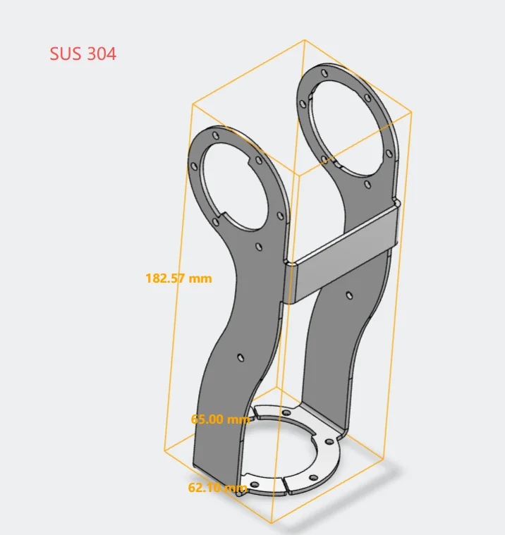|  MVSHM-3N02048-48P-EH8AF-L  | 1 | Sheet Metal Fabrication (CNC) | SUS304 |
| J4_D  | 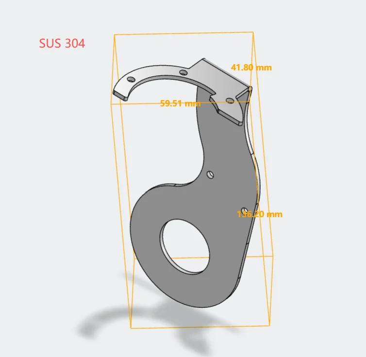  | MVSHM-3N02048-48P-WH1FY-L   | 1 | Sheet Metal Fabrication (CNC) | SUS304 |
| Circular Post - Threaded on Both Ends. M3.  | 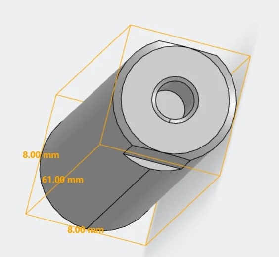|  AETTS8-61-SC0-M3-N3  | 1 | Metal Cutting (CNC) | Aluminum 6061 |
| Circular Post - Threaded on Both Ends. M3.  | 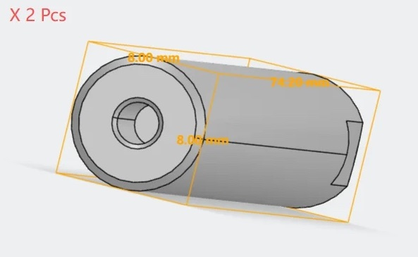  | AETTS8-74.2-SC0-M3-N3   | 2 | Metal Cutting (CNC) (CNC) | Aluminum 6061 |

_______________________

 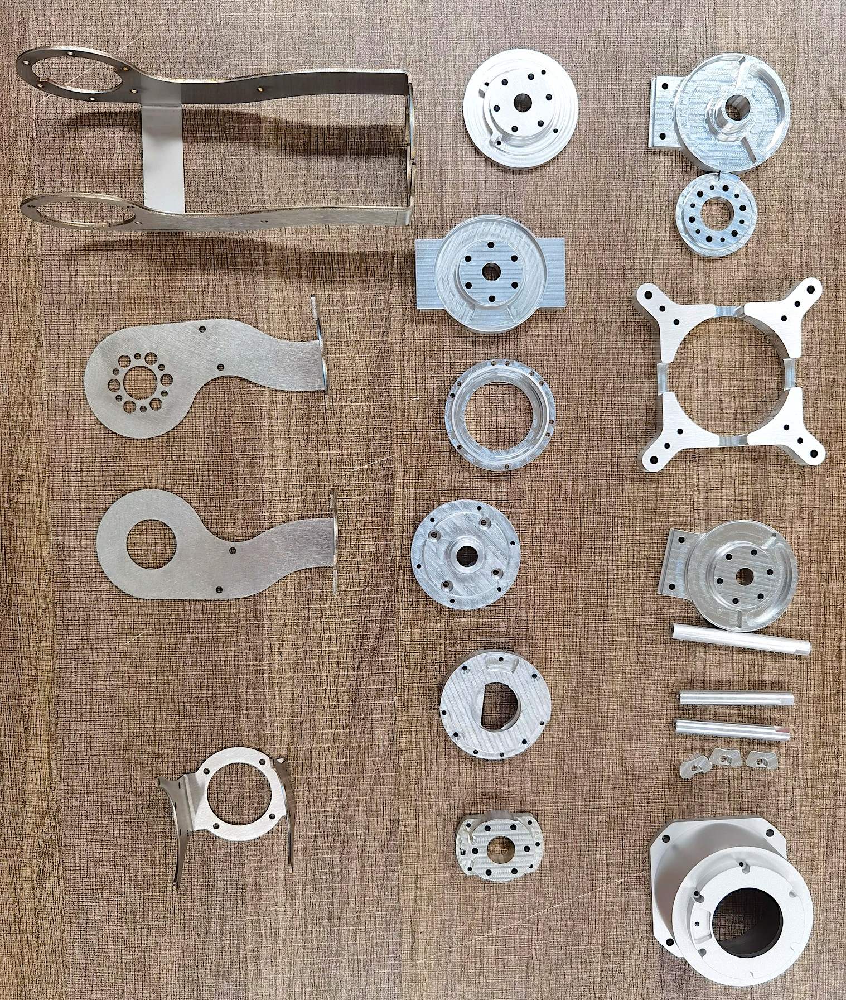 

_______________________

### Step 4: J3-J4 Sub-Assembly

| Description  | Drawings  |
| -------  |-------  |
| 1. Attach `J4_A` to the `J3` motor using 6 `M3x6` bolts. Make sure the two Power+CAN ports face the front and rear for easy wiring. | 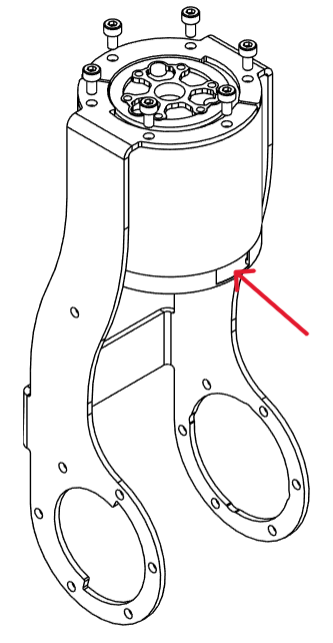 | 
| - tip Keep the communication port of the `J3` motor to the right side | 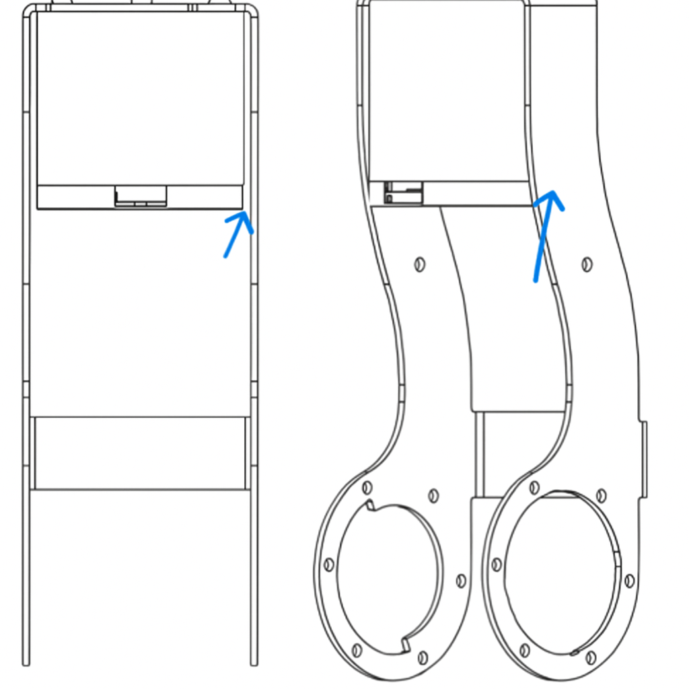 | 
| 2. Mount the bearing `FL6803ZZ` onto `J4_B` |  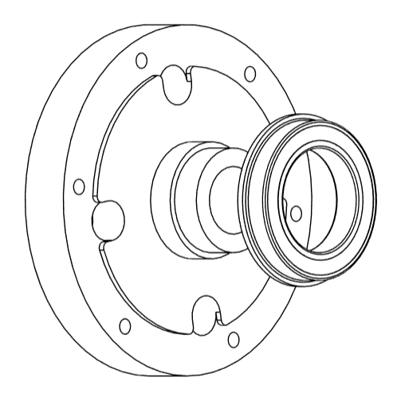 | 
| 3. Place the `J4_B` on the interior side of `J4_A`,aligning the holes. Do not fasten them yet. | 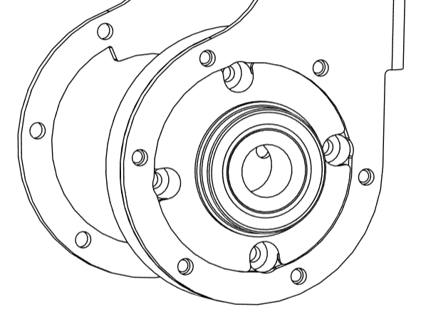 | 
| 4. Carefully slide the `J4` motor between `J4_A` and `J4_B`. Align it with the holes on `J4_B`. Refer to the photo for correct positioning of the Power+CAN port. Fasten the motor `J4` with part `J4_B` using 4 `M3x6` bolts. | 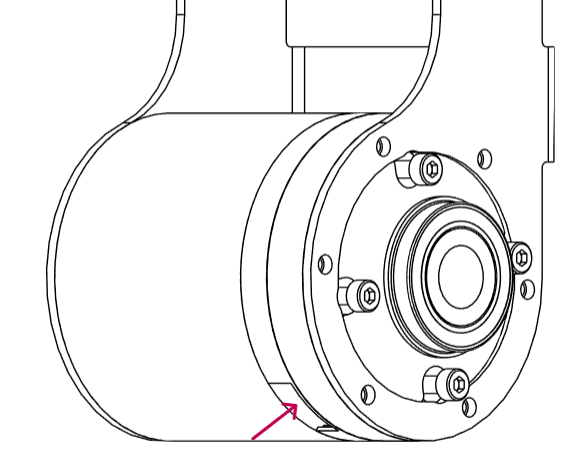 | 
| - tip Keep the communication port of the `J4` motor to the position as shown in the figure. |  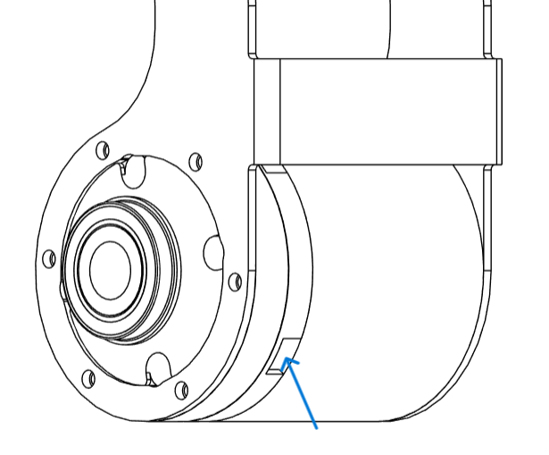 | 
| 5. Fasten `J4_A` into `J4_B` using 6 `M3x6` bolts | 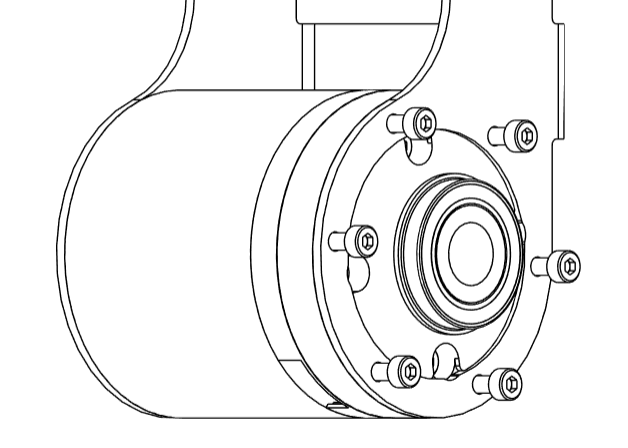 | 
| 6. Finally, fasten `J4_A` to the motor `J4` using 6 `M3x6` bolts. |  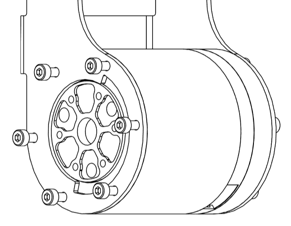 | 
| 7. Carefully insert the post `AETTS8-61-SC0-M3-N3` between the flanges of `J4_A` and fasten them with 2 `M3x6` bolts |  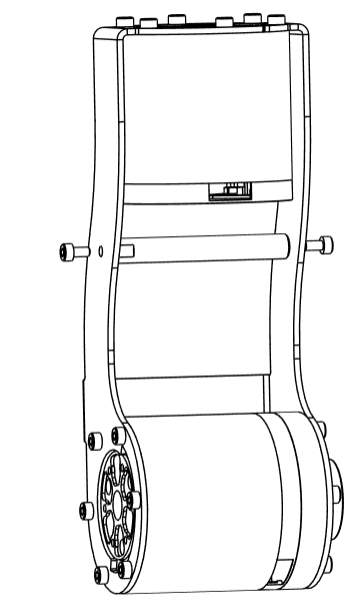 | 
| - info That concludes the J3-J4 Sub-Assembly | 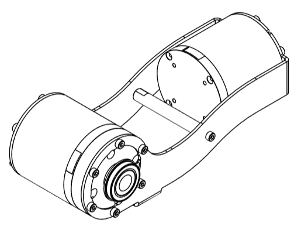 | 

_______________________

### Step 5: J4-J5 Sub-Assembly

| Description  | Drawings  |
| -------  |-------  |
| 1. Attach `J4_C` to the rotor of `J4` motor using 6 `M3x6` bolts | 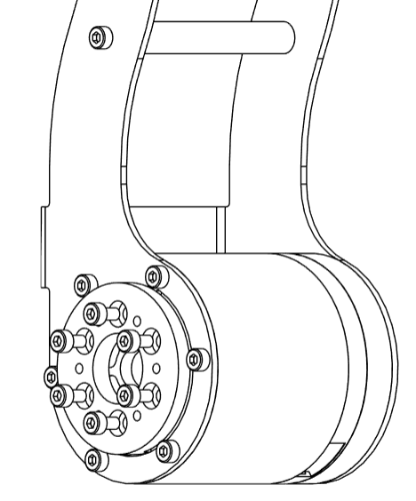 | 
| 2. Mount the component `J4_D` onto the `FL6803ZZ`  |  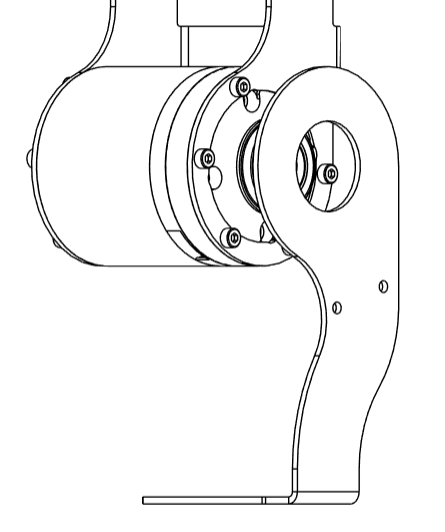 | 
| - tip Align the `J4_E` component vertically with the mechanical stop on `J4_C`, ensuring proper orientation before fastening. | 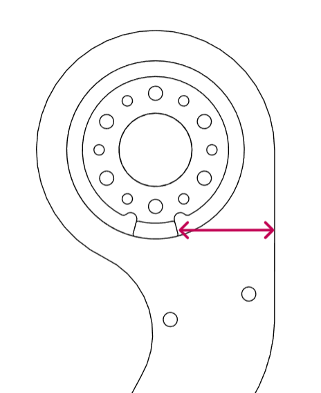  | 
| 3. Attach the component `J4_E` to `J4_C` using 6 `M3x6` bolts.  | 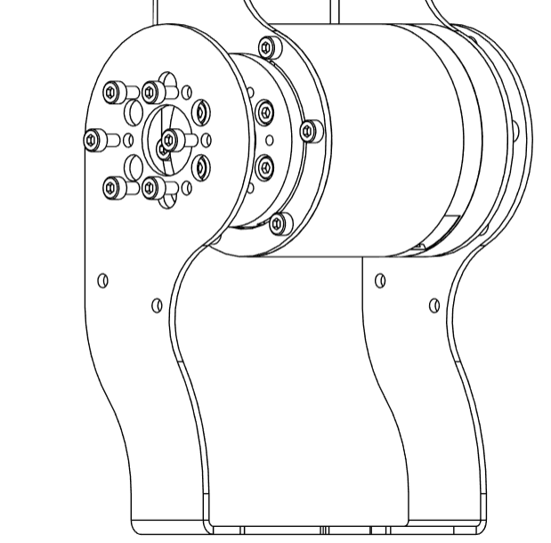 | 
| 4. Place the `J5` motor between the `J4_D` and `J4_E` and fasten them using 6 `M3x6` bolts. Ensure that the Power+CAN ports are facing front and rear for effective wiring. Keep the communication port facing towards the part `J4_E`. |  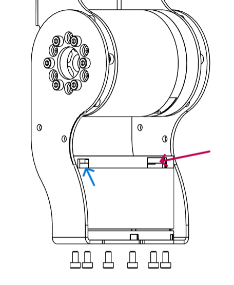 | 
| 5. Carefully place two posts `AETTS8-74.2-SC0-M3-N3` between the `J4_D` and `J4_E` components, and fasten them using `M3x6` bolts | 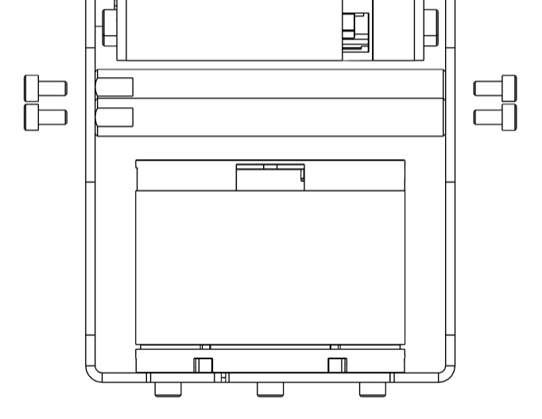 | 
| info That concludes the J4-J5 Sub-Assembly |  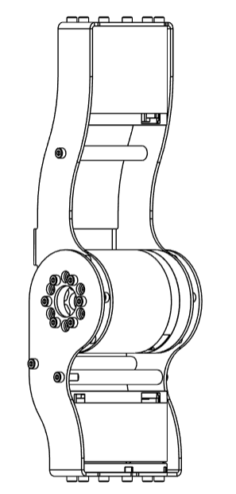 | 

