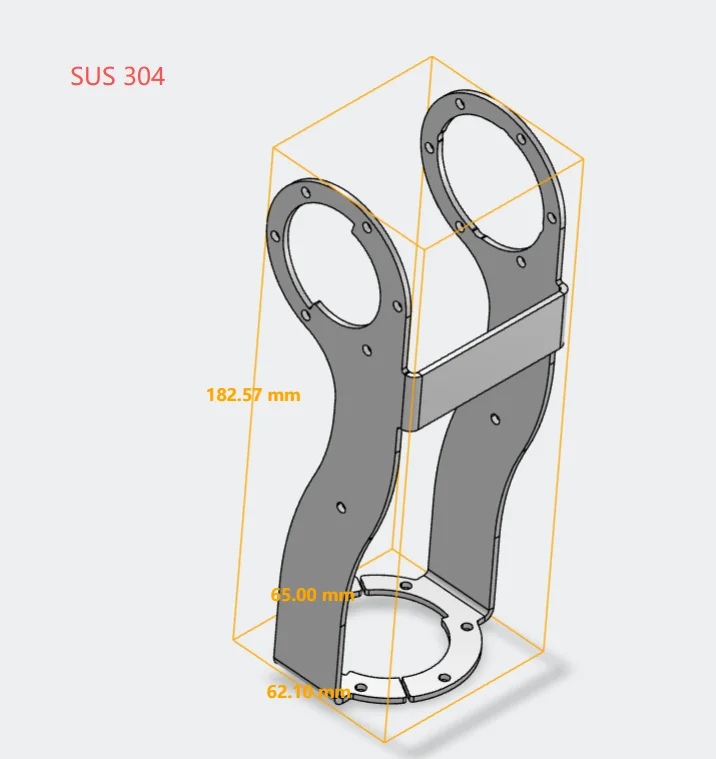

| Name  | Photo  |  Model Number  |Quantity (PCS) | Manufacturing Method | Material | 
| -------  | -------  |  -------  |------- | ------- | ------- |
| J4_A  | |  MVSHM-3N02048-48P-EH8AF-L  | 1 | Sheet Metal Fabrication (CNC) | SUS304 |
| J4_D  |   | MVSHM-3N02048-48P-WH1FY-L   | 1 | Sheet Metal Fabrication (CNC) | SUS304 |

